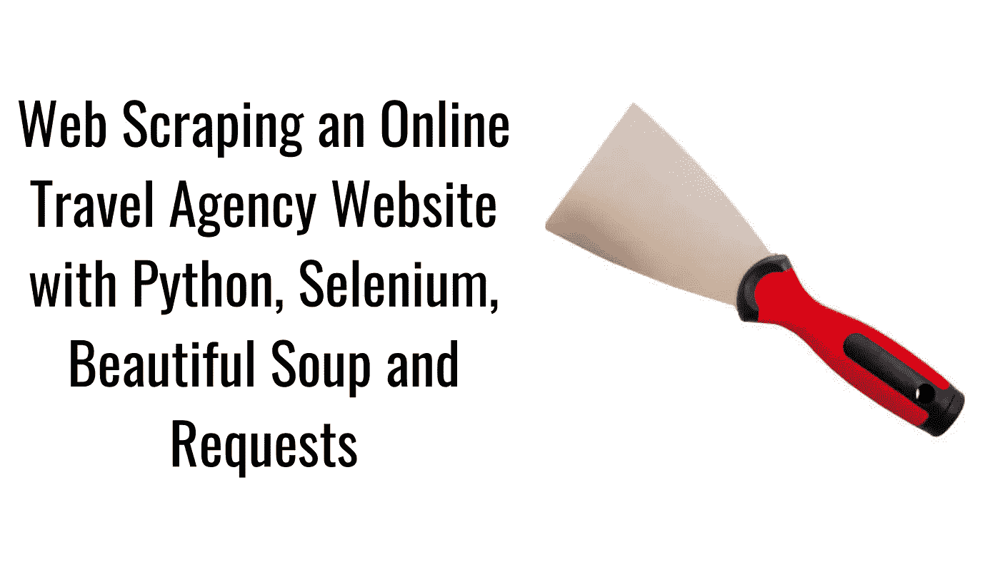
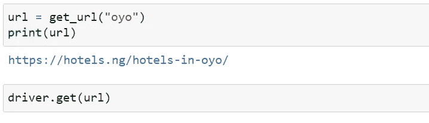
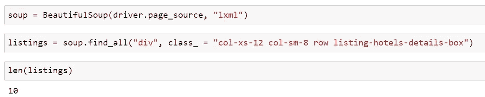
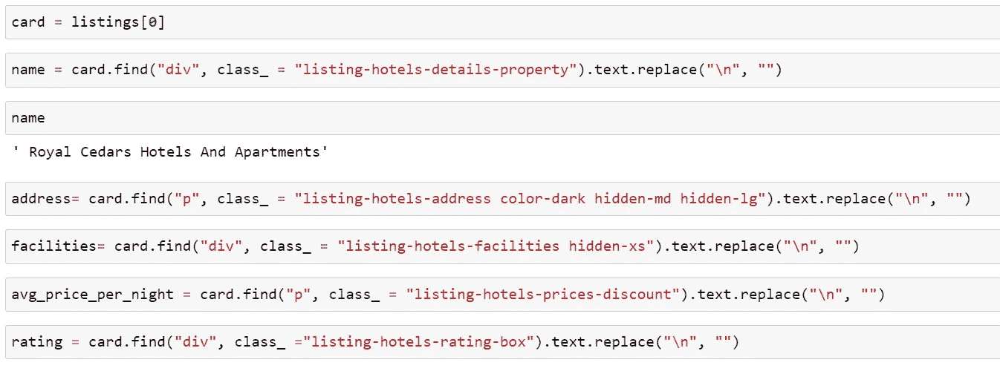
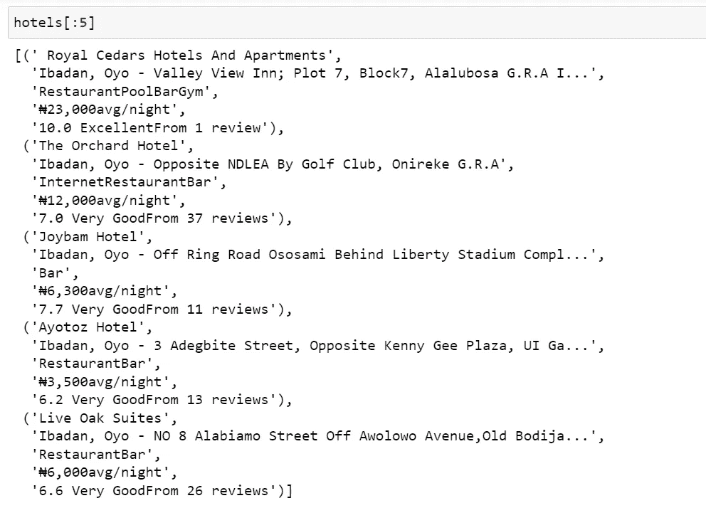
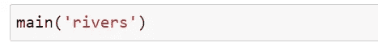
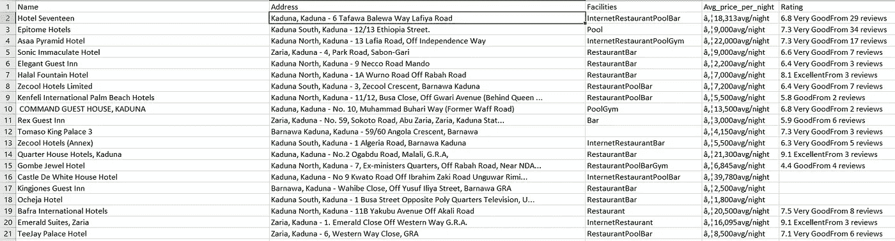
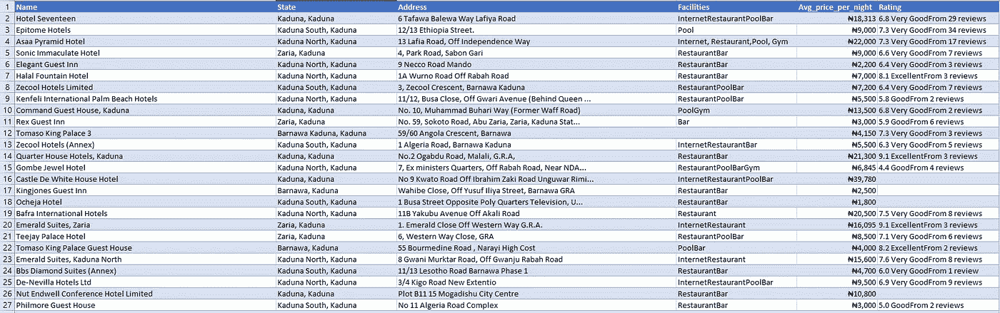

# 一个在线旅行社网站，有 Python，Selenium，Beautiful Soup 和 Requests

> 原文：<https://medium.com/mlearning-ai/web-scraping-an-online-travel-agency-website-with-python-selenium-beautiful-soup-and-requests-def99b4a8123?source=collection_archive---------0----------------------->

Web Scraping an Online Travel Agency Website with Python, Selenium, Beautiful Soup, and Requests. Image by the author.

2006 年，数据科学和以客户为中心的商业战略方面的英国数学家和企业家 Clive Robert Humbly 创造了一个短语“数据是新的石油”[1]。网络上有很多。数据呈指数级增长。研究人员估计每天会产生 2.5 万亿字节的数据。这些数据的一些来源包括购买交易记录、社交媒体网站，如 Twitter 的推文、LinkedIn 上的评论、多媒体图像以及上传到 Instagram、抖音和物联网(IoT)的视频[3]。企业收集、处理和分析生成的数据至关重要，以便[4]:

1.  做出更明智的业务驱动型决策。
2.  优化性能并提高成本效率。
3.  为战略制定和可持续变革积累见解。
4.  提高财务绩效和管理风险。

网络搜集是一种在线收集数据的有效技术[5]。Web 抓取是“创建一个计算机程序以自动方式从 web 下载、解析和组织数据的过程”[6]。简而言之，网络抓取是互联网数据的自动收集。这些数据被保存到文件或数据库中，需要时可以检索出来进行分析。Web 抓取也称为“web 数据提取”、“web 收获”或“web 挖掘”。

虽然公司提供的应用编程接口(API)是另一种在互联网上收集数据的技术，但是网络抓取仍然是最优选的，因为[6]:

1.  提供的 API 只能在有限的时间内访问。
2.  提供的 API 需要在使用前付费。
3.  提供的 API 没有公开所有需要的数据。
4.  该网站不提供 API。

## **网页抓取过程**

Web 抓取至少使用一种流行的编程语言来完成，比如 R 或 Python。一旦确定了要抓取的网站，就会创建一个 HTTP 请求来提取数据。该请求在包含 GET 查询或 POST 查询的 URL 中执行。如果请求成功，定位器将用于搜索 HTML 元素中的数据。在下一阶段，将提取和解析数据，并以结构化格式保存已获取的所需信息。

## **法律和道德含义**

关于网页抓取的法律仍然是一个“灰色地带”[7]。尽管网页抓取并没有错，因为它取决于意图，但是即使要丢弃的数据是打算用于道德目的，也有一些准则要遵循。

## **使用或服务条款**

大多数网站向网络用户提供“使用条款”或“服务条款”协议，明确禁止网络抓取。要接受这些条款，网络用户必须点击复选框或“我接受”链接。如果一个网络用户在表明他或她的提升后没有遵守条款，那么他或她就违反了合同，从法律的角度来看，可能会被起诉[7]。

## **版权或商标侵权**

当网络用户抓取网站所有者明确拥有版权的数据或信息时，就发生了版权侵权[8]。尽管如此，在没有得到网站所有者许可的情况下，仍然可以在有限的范围内抓取受版权保护的信息或数据。在法律上，这属于“合理使用”的法律原则。

## **网站受损**

在 web 抓取期间同时发送数百个请求可能会使服务器过载。这可能导致网站提供的服务价值降低，甚至对网站造成损害。网站所有者可以起诉网络用户侵犯动产，要求赔偿损失。

刮削时要记住的一些一般准则

1)只有公共信息应该被废弃。

2)在抓取之前，一定要查看网站的使用条款或服务政策。

3)避免抓取有版权的数据或信息。

4)不要同时向 web 服务器发送多个请求。

## **Python 网页抓取库**

有几个用于 web 抓取的 Python 库。在本文中，我将简要介绍五(5)个库。

**1)美汤(BS4)**

Beautiful soup (BS4)是一个 Python 库，用于从 HTML 和 XML 文件中提取数据。BS4 是一个支持 HTML 解析器的解析器库。此外，它还支持 LXML 等第三方 Python 解析器。解析器帮助程序员轻松获得 HTML 文件。

除了对初学者友好和易于使用之外，BS4 还具有自动编码检测功能。它可以将 UTF 8 格式的文件转换成 Unicode 格式，反之亦然。更重要的是，BS4 经常与请求库一起使用。

在这里阅读它的文档

****2)刺儿头****

**Scrapy 是一个网页抓取和网页抓取框架。它抓取网站并从其网页中检索数据。scrapy 的一些用途包括:-数据监控，数据挖掘，自动化测试。**

**阅读其文档 [**此处**](https://docs.scrapy.org/en/latest/)**

****3)请求****

**请求库允许用户发送 GET 和 POST 之类的 HTTP 请求。请求提取网页的原始 HTML。请求不解析提取的数据。通过 BS4 和 LXML 进行解析。**

**在这里阅读它的文档**

******4)硒******

****Selenium 是一个基于 web 的自动化测试工具，使用 Selenium WebDriver。它使浏览器自动化，可以打开网页，点击链接，填写表格，并模仿互联网上的其他人类行为。关于网络抓取，它是抓取用 JavaScript 编写的网站的一个很好的选择。此外，不同于其他图书馆，它可以用来刮动态网站同样静态网站。****

****阅读其文档 [**此处**](https://www.selenium.dev/documentation/)****

******5) Urllib******

****Urllib 是一个用于获取 URL(统一资源定位器)的 Python 包。它包含以下模块:****

*   ****urllib.request 打开并读取 URL****
*   ****urllib.error 包含由 urllib.request 引发的异常****
*   ****urllib.parse 解析器 URL****
*   ****urllib.robotparser 解析器 robots.txt 文件****

****阅读其文档 [**此处**](https://docs.python.org/3/library/urllib.html)****

****人们并不总是需要编写 Python 脚本来从互联网上收集数据。有许多工具和软件解决方案可用于网络报废。其中包括:****

*   ****八解析****
*   ****ProWebScraper****
*   ****ParseHub****
*   ****报废蜜蜂****
*   ****Import.io****
*   ****刮刀猫头鹰****

# ******实际演示******

******任务:**编写一个 python 脚本，自动从网站收集公共信息，并以表格格式保存。****

****目标:从酒店收集酒店列表信息。ng 网站并保存为 CSV 文档。****

******关于 Hotels . ng**酒店。ng 是一家专门从事尼日利亚酒店预订的在线旅行社。他们帮助客户在网上预订酒店房间。他们还为客户提供全面的帮助和支持，使酒店预订过程变得顺畅和简单。此外，他们还提供酒店推荐和评论。****

******结果输出******

****从网站上提取了卡杜纳、阿布贾、拉各斯和河流州的总共 854 个酒店列表数据。****

******我刮来的数据**
1)酒店名称
2)地址
3)设施
4)每晚均价
5)评级****

****对于这个项目，我使用 Selenium 来自动化浏览器。其他被使用的库包括:
-请求
-漂亮组
- lxml****

## ****我们开始吧****

## ****导入依赖项****

****Import dependencies. Image by the author.****

## ****启动 web 驱动程序****

****步骤:****

*   ****启动 web 驱动程序****
*   ****导航到目标网站****
*   ****使用。获取驱动程序的方法，并将 url 作为参数传入****

****Startup the webdriver. Image by the author.****

## ****创建一个使用字符串格式插入搜索词的函数****

****步骤:****

*   ****将 url 链接分配给模板变量****
*   ****删除 url 中的关键字搜索词，用花括号{}替换。这就是我们要插入搜索词的地方。****
*   ****此外，用加号(+)替换搜索词中的每个空格，以符合 url 约定。****
*   ****返回插入了字符串格式的搜索词的模板。****

****Create a function that will insert a search term using string formatting. Image by the author.****

****现在我们有了一个函数，它将根据提供的搜索词生成一个 URL。让我们试一试。****

********

## ****做汤****

****需要注意的几点:****

*   ****这将使我们能够访问网站的 HTML 元素，并将其表示为嵌套的数据结构。****
*   ****Beautiful Soup 支持 Python 标准库中包含的 HTML 解析器，但它也支持许多第三方 Python 解析器。一个是 lxml 解析器。我们将使用 lxml 解析器，因为它比 HTML 解析器快。****
*   ****司机。page_source 检索我们在 driver 上传递的 url 的 HTML。获取(url)。当我们单击 Inspect Element 时，它得到的代码与我们在浏览器上看到的代码相同。****
*   ****find_all()返回所有匹配过滤器的标签和字符串。****

********

****Making the Soup. Image by the author.****

## ****创建一个原型模型来提取酒店数据****

****这里，我们原型化了单个记录的提取。然后，将模型应用于整个记录集。之后，我们将第一个结果分配给变量卡。****

********

****Create a prototype model to extract the hotel data. Image by the author.****

## ****将原型模型放在一起****

****步骤:****

*   ****将原型模型归纳为一个函数，并将其应用于页面上的所有酒店列表。****
*   ****定义一个名为 get_hotel_listings 的函数，该函数接受信用卡参数。****
*   ****复制并粘贴我们创建的所有代码来获取卡数据****
*   ****向我们的 def 函数添加错误处理。****
*   ****将变量组织成一个元组，然后将其分配给一个 hotel_listings 变量。****
*   ****然后返回 hotel _ listings 变量。****

****Put the prototype model together. Image by the author.****

## ****使用 for 循环将原型模型应用于页面上的所有列表****

****步骤:****

*   ****创建一个空的 hotels []列表，其中包含我们提取的所有酒店数据。****
*   ****使用上面的列表模式收集页面上所有的酒店列表进行迭代。****

****Apply the prototype model to all listings on the page using a for loop. Image by the author.****

## ****打印前 5 个列表****

********

****Print the first 5 listings. Image by the author.****

## ****进入下一页****

****步骤:****

*   ****使用字符串格式将页面查询添加到 url****
*   ****然后请求下一页，直到我们已经从网站的所有页面提取。****
*   ****为方便起见，我们需要修改已经定义的 get url 函数。****
*   ****赋给一个 url 变量 template.format .然后像前面一样传入我们的搜索词。****
*   ****添加页面和花括号{}。这将给我们提供字符串格式的下一个页码。****
*   ****最后，我们将返回 url。****

## ****将所有内容放在一起/抓取多页****

****只在一个页面上搜集了酒店列表，在这个阶段，我们组装了所有的代码来从网站的多个页面中提取数据。****

## ****定义一个主函数来执行程序****

****在这个阶段，我们定义一个主函数。主函数将帮助执行程序。定义一个主函数，并让它接受搜索词的一个参数。它会为我们运行搜索，并根据搜索词保存数据。****

****步骤:****

*   ****启动 web 驱动程序。****
*   ****创建一个空的 hotels []列表，其中包含我们提取的所有酒店数据。****
*   ****用我们传递到主函数中的搜索词设置一个 url。****
*   ****迭代超过 10 页。****
*   ****关闭驱动程序。****

****Define a main function to execute the program. Image by the author.****

## ****将数据保存到 csv 文件中****

****Save the data to a csv file. Image by the author.****

****现在一切都创建好了，我们可以通过输入搜索词来运行主程序。在这里，我对尼日利亚河流州的酒店感兴趣。****

********

****Run the main program by inputting our search term. Image by the author.****

****从网站上提取了卡杜纳、阿布贾、拉各斯和河流州的总共 854 个酒店列表数据。****

## ******数据清理******

****提取数据后，我用 Microsoft Excel 进行了数据清洗。****

*   ******脏数据******

********

****Dirty data. Image by the author****

*   ****清理的数据****

********

****Cleaned data. Image by the author.****

****祝贺你到达终点。如果你有任何问题或者只是想打个招呼，请在下面发表。****

****参见我的 [GitHub](https://github.com/SampsonIpiankama/Web_Scraping_Projects/tree/main/Hotels.ng) 中的完整代码****

****在推特上关注我****

****在 LinkedIn[上与我联系](https://www.linkedin.com/in/sampsonipiankama/)****

## ****参考****

****[1] C. Arthur，“科技巨头可能很庞大，但没有什么比得上大数据”，*《卫报》*，2013 年 8 月 23 日。[https://www . the guardian . com/technology/2013/aug/23/tech-giants-data #:~:text = % 22 data % 20 is % 20 the % 20 new % 20 oil](https://www.theguardian.com/technology/2013/aug/23/tech-giants-data#:~:text=%22Data%20is%20the%20new%20oil)(2022 年 3 月 24 日访问)。****

****[2] W. Lemahieu，S. vanden Broucke 和 B. Baesens，*数据库管理原理:存储、管理和分析小型和大型数据的实用指南*。剑桥:剑桥大学出版社，2018 年。****

****[3] J. Li，L. Xu，L. Tang，S. Wang，L. Li，“旅游研究中的大数据:一个文献综述”，*旅游管理*，第 68 卷，第 301–323 页，2018 年 10 月，doi:10.1016/j . tourman . 2018 . 03 . 009。****

****[4] V. Jayagopal 和 B. K. K .，“数据管理和大数据分析:数字经济中的数据管理。，“在*大数据分析、架构和应用研究选集*中，信息资源管理协会编辑。IGI 全球，2022 年，第 1614-1633 页。****

****[5] S. J. Mooney、D. J. Westreich 和 A. M. El-Sayed，“大数据时代的流行病学”，*流行病学*，第 26 卷，第 3 期，第 390-394 页，2015 年 5 月，doi:10.1097/ede . 000000000000274****

****[6] Seppe Vanden Broucke 和 B. Baesens，*用于数据科学的实用 Web 抓取*。加州伯克利，2018 年。****

****[7] J. Snell 和 N. Menaldo，“大数据 2.0 时代的网络抓取”，彭博法律新闻，2016 年。访问时间:2022 年 3 月 25 日。【在线】。可用:[https://www . Perkins coie . com/images/content/1/5/v2/156775/Snell-we B- scraping-bnai . pdf](https://www.perkinscoie.com/images/content/1/5/v2/156775/Snell-web-scraping-BNAI.pdf)。****

****[8] A. J .德雷耶和 j .斯托克顿，“互联网‘数据搜集’:咨询客户入门”，《纽约法律期刊》，2013 年 7 月。访问时间:2022 年 3 月 24 日。【在线】。可用:【https://www.law.com/newyorklawjournal/almID/1202610687621/? slreturn=20220229032115。****

**** [## Mlearning.ai 提交建议

### 如何成为 Mlearning.ai 上的作家

medium.com](/mlearning-ai/mlearning-ai-submission-suggestions-b51e2b130bfb)****