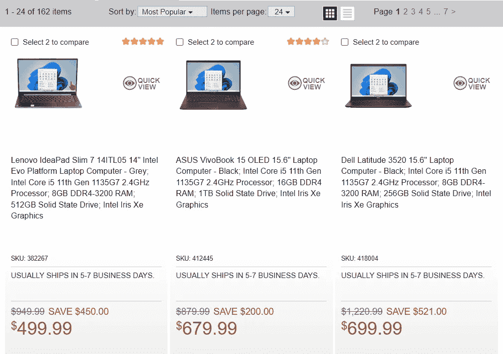
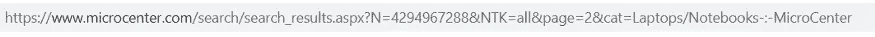
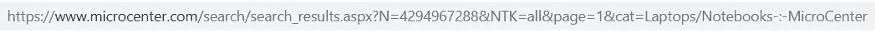
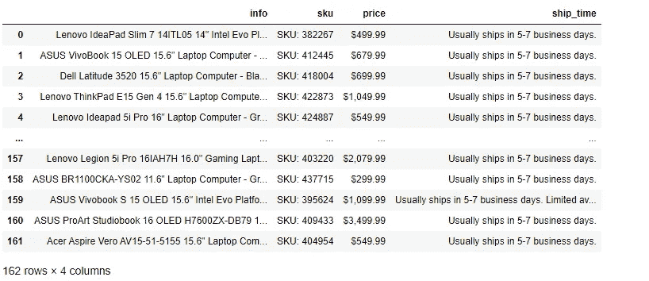

# Python 中的 Web 抓取

> 原文：<https://medium.com/mlearning-ai/web-scraping-in-python-cf1e506572f?source=collection_archive---------2----------------------->

在本文中，我们将关注 Python 中的 Web 抓取。我们将演练什么是 web 抓取，在 Python 中使用什么库，什么是 CSS 选择器，以及一个循序渐进的例子。希望你觉得有用，我感谢任何反馈。另外，请在下面的 GitHub 或 Gitlab 库中找到这些项目。

gitlab:[https://gitlab.com/rshowrav/webscraping-in-python](https://gitlab.com/rshowrav/webscraping-in-python)

GitHub:【https://github.com/rshowrav/webscraping-in-python 

请注意，这类似于我写的一篇关于如何在 r 中抓取网页的文章。如果你对此感兴趣，请参见下面的文章。

[](/mlearning-ai/web-scraping-in-r-dcd1e95ae8fd) [## R 中的网页抓取

### 在这篇文章中，我们将重点讨论 r 中的 web 抓取。我们将演练什么是 Web 抓取，在 r 中使用什么库…

medium.com](/mlearning-ai/web-scraping-in-r-dcd1e95ae8fd) 

# 什么是网页抓取？

网络抓取最简单的定义是从网站中提取内容和数据的行为。网站是使用超文本标记语言(HTML)代码构建的，网页抓取代码或网页抓取器可以从该代码下载对象。Python 是一个强大的工具，让我们可以使用代码来抓取网站。

# 什么是 CSS 选择器？

当使用 HTML 构建网站时，它们与定义了规则的属性值一起存储。在 Web 抓取的意义上，通过识别 CSS 选择器，我们可以更简单地获得 HTML 代码的特定部分。SelectorGadget 是为给定站点识别 CSS 选择器的一个很好的工具。SelectorGadget 确实要求你使用谷歌 Chrome 作为浏览器。注意，在示例项目中也使用了这个工具来识别所需的 CSS 选择器。要了解有关该工具的更多信息，请参阅以下链接中的文档:

[](https://chrome.google.com/webstore/detail/selectorgadget/mhjhnkcfbdhnjickkkdbjoemdmbfginb?hl=en) [## 选择 orGadget

### 简单，强大的 CSS 选择器生成。

chrome.google.com](https://chrome.google.com/webstore/detail/selectorgadget/mhjhnkcfbdhnjickkkdbjoemdmbfginb?hl=en) 

# 这个例子

在本文中，我们将浏览一家笔记本电脑商店，并从网站上获取所需的基本信息。这个例子中使用商店是 MicroCenter。将收集的详细信息包括笔记本电脑信息、SKU 号码、产品价格和预计发货时间。我们将在 Python 中执行必要的提取。

# 步骤 1:安装必要的软件包

使用下面的代码(假设你用的是 Notebook ),我们下载必要的包来执行网络抓取。每个包装的详细信息如下:

*   Pandas-是 Python 中的一个包，它让我们可以执行数据分析和操作。为了我们的目的，将被用来创建一个数据帧。
*   BS4-是 Python 中的一个包，可以让你从 HTML 中提取数据。
*   请求——允许我们向网站发送 HTTP 请求。简单来说，它让我们与网站互动。

```
!pip install pandas
!pip install bs4
!pip install requests
```

# 步骤 2:导入包

在安装完这些包之后，接下来必须将它们导入 Python 以用于我们的代码。这可以使用下面的代码来完成。

```
import pandas as pd
from bs4 import BeautifulSoup
import requests
```

# 第三步:了解网站

接下来就是了解网站了。正在使用的示例包含以下内容。



上面的截图向我们展示了我们想要捕捉的功能，包括笔记本电脑信息、SKU 号码、价格和发货时间细节。另外，请注意，总共有 162 台可用的笔记本电脑(即我们预期的记录数量)。此外，请注意，这些笔记本电脑在多个网页上。

# 步骤 4:了解统一资源定位器(URL)

理解如何与 URL 交互是网络抓取的关键。正如我们在下面看到的，如果我们转到网站的第 2 页，我们会看到下面的 URL。



重复这个过程，转到第 1 页，得到下面的网址。



请注意，在 URL 中，转到 URL 中的第 2 页，我们看到 page=2，转到第 1 页，URL 变为 page=1。此外，URL 中的所有其他字段保持不变。

# 步骤 5:创建空数组

为了存储我们感兴趣的数据，我们需要创建空数组。这可以使用下面的代码来完成:

```
info = []
sku = []
price = []
ship_time = []
```

# 第六步:网页抓取

下面 Python 中的下一个代码是数据的实际抓取和编译，我们将解释它的每个元素。第一部分是一个 for 循环，它创建了一个 pgn 元素，该元素从 1 到 7(注意:这是因为网站有 7 个页面)。下一部分是创建一个链接(即代码中的 url)，这分为 3 个部分的网址，中间部分填充后页=正如我们在研究时确定的网址。因此，每个页面都将使用 request 语句 requests 来读取，并存储在 res 中。然后，漂亮的 soup 包将为我们提供一种从 URL 与 HTML 进行交互的方法，并将它存储在 Soup 中。接下来，是我们的初始 for 循环中的一系列 for 循环:它的第一个方面是定位 CSS 选择器(注意:使用 SelectorGadget)，在循环中以文本形式返回结果，然后追加到数组中。循环运行，直到它通过所有 7 页。

```
# Initial loops through each page
for pgn in range(1,8):
    url = "[https://www.microcenter.com/search/search_results.aspx?N=4294967288&NTK=all&page=](https://www.microcenter.com/search/search_results.aspx?N=4294967288&NTK=all&page=)" + str(pgn) + "&cat=Laptops/Notebooks-:-MicroCenter"
    res = requests.get(url)
    soup = BeautifulSoup(res.text)
   #loops to get each text from each CSS selector 
    for info_select in soup.select(".normal a"):
        info.append(info_select.text)
    for sku_select in soup.select(".sku"):
        sku.append(sku_select.text)
    for price_select in soup.select(".price > span"):
        price.append(price_select.text) 
    for ship_time_select in soup.select(".availabilityTrunc"):
        ship_time.append(ship_time_select.text)
```

# 步骤 7:存储在数据框中

最后，我们需要使用 Python 中的 Pandas 包来存储数据框中的数据。这可以使用下面的代码来完成:

```
df=pd.DataFrame(columns=['info','sku','price','ship_time'])
df['info']=pd.DataFrame(info)
df['sku']=pd.DataFrame(sku)
df['price']=pd.DataFrame(price)
df['ship_time']=pd.DataFrame(ship_time)df
```

代码的第一个方面是用给定的列名创建一个空数据框。然后将前一步中的每个数组存储在每一列中。

# 最终输出

最终输出将是下面的内容，其中包含我们感兴趣的要素和现在位于数据框中的 162 条记录。

[](/mlearning-ai/mlearning-ai-submission-suggestions-b51e2b130bfb) [## Mlearning.ai 提交建议

### 如何成为 Mlearning.ai 上的作家

medium.com](/mlearning-ai/mlearning-ai-submission-suggestions-b51e2b130bfb)