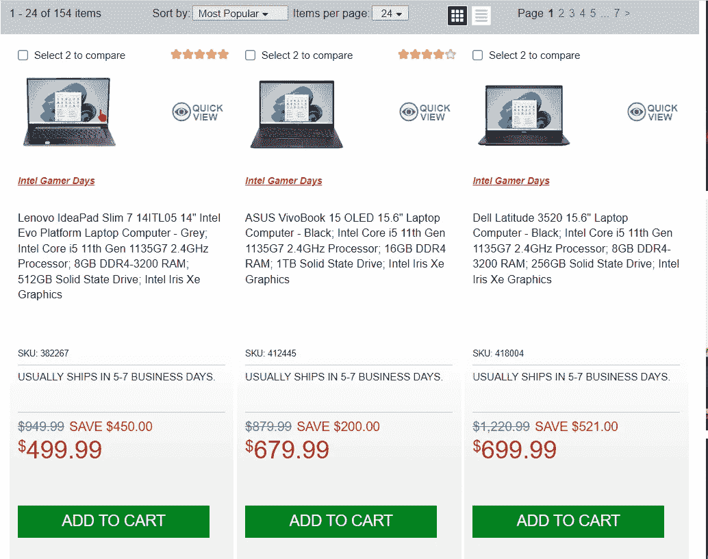
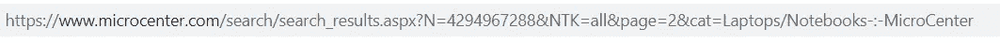
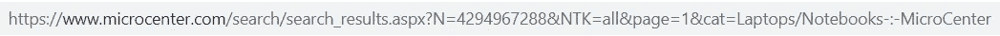
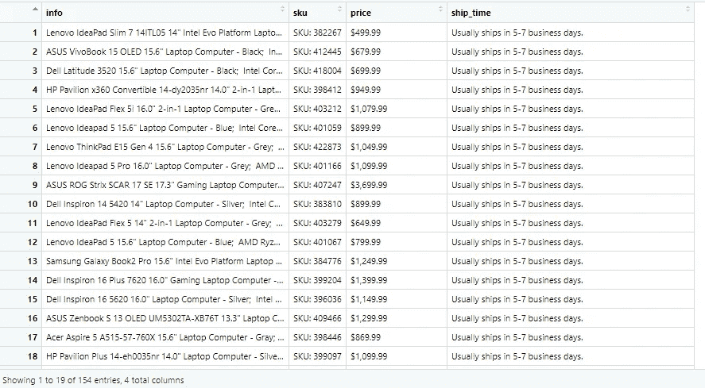

# R 中的网页抓取

> 原文：<https://medium.com/mlearning-ai/web-scraping-in-r-dcd1e95ae8fd?source=collection_archive---------1----------------------->

在这篇文章中，我们将关注 R 中的 web 抓取，我们将演练什么是 Web 抓取，在 R 中使用什么库，什么是 CSS 选择器，以及一个逐步的例子。希望你觉得有用，我感谢任何反馈。另外，请在下面的 GitHub 或 Gitlab 库中找到这些项目。

gitlab:[https://gitlab.com/rshowrav/webscraping-in-r](https://gitlab.com/rshowrav/webscraping-in-r)

GitHub:【https://github.com/rshowrav/webscraping-in-r 

# 什么是网页抓取？

网络抓取最简单的定义是从网站中提取内容和数据的行为。网站是使用超文本标记语言(HTML)代码构建的，网页抓取代码或网页抓取器可以从该代码下载对象。r 是一个强大的工具，让我们使用代码来抓取网站。

# 什么是 CSS 选择器？

当使用 HTML 构建网站时，它们与定义了规则的属性值一起存储。在 Web 抓取的意义上，通过识别 CSS 选择器，我们可以更简单地获得 HTML 代码的特定部分。SelectorGadget 是为给定站点识别 CSS 选择器的一个很好的工具。SelectorGadget 确实要求你使用谷歌 Chrome 作为浏览器。注意，在示例项目中也使用了这个工具来识别所需的 CSS 选择器。要了解有关该工具的更多信息，请参阅以下链接中的文档:

[](https://chrome.google.com/webstore/detail/selectorgadget/mhjhnkcfbdhnjickkkdbjoemdmbfginb?hl=en) [## 选择 orGadget

### 简单，强大的 CSS 选择器生成。

chrome.google.com](https://chrome.google.com/webstore/detail/selectorgadget/mhjhnkcfbdhnjickkkdbjoemdmbfginb?hl=en) 

# 这个例子

在本文中，我们将浏览一家笔记本电脑商店，并从网站上获取所需的基本信息。这个例子中使用商店是 MicroCenter。将收集的详细信息包括笔记本电脑信息、SKU 号码、产品价格和预计发货时间。我们将在 r 中执行必要的提取。

# 步骤 1:安装必要的软件包

使用下面的代码，我们下载必要的包来执行网络抓取。每个包装的详细信息如下:

*   Rvest-是 R 中用于网页抓取的首要包，特别是对于有多个页面的网站。
*   tidy verse——是一个 R 包，它是主要用于数据科学的包的集合。具体来说，对于这个例子，将使用的来自 Tidyverse 的包是 Dplyer，它允许管道函数(即 if then 函数)。
*   data . table——是一个 R 包，允许我们以列和行的形式存储数据。

```
install.packages("rvest")
install.packages("tidyverse")
install.packages("data.table")
```

# 步骤 2:加载包

在安装完软件包之后，必须将它们加载到 R 中，以便用于我们的代码。这可以使用下面的代码来完成。

```
library(rvest)
library(tidyverse)
library(data.table)
```

# 第三步:了解网站

接下来就是了解网站了。正在使用的示例包含以下内容。



上面的截图向我们展示了我们想要获取的功能，包括笔记本电脑信息、SKU 号码、价格和发货时间等细节。另外，请注意，总共有 154 台可用的笔记本电脑(即我们预期的记录数量)。此外，请注意，这些笔记本电脑在多个网页上。

# 步骤 4:了解统一资源定位器(URL)

理解如何与 URL 交互是网络抓取的关键。正如我们在下面看到的，如果我们转到网站的第 2 页，我们会看到下面的 URL。



重复这个过程，转到第 1 页，得到下面的网址。



请注意，在 URL 中，转到 URL 中的第 2 页，我们看到 page=2，转到第 1 页，URL 变为 page=1。此外，URL 中的所有其他字段保持不变。

# 步骤 5:创建一个空数据表

要填充和追加 R 中的数据表，我们必须使用 data.table 包创建一个空的数据表。这可以使用下面的代码来完成。

```
laptops = data.table()
```

# 第六步:网页抓取

下面 R 中的最后一个代码是数据的实际抓取和复杂化，我们将解释它的每个元素。第一部分是一个 for 循环，它创建了一个 pgn 元素，这个元素从 1 到 7(注意:这是因为网站有 7 个页面。下一部分是创建一个链接，这是分为 3 个部分的网址，中间部分填充后页=正如我们在研究时确定的网址。因此，将使用 Rvest 语句 read_html 读取每个页面。接下来，为了收集每个感兴趣的特性，我们使用管道函数(Dplyer 包):它的第一个方面读取页面，下一个方面(html_nodes)定位 CSS 选择器(注意:使用 SelectorGadget)，最后一个方面以文本形式返回结果。此循环的最后一部分将把一页中的记录添加到列和行中的选择要素的数据表中，然后在循环中运行另一页时追加。循环运行，直到它通过所有 7 页。

```
for(pgn in seq(from=1, to=7, by =1 )){ link = paste0("https://www.microcenter.com/search/search_results.aspx?       N=4294967288&NTK=all&page=",pgn,"&cat=Laptops/Notebooks-:-MicroCenter")  
page = read_html(link)    

info = page%>% html_nodes(".normal a")%>% html_text()  
sku = page%>% html_nodes(".sku")%>% html_text()  
price = page%>% html_nodes(".price > span")%>% html_text()                  ship_time= page%>% html_nodes(".availabilityTrunc")%>% html_text() laptops = rbind(laptops, data.table(info, sku, price, ship_time, stringsAsFactors = FALSE))}
```

# 最终输出

最终输出将是下面的内容，其中包含我们感兴趣的特征和现在在数据表中的 154 条记录。

[](/mlearning-ai/mlearning-ai-submission-suggestions-b51e2b130bfb) [## Mlearning.ai 提交建议

### 如何成为 Mlearning.ai 上的作家

medium.com](/mlearning-ai/mlearning-ai-submission-suggestions-b51e2b130bfb)