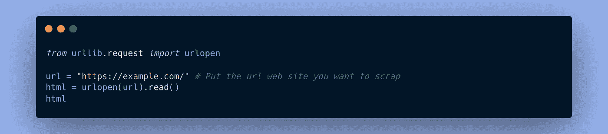
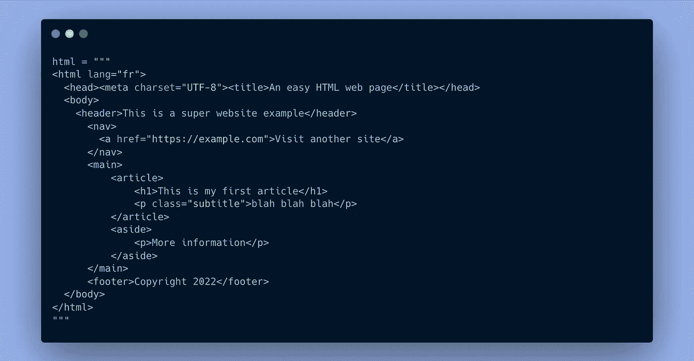
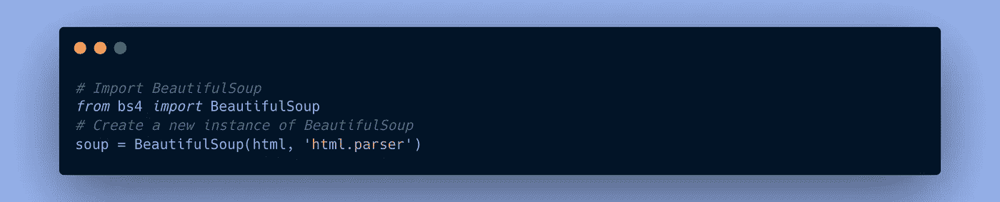
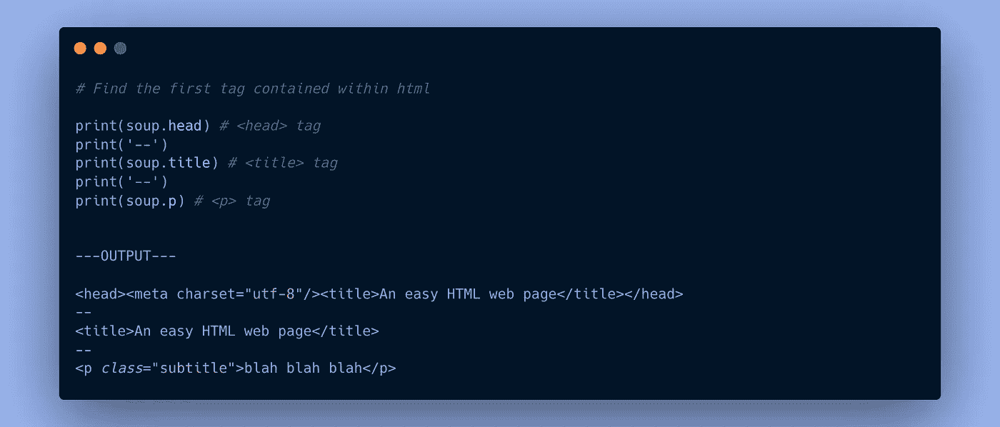
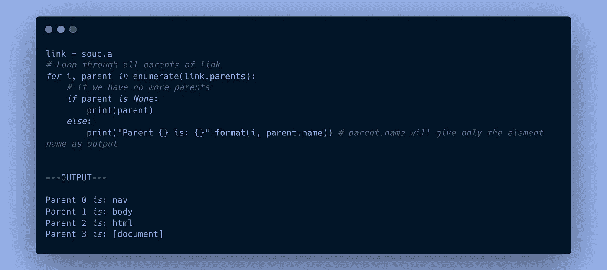
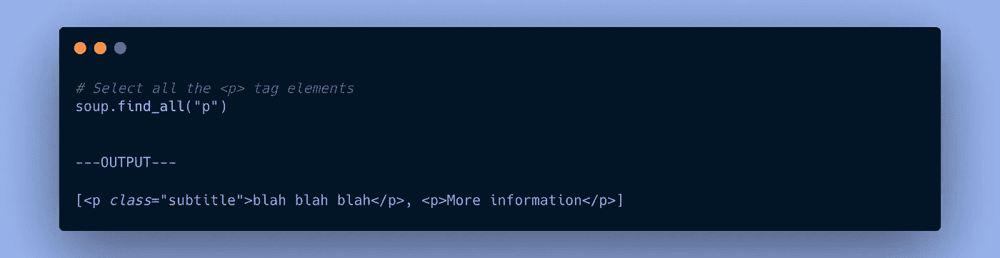
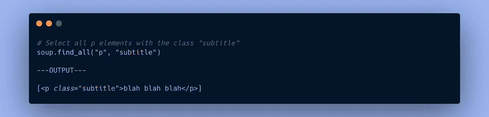
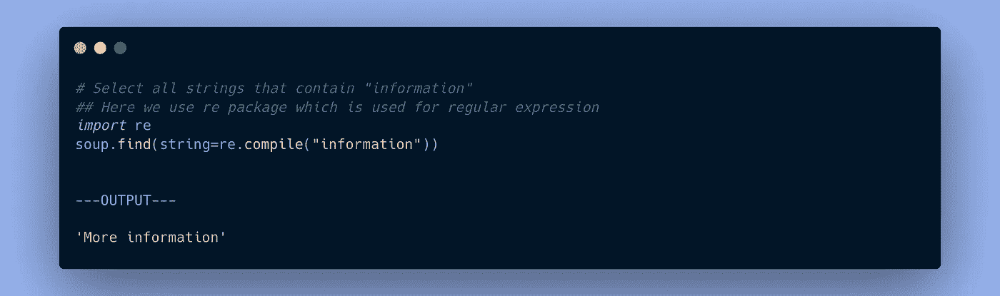

# 如何使用漂亮的应用程序从 Web 获取数据

> 原文：<https://medium.com/mlearning-ai/web-scrapping-with-beautifulsoup-d94e4ebfc209?source=collection_archive---------2----------------------->

## **网络包含着无限量的数据。**如果我们能够从众多网页中创建自己的数据集，机会将是无限的……

🎉好消息是，

每个网页都是按照一种特定的格式构建的:**HTML 语言**。像任何类型的结构化数据一样，检索我们要寻找的信息非常容易。

这就是所谓的 Web 报废，我们将在本文中看到如何使用 Python 的**beauty lup**库来分析网页的内容。

Photo by [Joshua Sortino](https://unsplash.com/@sortino?utm_source=medium&utm_medium=referral)

# 1.如何获取网页的 HTML 代码

要分析网页的内容，第一件要做的事就是检索它的源代码**，即与它相关联的 HTML 代码**。

为此，有几种方法可以在 Python 中实现这一任务。以下是其中之一:

Get the HTML code of a web page

在这个例子中，我使用`urllib`库，该库允许轻松查询给定 *url* 的 HTML 代码。对于这个例子，为了简单起见，假设上面代码的`html`元素的输出是:

Some HTML example

如果你对 HTML 有一些了解，你可能会认识到这个网页上的大多数标签(正文、标题、h1、p、文章…)。

当然，这个例子是一个简化的真实例子。

一旦将 HTML 代码加载到 Python 脚本中，我们就可以继续进行第 2 步:*使用 BeautifulSoup 进行分析。*

# 2.使用 BeautifulSoup 解析 HTML

**beautulsup**是一个 Python 库，可以对网站数据进行爬网和收获。Python 生态系统中还有许多其他的库(你可能听说过 **selenium** )，但**beauty lump**以简单易用而著称，因此推荐给那些想从网页抓取开始的人。

要开始使用**美化输出**，你需要给它两件事作为输入:

*   要解析的代码(在我们的例子中是`html` python 变量)
*   要使用的解析器(在我们的例子中是`'html.parser'`，一个 **HTML** 解析器)

*true beauty ulsup 允许您解析其他类型的数据(例如 XML)。*

Initialize BeautifulSoup

然后我们得到一个`soup`的 **HTML** 代码。

然后，我们可以开始寻找我们对变量`soup`感兴趣的元素。

要找到我们的 **HTML** 页面中包含的第一个标签，你只需要做:

Find the first element tag

当你在你的 **HTML** 页面中寻找一个特定的标签，并且想要更多关于它的使用的上下文，了解“它的父母”是很有帮助的。

**父元素**就是被查看元素上面的标签。在我们的例子中，`<a>`标签的第一个父标签是`<nav>`标签。

我们来查一下`<a>`的历任父母的设定:

Find all the parents tag

如您所见，`soup.tag`函数检索在我们的网页中找到的第一个标签。如果我们想要检索所有的标签，我们可以使用 web 报废中最常用的方法之一:

`soup.find_all()` → **这种方法可以让你精确搜索你要找的元素。**

例如，要搜索所有`
`标签:

soup.find_all()

您甚至可以使用您正在寻找的标签的**类**来增强您的搜索:

soup.find_all() with parameter

如果您仍然找不到您要找的信息，您可以使用**字符串参数**，它会搜索包含指定单词的所有字符串:

Find a specific word in a webpage

# 结论

下面简单介绍一下 **BeautifulSoup** ，Web 报废领域常用的库！

现在，网络是你的了！🎉

如果你喜欢这篇文章，请鼓掌告诉我👏👏

*皮埃尔-路易·迪*

 [## Mlearning.ai 提交建议

### 如何成为 Mlearning.ai 上的作家

medium.com](/mlearning-ai/mlearning-ai-submission-suggestions-b51e2b130bfb)