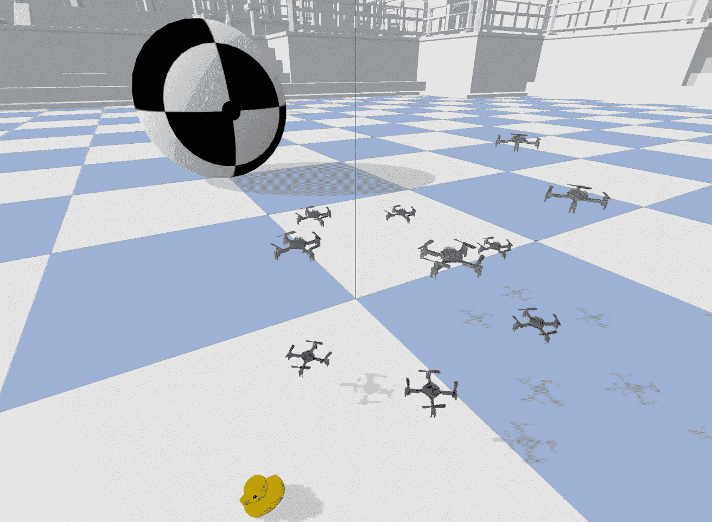
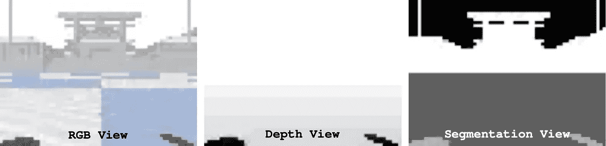
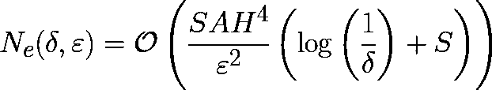
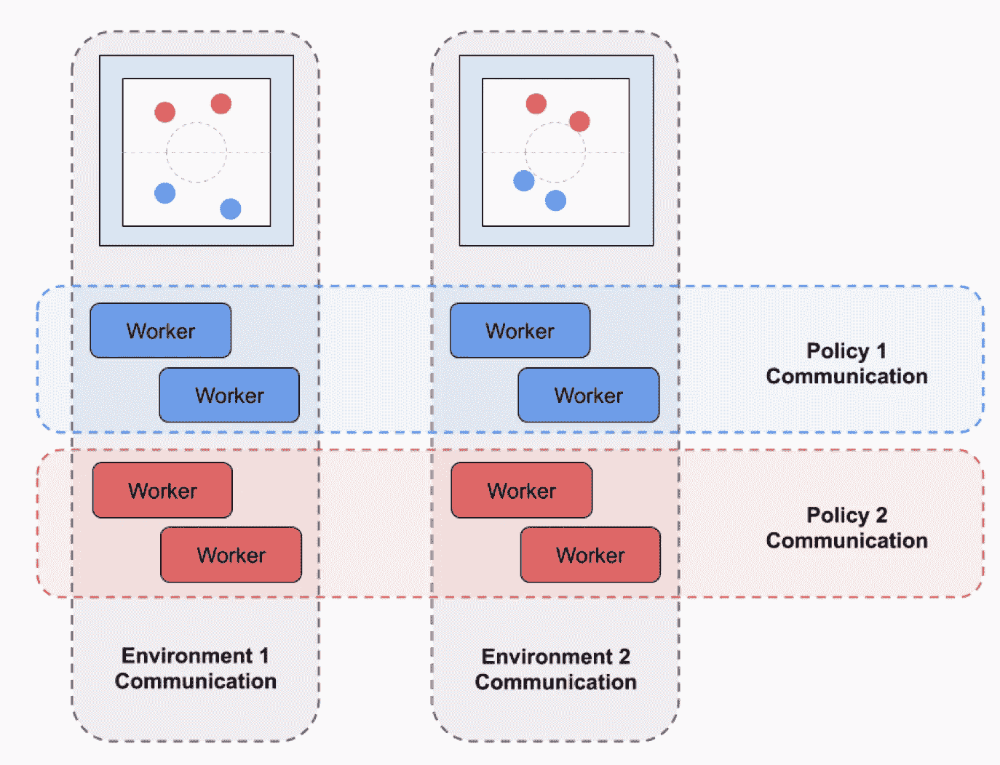
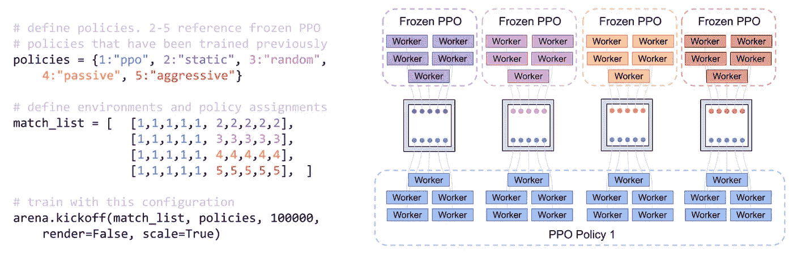
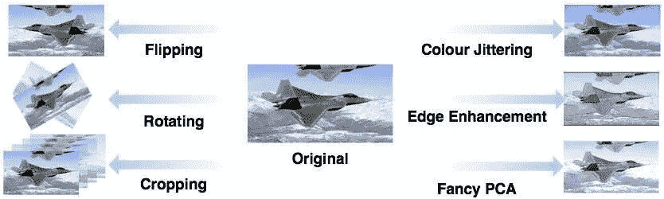
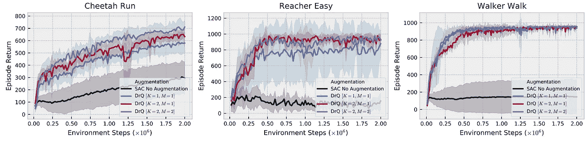
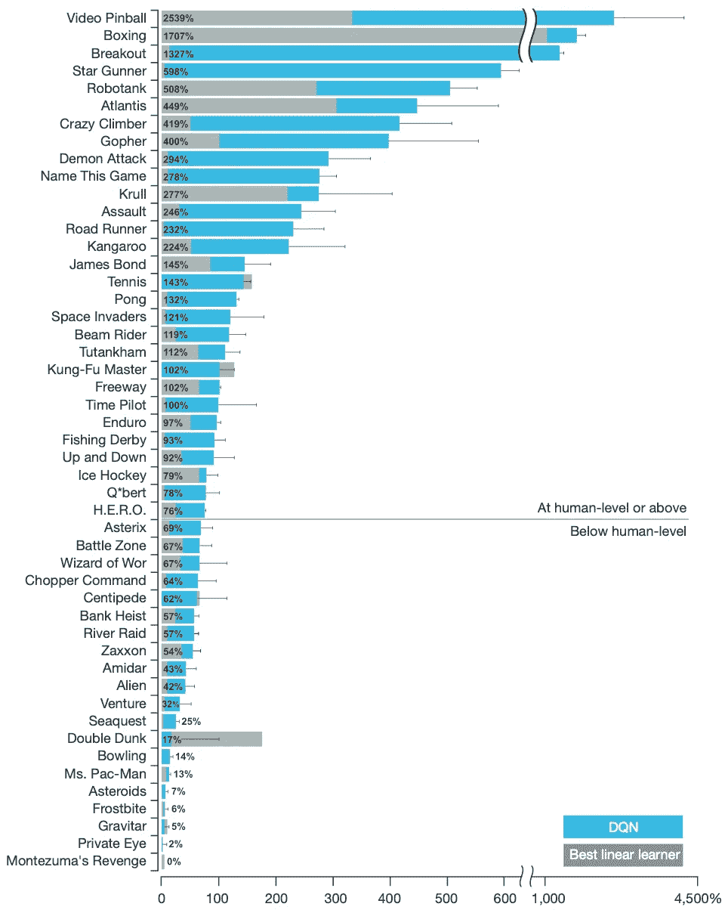
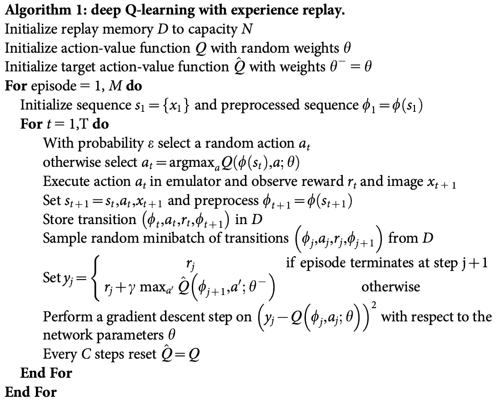

# 强化学习论文#1 的每周回顾

> 原文：<https://medium.com/mlearning-ai/weekly-review-of-reinforcement-learning-papers-1-b9de230a4158?source=collection_archive---------3----------------------->

## 每周一，我都会发表我研究领域的 4 篇论文。大家来讨论一下吧！

[ [←上一次回顾](https://qgallouedec.medium.com/weekly-review-of-reinforcement-learning-papers-0-facb2274ce08?source=friends_link&sk=5aa2680677662517c857bbf1c40560dc) ][ [下一次回顾→](https://qgallouedec.medium.com/weekly-review-of-reinforcement-learning-papers-2-649e96b00c66?source=friends_link&sk=6b89f7a8194780375e880891082cce51)

# 论文 1:学习飞行——多智能体四轴飞行器控制强化学习的 PyBullet 物理学体育馆环境

[论文](https://arxiv.org/abs/2103.02142)*——*帕内拉蒂 j .和 al。

包含机械臂或导航机器人的机器人环境非常常见。但是你在无人机上试过你的学习算法吗？这就是本文作者提出的:基于 PyBullet 的开源 OpenAI gym 环境，用于涉及一架或多架四轴飞行器的不同任务。

Figure from the article : Rendering of a gym-pybullet-drones simulation with 10 Crazyflie 2.x on a circular trajectory and a rubber duck for scale.

强化学习需要大量的数据。这就是机器人环境被大大简化的原因。这种简化允许收集足够的数据来正确地学习策略。但是这是以牺牲模拟的真实性为代价的。出于这个原因，**大多数机器人环境不适合在现实世界中部署学习到的策略**。作者试图通过模拟四轴飞行器的动态行为、它们携带的相机、碰撞和空气动力学效应，使模拟尽可能接近现实。

Figure from the paper : RGB, depth, and segmentation. A Crazyflie 2.x can be given image processing capabilities by the AI-deck.

这些环境允许进行大量任务的训练:动态速度控制、稳定性等。但我发现最有趣的是多智能体强化学习的界面(我们这里说的是无人机群！).

就性能而言，取决于你是否想模拟无人机的视觉，它变化很大。如果要模拟视觉，可以模拟 5 架无人机的环境，实时因子 2.5。如果我们想在没有视觉的情况下进行模拟，可以同时模拟 80 架无人机的 4 个环境，同时保持 0.8 的实时系数(测试使用配备英特尔 i7–8850h 处理器和 Nvidia Quadro P2000 显卡的 PC)。

我期待着下一个出版物将曝光在真正的无人机上获得的结果！

# 论文 2:适应性无奖励探索

[论文](https://arxiv.org/abs/2006.06294)*——*考夫曼等。

记得当你还是个孩子的时候，有人告诉你

> **“强化学习是学习做什么——如何将情况映射到行动——以便最大化数字奖励信号”**——*萨顿，R. S .，&巴尔托，A. G. (2018)。强化学习:导论。麻省理工出版社。*

如果我告诉你这并不总是对的。如果我告诉你，一些工作表明，学习的一部分可以在不需要奖励的情况下完成。这部分研究的挑战是尽可能多地发现环境，而互动次数最少。这可能会让你想起置信上限(UCB)的工作，在那里代理人对环境的“知识”被量化。因此，代理人鼓励我们对结果知之甚少的行动(参见阿格拉瓦尔的[UCB(1995)](https://www.jstor.org/stable/1427934?seq=1))。

让我们回到正题。作者们无偿地进行了探索。他们的算法叫做无奖励上置信强化学习(RF-UCRL)。有趣的是，他们能够将获得足够大的交互数据集所需的剧集数量限制在**允许学习任何奖励函数**。这是最终的方程式。

在哪里

*   *N_e(* δ *，* ε *)* 是输出概率为 1δ的最优策略的ε-近似值所需的情节数，
*   *S* 是状态数，
*   *H* 地平线(一集最大长度)
*   *一个*动作的次数

我没有计算，但我发现有趣的是，作者能够用数学方法正式证明这个结果。这是机器学习中一种罕见的方法，我们经常高兴地提出并观察到“*行得通*”或“*行不通*”。

你可能已经注意到(对于基于 UCB 的算法)，所有这些结果对于离散的有限观察和动作空间都是有效的。如果可以将动作空间离散化，那么对于观察空间就不那么简单了。

我承认，这是我第一次看到这样一种探索方法，它对任何奖励函数都有效。还有很多要说的，感谢这个伟大的出版物。

# 论文 3:人工智能领域:分布式多智能体强化学习的框架

[论文](https://arxiv.org/abs/2103.05737)*——*斯特利 e .和阿尔。

这篇论文的作者已经完成了一项工作，它标志着多主体强化学习的一个转折点。他们扩展了我们都知道的 OpenAI gym 接口，使其更加灵活，并且在我看来还扩展了多代理强化学习的概念。以下是它们的扩展所允许的部分列表:

代理的性质可以不同，每个代理可以有自己的目标、自己的策略、自己的学习算法、自己的动作空间和观察空间。这不是对某个代理人进行有限观察的问题。观察和行动的本质可能不同。举个具体的例子:有可能有一个会处理图像的无人机(hi paper 1)和一个会处理关节位置的机械臂。学习到的策略可以在一个环境中完全或部分共享，甚至可以在几个并行环境中共享。因此，我们可以考虑并行化的学习算法(例如 A3C ),在这些不同的环境之间共享工作人员。

应该注意的是，通过直接操作 MPI 标准，这个框架被设计成高度可并行化的。这保证了每个工作策略和每个环境都有自己的过程。

*Figure from the paper : Communication groupings among AI Arena processes.*

这项工作真正的附加价值是，用几行代码就可以定义相当复杂的环境。查看出版物中的这个例子。

*Figure from the paper : Python code and process diagram for a TanksWorld training scheme against four enemy strategies*

我发现“竞技场”这个名字选得很好，从某种意义上来说，环境本身并不包含目标，但**应该被视为一个共享空间，在这里几个不同种类的代理可以相互作用**。他们的工作给我留下了深刻的印象，所以我邀请你去看看他们的出版物和代码。我正在启动我自己的第一次培训。

# 论文 4:图像增强是你所需要的:从像素中调整深度强化学习

[ [论文](https://arxiv.org/abs/2004.13649)——科斯特里科夫 I .和亚拉茨 d .和 al。

与环境的互动是昂贵的。因此轨迹的数量是有限的。人为增加交互次数，方法之一是学习一个环境的模型，并与这个学习到的环境进行交互。这是基于模型的学习。这种方法很吸引人，但是在实践中，有些环境是不容易学会的。所以我们使用无模型学习。如果做无模型学习，如何增加区间数？**在这篇论文中，作者提出了一种他们从我们的计算机视觉兄弟那里借鉴来的方法，称为数据增强**。数据扩充包括通过添加构成图像数据集的图像的失真或噪声版本来扩大图像数据集。

Data augmentation is enlarging the dataset with the flipped, rotated, cropped… versions of an image. [Source image](https://www.researchgate.net/figure/Overview-of-the-Data-Augmentation-DA-methods-evaluated_fig1_319210096)

令人惊讶的是，在不需要调整无模型算法的情况下，数据扩充允许结果的极大改善。以下是在 3 种环境下获得的结果:

DrQ[K=1，M=1]指用随机移位增强的 SAC。您可以看到，通过应用简单的数据扩充，学习性能显著提高。

该出版物的第二个贡献是他们提出的对扩充数据的正则化。我让你查阅出版物以了解更多细节。主要的一点是，这种正则化允许稍微提高性能(图上的 DrQ[K=2，M=1，2])。

# 奖励论文:通过深度强化学习进行人类水平的控制

*Nature(2015)——*Mnih v，Kavukcuoglu K，Silver D .和 al 的[论文](https://www.nature.com/articles/nature14236?wm=book_wap_0005)。

本周我想写一个“必须知道”的话题。这是**推出深度 Q 网络(DQN)** 算法的出版物。这种算法的威力已经在 49 台 Atari 2600 游戏上得到了验证。对于大多数游戏来说，结果远远超过了最好的最先进的算法。

Figure from the paper: Comparison of the DQN agent with the best SOTA RL methods. Professional human games tester = 100% ; random play = 0%

让我们简单回顾一下 DQN。这里是关键点，它区别于表格方法。(1)用神经网络(卷积)近似 Q 值函数。这一点至关重要，因为与表格方法相反，它允许在尚未遇到的状态中进行归纳；(2)探索基于ε-贪婪策略。代理以*ε*的概率采取随机行动；(3)转换被存储在存储器中( *D* ，并且神经网络被训练来预测与一对(状态，动作)相关联的值函数。因此，众所周知的算法是:

令人印象深刻的是，这份出版物只有六年的历史。自那时以来，已经取得了如此大的进展。研究进展迅速，新的伟大成果不断出现，这份出版物就是证明。

我很高兴向你们展示我本周的五篇阅读材料。我希望你会喜欢这个**第二版**。我期待你的反馈。
要阅读我周日晚上的评论，请访问我的博客:[https://qgallouedec . github . io](https://qgallouedec.github.io)