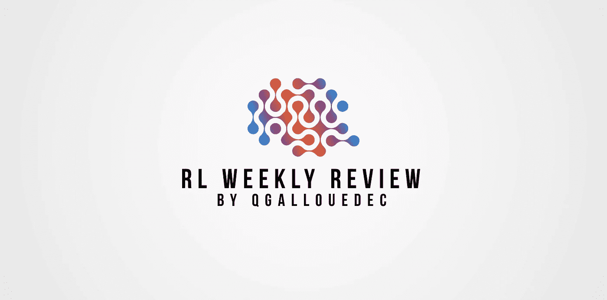
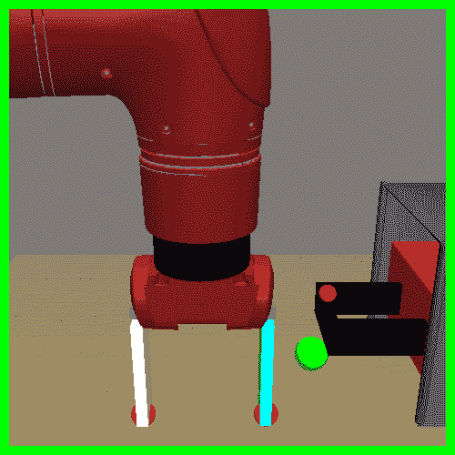
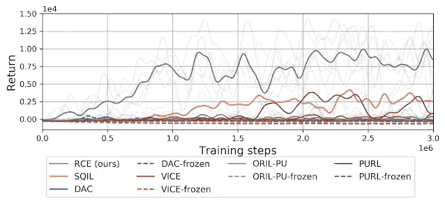
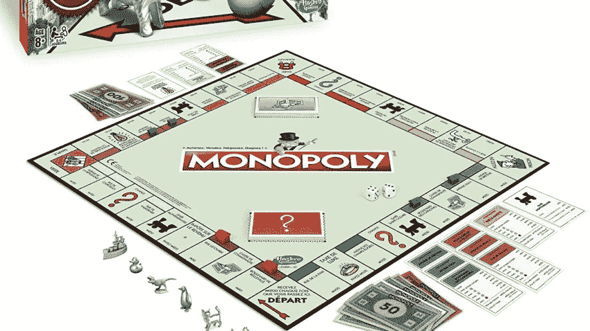
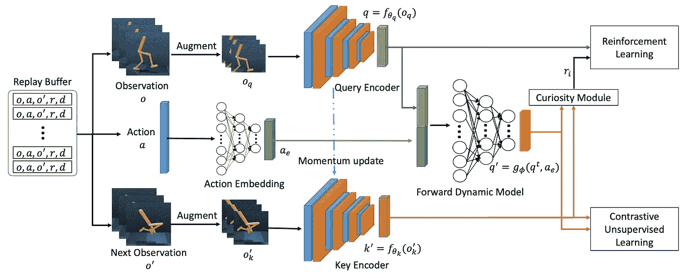
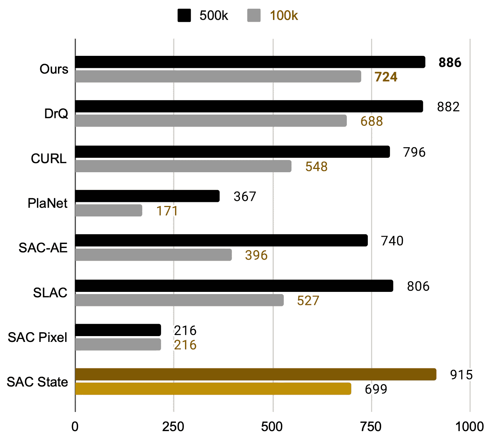
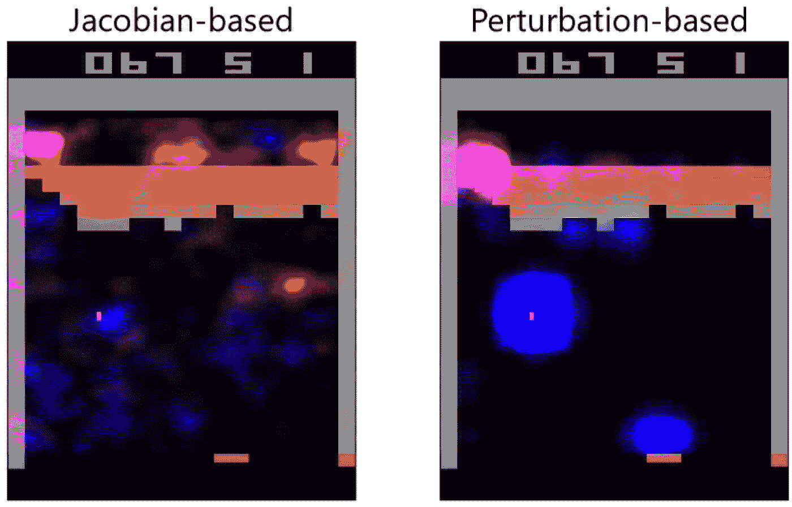

# 强化学习论文的每周回顾#2

> 原文：<https://medium.com/mlearning-ai/weekly-review-of-reinforcement-learning-papers-2-649e96b00c66?source=collection_archive---------1----------------------->

## 每周一，我都会发表我研究领域的 4 篇论文。大家来讨论一下吧！

[ [←上一次回顾](/mlearning-ai/weekly-review-of-reinforcement-learning-papers-1-b9de230a4158?source=friends_link&sk=78551cd3d1f21f54d6b5ed944f4aa087) ][ [下一次回顾→](https://qgallouedec.medium.com/weekly-review-of-reinforcement-learning-papers-3-32f03633066e?source=friends_link&sk=c53ec970bac2d20ac7c0853391b83e12)

# 论文 1:用例子代替奖励:通过递归分类的基于例子的政策搜索

艾森巴赫，b .，莱文，s .，和萨拉胡特季诺夫，R. (2021)。[用实例代替奖励:通过递归分类进行基于实例的策略搜索](https://arxiv.org/abs/2103.12656)。 *arXiv 预印本 arXiv:2103.12656* 。

强化学习的核心是奖励函数:代理做得有多好。在某些情况下，这个奖励函数很容易描述:在电子游戏中:让我们看看分数。在其他情况下，不容易给出一个奖励函数。让我们以文章为例:关闭一个抽屉。如果观察空间是场景(机器人和抽屉)的图像，那么定义任务是否成功就非常复杂:我们需要一种算法来估计抽屉的位置，考虑到家具的遮挡以及一系列条件等等…

尽管如此！很容易产生关闭抽屉的图像。如果任务成功，这些将是观察的例子。这就是这篇文章背后的想法。

*Success Examples of closed drawer*

不要搞错，这不是模仿学习:动作的中间状态并没有给出。基本上，基于示例的学习接近目标条件的 RL:最大化达到给定状态的概率。

该算法不从成功的例子中学习奖励函数。相反，**它基于递归学习，直接学习预测任务未来是否成功**。在每次迭代中，训练分类器来预测成功状态示例的 *y=1* ，以及 *y=γ w/(1+γ w)* ，其中 *w* 是分类器在下一次交互中的预测(因此是递归项)。然后用相互作用收集新的轨迹。诸如此类。他们称他们的算法为**递归分类的例子(RCE)。**

Compared with prior methods, the RCE approach solves the task of hammering a nail into a board more reliably that prior approaches based on imitation learning [[SQIL](https://arxiv.org/abs/1905.11108), [DAC](https://arxiv.org/abs/1809.02925)] and those that learn an explicit reward function [[VICE](https://arxiv.org/abs/1805.11686), [ORIL](https://arxiv.org/abs/2011.13885), [PURL](https://arxiv.org/abs/1911.00459)]. [Source](https://ai.googleblog.com/2021/03/recursive-classification-replacing.html)

结果似乎相当不错。我想知道这样的结果是否会在所有经典的 RL 基准上得到。这是一种试图简化强化学习范式的方法。我很喜欢的就是这种刊物。

# 论文 2:学习垄断游戏:一种混合的无模型深度强化学习和模仿学习方法

Haliem，m .、Bonjour，t .、Alsalem，a .、Thomas，s .、Li，h .、Aggarwal，v .…& Kejriwal，M. (2021)。[学习垄断玩法:一种混合的无模型深度强化学习和模仿学习方法](https://arxiv.org/abs/2103.12656)。 *arXiv 预印本 arXiv:2103.00683* 。

这本出版物没有重大突破，但我确实想谈谈它。作者在一个大富翁游戏上训练了一个代理人！这个游戏我玩过很多，有很多策略可以考虑。当然有随机性，因为你必须掷骰子或使用幸运牌。这是一个我没有想到的强化学习环境！

为了做到这一点，他们从模仿学习开始，使用一个代理，它的选择是预先设定好的(硬编码策略)。然后，代理继续使用带有经验回放的 DQN 算法进行训练。为了评估他们的代理人，他们提出了 4 个代理人，他们的水平在增加，他们的策略是硬编码的(称为 P1，…，P4)。为了评估，他们组织了锦标赛(50 场比赛，4 名球员)，让他们的代理人与代理人 P1 对抗，…，第 4 页。不管对手的构成如何，他们的经纪人至少赢得了 75%的锦标赛。不知道大富翁会不会成为 RL 基准测试的经典环境？

# 论文 3:样本有效强化学习表征学习与好奇心对比正向动力学模型

阮泰荣、吕泰明、吴泰荣、刘忠德(2021)。[利用好奇号对比正向动力学模型进行样本高效强化学习表征学习](https://arxiv.org/abs/2103.08255)。 *arXiv 预印本 arXiv:2103.08255* 。

如何有效地从原始图像中学习？这是强化学习中的一个重要问题:通常，大多数像素都没有什么重要性。就好像重要的信息隐藏在一个非常高维的空间里。

为了解决这个问题，作者提出了一种算法，他们称之为*好奇心对比正向动态模型* (CCFDM)。该算法的三个主要方面是对比学习、*正向动态模型* (FDM)和好奇心模块。让我用两个词来解释一下。

对比学习方面借鉴了无监督学习。[这里](https://towardsdatascience.com/understanding-contrastive-learning-d5b19fd96607)是一篇很好的文章，会帮助你理解它是什么。这一切都始于重放缓冲区中的转换采样。简单来说，当前观察将是查询，下一个观察将是关键。它们都被 CNN 增强和编码(它给出了 *q* 和*k’*)。这就是 FDM 的用武之地。观察特征( *q* )和动作特征( *a_e* )被输入到 FDM 中，并且输出在概念上将是下一个状态的预测(*q’*)。这个*q’*是查询，然后通过对比无监督学习来处理关键字。

他们还增加了“好奇号”模块。我不太了解它是如何工作的。最主要的一点是，它增加了对探索新州的奖励。这是一个经常看到的想法，也是相当有效的。至此，强化学习的一切准备就绪。

结果相当不错。它们接近于他们所谓的学习上限(用状态上的 SAC 获得的上限)。与 DrQ 相比，将对比学习和 DRL 方法联系起来很有趣，即使我对算法的复杂性感到遗憾。

# 论文 4:深度强化学习中的可解释性

赫伊莱，a .，库图伊斯，f .，&迪亚斯-罗德里格斯，N. (2021)。[深度强化学习中的可解释性](https://arxiv.org/abs/2103.08255)。*基于知识的系统*， *214* ，106685。

这就是人工智能的魔力和陷阱，模型的可解释性。作为一名优秀的科学家，我们不能只说“*有效*”。我们必须能够解释学习机制。这是一个重复出现的问题，在分类问题中被广泛研究，但在强化学习中却很少被研究。本文对旨在解释强化学习的论文进行了综述。他们将这些论文分为两类:透明算法和事后解释能力。这是一篇 17 页的非常密集的论文。由于每篇讨论的论文都有自己处理问题的方式，所以不可能对本文中的所有材料进行忠实的综合。因此，我将满足于一个单一的，可视化的例子。

Figure from the article : Comparison of Jacobian saliency (left) first introduced by Simonyan et al. to the authors’ perturbation-based approach (right) in an actor-critic model. Red indicates saliency for the critic; blue is saliency for the actor. Reproduced with permission of Sam Greydanus.

一种基于扰动计算显著性的方法:对图像应用扰动，这将移除信息。这种扰动给扰动区域增加了空间不确定性。通过测量这种扰动对主体的影响，我们能够区分主体选择的决定区域。结果如右图所示。结果看起来很自然:球和球拍周围的区域具有较高的值。

这是本文介绍的众多方法之一。我真的邀请你去看看这个出版物的细节。

# 奖励论文:第一个 M87 事件视界望远镜的结果。七。环的极化

事件视界望远镜合作和人工智能。(2021).[第一个 M87 事件视界望远镜的结果。七。环的极化](https://iopscience.iop.org/article/10.3847/2041-8213/abe71d)。*《天体物理学杂志快报*，910:L12

你还记得事件视界望远镜在 2019 年 4 月 10 日拍摄的历史性图像吗？黑洞的第一张图片，叫做 M87！这个黑洞位于 5300 万光年之外。为了实现这样一个非凡的壮举，不是一个，而是 8 个射电天文台，分布在 4 个大洲。这项合作被称为*事件视界望远镜*。通过结合他们的观察，有可能获得一幅图像，清晰地显示粒子和尘埃围绕所谓的事件视界运行:黑洞的引力如此之强，以至于任何东西，甚至是光或物质，都无法逃脱。

自从这个神话般的突破，研究人员没有闲着。上周，他们公布了这张照片。

The image of M87’s supermassive black hole, depicting the lines of polarized light surrounding the black hole’s event horizon. [Source](https://www.technologyreview.com/2021/03/24/1021170/m87-supermassive-black-hole-polarized-light-magnetic-field/)

通过检查偏振光的运动，天文学家注意到圆盘的一个区域显示出有趣的图案。这种偏振光实际上描述了它所来自的空间的偏振。通过使这些偏振出现在原始图像上，我们看到了非常美丽的场线。除了美观之外，这将有助于天文学家更好地理解超大质量黑洞的形成机制。

一个让你晕头转向的小备注:拍摄这张图像的光子在恐龙灭绝后不久就离开了黑洞区域。

我很高兴向你们展示我本周的阅读材料。请随时向我发送您的反馈。
要阅读我周日晚上的评论，请访问我的博客:[https://qgallouedec . github . io](https://qgallouedec.github.io)