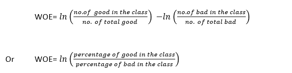
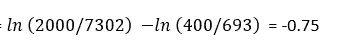
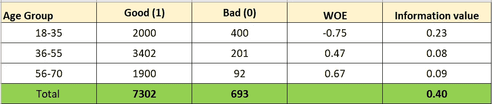
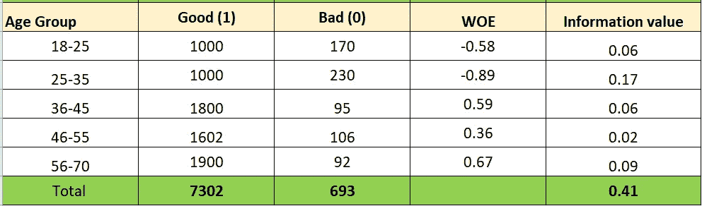
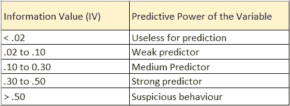

# 证据权重(WoE)和信息价值(IV) —如何在 EDA 和建模中使用？

> 原文：<https://medium.com/mlearning-ai/weight-of-evidence-woe-and-information-value-iv-how-to-use-it-in-eda-and-model-building-3b3b98efe0e8?source=collection_archive---------0----------------------->

证据权重(WoE)和信息价值(IV)可用于理解独立变量的预测能力。WoE 有助于理解某一类独立变量是否具有更高的好坏分布。

Image by author

# 如何计算 WOE 和 IV？

如果我们考虑一个二元分类，其中我们的目标变量是不良(0) /良好(1)贷款，我们有一个称为年龄组的特征，有 3 个类别(18-35，36-55，56-70)，我们可以使用下面的等式计算每个类别的权重系数:

在下面的示例中，共有 7302 个良好(1)观察，其中 2000 个属于 18-35 岁年龄组。同样，在总共 693 (0)个坏观察值中，400 个观察值属于 18-35 类。

> 18-35 岁阶层的悲哀=

Image by author

18–35 的负 WoE 值表示 18–35 岁年龄组的商品的**差** > **分布。**

现在，可以通过使用下面的等式来计算信息值:

***IV= WoE *(类中所有好的比例—类中所有坏的比例)***

因此，对于 18-35 岁的阶层，IV =-0.75 *(0.27—. 58)= . 23

年龄组的总体信息值为= (.23+ .08 + .09) = .40

# 哪里用 WoE？

## A.使用 WoE 分析执行特征的宁滨:

在 EDA 过程中，我们经常对分类变量和连续变量进行宁滨。假设在一个数据集中，我们将年龄作为连续变量，将好/坏贷款作为分类目标变量。我们可能有兴趣找到为不同年龄组创建分类的逻辑分离。首先，我们创建更多的年龄组，然后计算每个组的权重。如果存在 WOE 值的单调趋势(下降或上升),那么我们可以确认我们的仓具有一般趋势。如果它不是单调的，那么我们需要压缩容器以形成新的组，并且需要再次检查 WOE 值。因此，使用 WOE，我们可以为进一步的数据分析创建逻辑箱。

Image by author

在我们的第一次尝试中，我们为连续变量“年龄”创建了 5 个箱。但是这里看不到**单调趋势**。因此，在下一次尝试中，我们压缩了两个组并创建了 3 个 bin，如下所示。现在，我们可以看到不同类别“年龄”的单调趋势(WOE 值降低)。

Image by author

我们可以遵循相同的方法，将具有较高类别数量的序数和名义分类变量分组到较少数量的箱中。

## **B .使用 IV 进行二元逻辑回归的特征选择:**

我们可以计算一个独立变量的总体信息值，如果该值在 0.30 到 0.50 之间，我们可以认为该变量是一个强预测变量。任何 IV 小于 0.02 的变量都可以排除在我们的二元逻辑回归模型之外。下表显示了 IV 和变量预测能力之间的关系。

Image by author

在我们之前的例子中,“年龄”的 IV = .40，这使得它成为预测我们的目标变量(如果贷款是坏的/好的)的强预测器。

## C.使用权重值将连续变量转换为离散变量:

在上面的例子中，我们已经将连续变量“年龄”转换为分类变量，用于执行 EDA。我们可以进一步用它们的权重值替换这些类别，然后离散变量“年龄”可以用于我们的逻辑回归模型进行二元预测。它有助于模型变得更加稳定，并且“年龄”的微小变化不会影响模型。但这是有代价的。

你可以注意到一个有趣的事实。在将箱的数量从 5 个减少到 3 个之后,“年龄”变量的总信息值(IV)也减少了一点。每当我们使用宁滨将一个连续变量转换成一个分类变量或者减少一个分类变量的类别数量时，我们也**失去了该变量的一些预测能力**。

如果一个变量的总体 IV 是<= .1 then we consider it as a weak predictor and if IV is in between of .3 and .5 then it’s considered as a very good predictor.

## D. Using WoE value to transform Categorical Variables for model building:

During Binary Classification using Logistic Regression, it’s required to transform any categorical variables into numeric variables. One Hot Encoding and Label Encoding both have some dis-advantages. I am not going into too many details, but one disadvantage you may think of, when a nominal variable has too many classes and performing One Hot Encoding may lead to the **维数灾难**。

WOE 评分可用于将分类变量转换为数值变量。不同类别的计算的 WOE 值可以用来代替它们的实际值。因此，不需要为模型构建执行任何单独的编码。

**缺失值也可以分组**(比如“未知”类)，并且可以用计算出的 WoE 值进行估算。

WoE 是一种简单而强大的方法，在探索性/验证性数据分析和二元逻辑回归模型构建中非常有用。你需要记住，WoE 和信息值主要是针对二元 logistic 回归模型的。如果你打算使用任何其他分类算法，如 **SVM，决策树或随机森林，那么它不会给你最佳结果**。你能想到的一个原因，决策树或随机森林能识别自变量和目标变量之间的非线性关系。基于 IV 选择特征可能导致从模型中排除相关特征。