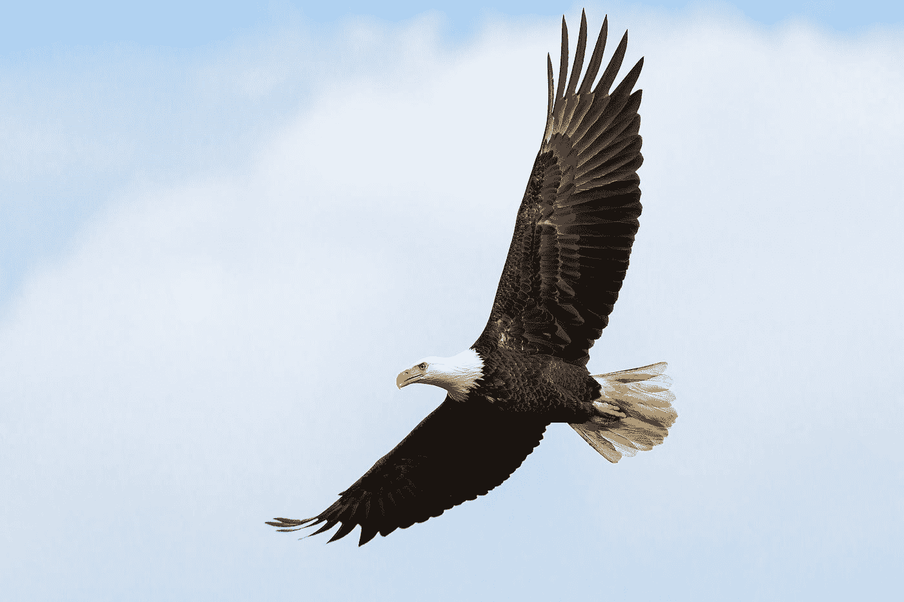
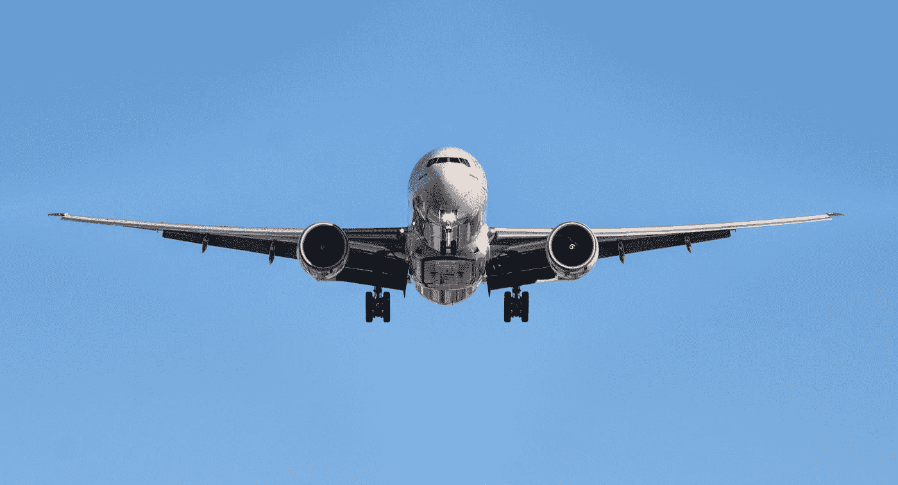
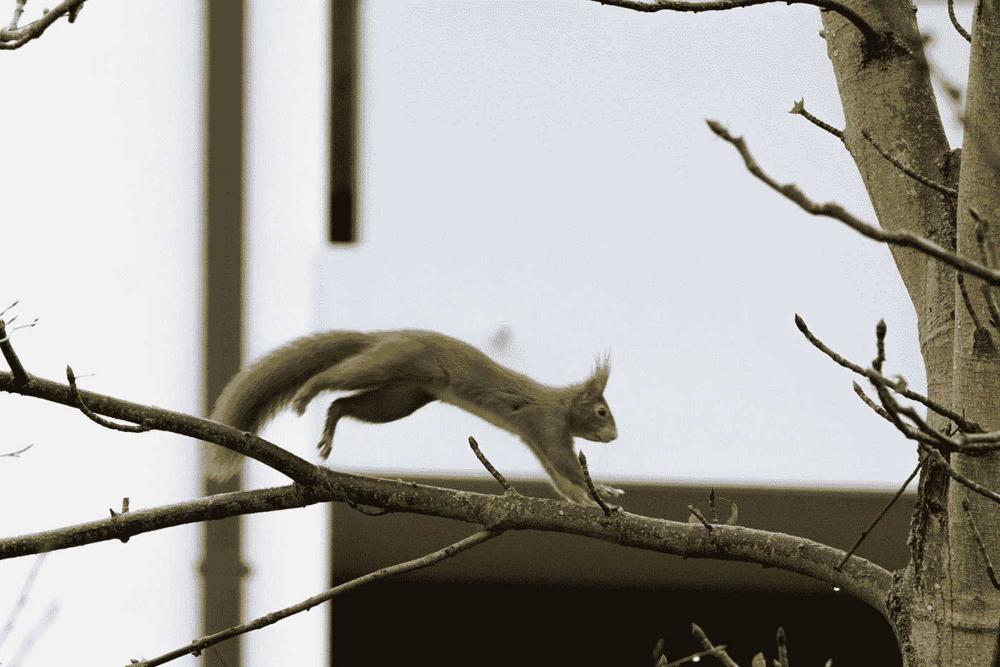
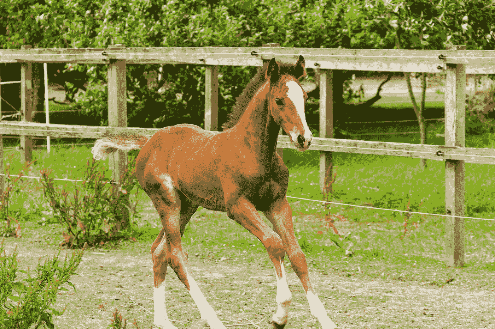
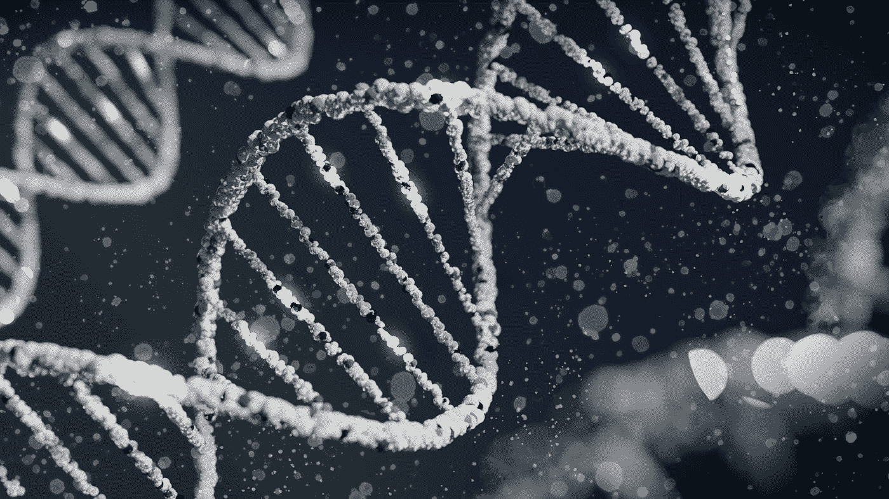
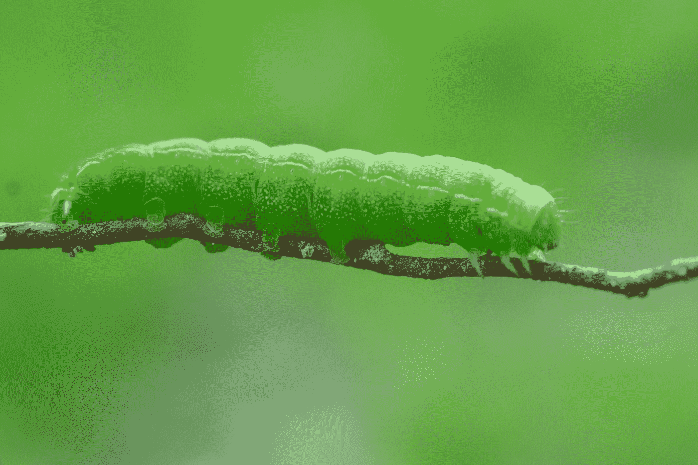
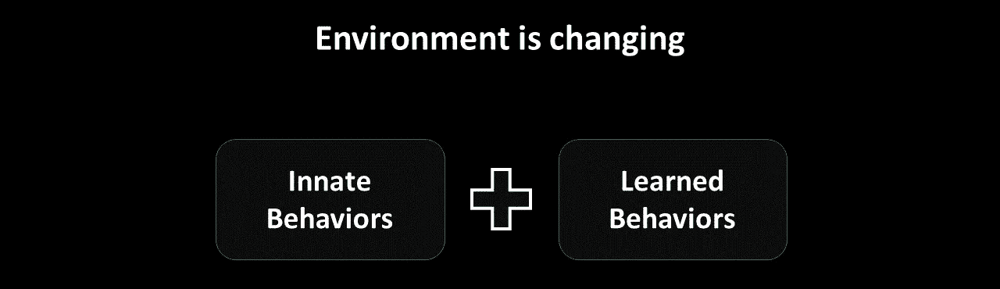
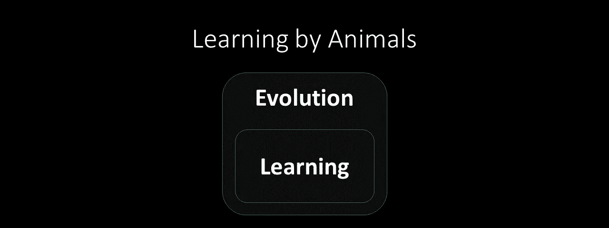

# 人工智能能从动物大脑中学到什么

> 原文：<https://medium.com/mlearning-ai/what-ai-can-learn-from-animal-brain-5c4c7af72601?source=collection_archive---------4----------------------->

## AI 能从动物大脑研究中受益吗？是的。

Photo by [Robina Weermeijer](https://unsplash.com/@averey?utm_source=medium&utm_medium=referral) on [Unsplash](https://unsplash.com?utm_source=medium&utm_medium=referral)

近年来，AI 领域的爆发主要是由于“**深度神经网络**”和巨大计算资源的可用性。海量数据的可用性和更好的“**监督学习**”算法也起到了催化作用。

这种对海量数据的过度依赖，与我们在自然界看到的形成了鲜明对比。

例如，我们不会给孩子很多苹果的图片来让他/她了解苹果。

Photo by [Meg Jenson](https://unsplash.com/es/@megjcreative?utm_source=medium&utm_medium=referral) on [Unsplash](https://unsplash.com?utm_source=medium&utm_medium=referral)

然而，人工智能领域进展非常快，每年都有更好的结果。

> 这一进展主要归功于[人工神经网络(ANNs)](https://en.wikipedia.org/wiki/Artificial_neural_network) 的发明，该网络旨在基于神经系统使用的计算原理构建人工系统，例如许多简单的单元，通过突触连接，并行操作(图 1)。

Figure 1 (Photo by author)

> 想到的问题是:**为了进步 AI，我们需要研究动物的大脑吗？**

根据安东尼·m·扎多尔的说法，我们仍然可以从研究动物大脑中学到很多东西，这对人工智能社区是有益的。他在论文中陈述了自己的论点: [**对纯学习的批判以及人工神经网络能从动物大脑中学习到什么**](https://www.nature.com/articles/s41467-019-11786-6) 发表在 2019 年《自然通讯》上。本文提供了论文中提出的论点。

# 反驳论点

可以用一只鸟的例子来反对文章的标题。

Photo by [Mathew Schwartz](https://unsplash.com/@cadop?utm_source=medium&utm_medium=referral) on [Unsplash](https://unsplash.com?utm_source=medium&utm_medium=referral)

我们知道鸟类擅长飞行，但我们已经发明了能飞得更快、更高、更远的飞机。鸟类的运作原理与飞机不同。

Photo by [Emanu](https://unsplash.com/@emanuux?utm_source=medium&utm_medium=referral) on [Unsplash](https://unsplash.com?utm_source=medium&utm_medium=referral)

因此，正如飞机与鸟类大不相同一样，我们可以想象智能机器的工作原理与生物机体的工作原理大不相同。

但这篇论文认为，在前面的例子中，即使飞机在某些方面更好，但鸟并不是为了飞得更快或飞得更高而设计的。而鸟类擅长的任务，飞机做不到像从树上无声无息地俯冲下来抓老鼠一样。

> 所以，一个**智能机器**，有时会被误称为“**人工通用智能**”——一点也不通用；它与人类能力的匹配非常紧密，只有结构类似于大脑的机器才能实现这一点。

因此，如果我们想设计一个能做我们所做的事情的系统，我们将需要根据相同的设计原则来构建它。因此，我们需要研究动物大脑的内部运作。

# 动物学习

在自然中可以找到的最有趣的观察结果之一是:**在没有大规模监督训练数据集的帮助下，动物如何在出生后这么快就表现得如此好？**

例如，一只松鼠可以在出生后几个月内从一棵树跳到另一棵树。

Photo by [Georg Eiermann](https://unsplash.com/@georgeiermann?utm_source=medium&utm_medium=referral) on [Unsplash](https://unsplash.com?utm_source=medium&utm_medium=referral)

小马出生后几小时内就能走路。

Photo by [Robert Hoffmann](https://unsplash.com/@rohoff703?utm_source=medium&utm_medium=referral) on [Unsplash](https://unsplash.com?utm_source=medium&utm_medium=referral)

这样一个问题的答案是，这些动物行为在出生时就已经存在，并且是从上一代遗传下来的。这些被称为**先天行为**。

> 这些先天的机制被编码在基因组中，这个基因组编码了连接神经系统的蓝图。

Photo by [Sangharsh Lohakare](https://unsplash.com/@sangharsh_l?utm_source=medium&utm_medium=referral) on [Unsplash](https://unsplash.com?utm_source=medium&utm_medium=referral)

在一些简单的生物体中，如蠕虫，*基因组有能力指定每个神经元之间的每一个连接，精确到最微小的细节。*

Photo by [Justin Lauria](https://unsplash.com/@justinlauria?utm_source=medium&utm_medium=referral) on [Unsplash](https://unsplash.com?utm_source=medium&utm_medium=referral)

> 因此，取而代之的是，基因组指定了一套在发育过程中连接大脑的规则。这被称为**基因组瓶颈**，因为基因组无法在大多数大脑中指定明确的线路图。

但是一项观察表明，动物的这些天生行为只有在环境不变的情况下才有用，而环境通常不会发生变化。

Figure 2 (Photo by author)

因此，**当环境发生变化时(图 2)，动物既需要先天行为，也需要后天行为，其中后天行为有助于动物适应环境。**

> 这些天生的行为是通过自然选择的进化而产生的。因此，进化和学习一样，也可以被看作是一种在比学习更长的时间尺度上提取统计规律的机制。

> 因此，动物的学习可以通过考虑两个嵌套的优化过程来总结(图 3):作用于世代时间尺度的外部"**进化**"循环，以及作用于单个个体一生的内部"**学习**"循环。

Figure 3 (Photo by author)

# 人工神经网络的含义

第一个观察结果表明，动物的大部分行为是天生的，而不是后天习得的。

> 解决一个新问题应该尝试建立在以前相关问题的解决方案上。

**第二个观察结果**是*基因组不直接编码表示或行为或直接编码优化原则，而是编码连接规则和模式，然后必须实例化行为和表示*。正是这些连线规则成为进化的目标。

> **这表明布线拓扑和网络架构应该是人工系统优化的目标。**

# 结论

最后，我想说的是，这篇论文给出了非常有趣的论点，关于当前一代的神经网络如何能够受益于对动物大脑进行的研究结果。

特别是观察到基因组只编码布线规则，显示了神经网络架构的重要性。

有兴趣的可以看看我关于这个话题的[视频](https://www.youtube.com/watch?v=SeKWU-wUfK8)。

 [## Mlearning.ai 提交建议

### 如何成为 Mlearning.ai 上的作家

medium.com](/mlearning-ai/mlearning-ai-submission-suggestions-b51e2b130bfb)