# 什么是购物篮分析和 apriori 算法？

> 原文：<https://medium.com/mlearning-ai/what-are-market-basket-analysis-and-the-apriori-algorithm-fe0e8e6e34d?source=collection_archive---------0----------------------->

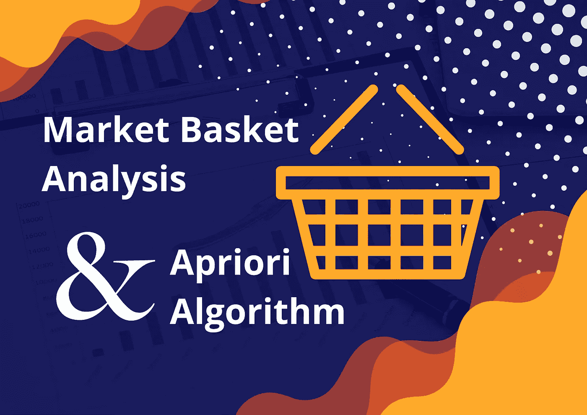

想象你是一个店主。这些是你可能想要回答的问题:

*   “店内摆放货架时，什么东西要放在什么东西的旁边？”
*   "对于在线购物应用程序，将向我们的客户推荐什么产品？"
*   "哪些产品应该在促销中一起推荐？"

应该执行市场购物篮分析的关联规则，以从大量交易数据中提取洞察力来回答这些问题。关联规则可以使用机器学习(或统计)来识别项目与购物篮中的项目之间的关系。

在本文中，我将介绍关联规则和 apriori 算法中的简单度量，这将减少关联规则的计算工作量。在编码之前理解这个概念是很重要的，因为编码很简单，但是翻译结果却很难。

# 例子

我们店里有 5 种商品，包括面包、黄油、果酱、牛奶和鸡蛋。数据库中有 5 个交易(篮子)。

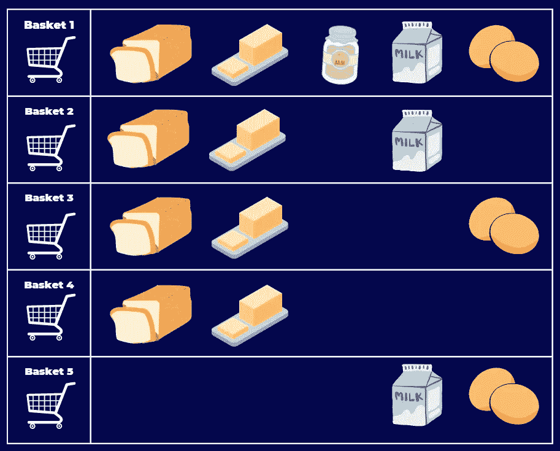

Transaction example

电脑会转换成这样的矩阵。

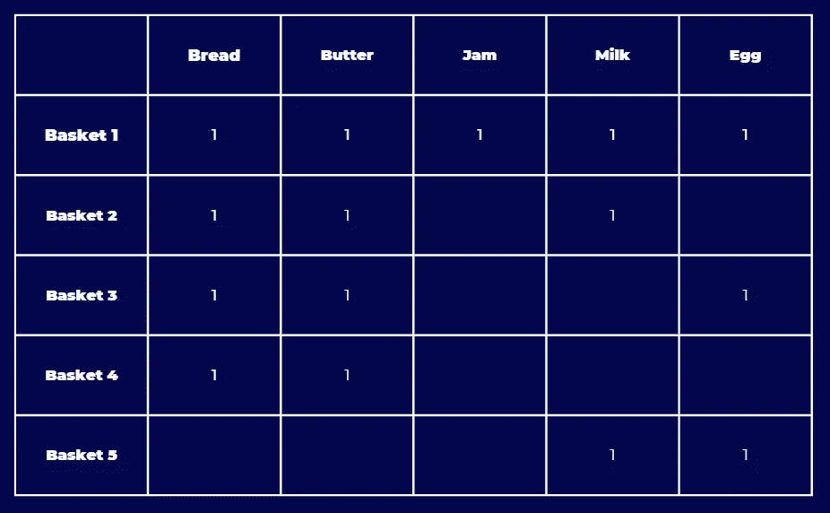

Transaction as a matrix

从事务数据集中，我们将计算可以指导我们业务行动的指标。本文涵盖了 5 个著名的指标:支持、信心、提升、杠杆和信念。

# 韵律学

## 1.支持

> 有多少事务包含此项目集？

Support 提供了一个项目集在所有事务中出现频率的概念。

支持值有助于我们确定值得考虑的规则，以便进一步分析。

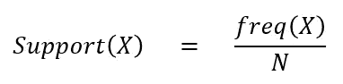

freq(X)是 X 在所有事务中出现的次数。

n 是事务总数。

**Ex** 。面包的支撑= 4/5 = 0.8

这些表显示了对大小为 1-2 的所有项目集的支持。你可以试着一起计算。

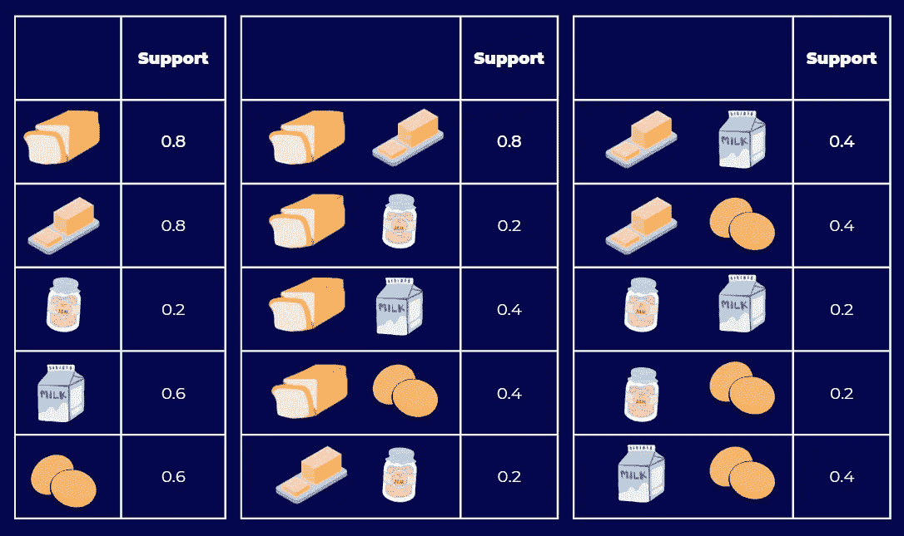

support of all itemset with size 1–2

> H 高支持意味着大多数顾客会购买这款商品，所以这款商品对我们店很重要。

我们可以过滤掉支持度低的项目集，因为出现次数太低，无法找到任何洞察(规则)。

## 2.信心

> 仅考虑包含物料 a 的事务处理。有多少事务处理包含物料 B？

置信度是一种条件概率(贝叶斯统计)。它定义了在给定某些项目(前提条件)已经存在于同一事务中的情况下，下列项目在该事务中出现的概率。

**例如。**
信心(面包→牛奶)= 2/4 = 0.5
信心(牛奶→果酱)= 1/3 = 0.33

下表显示了一些规则的可信度。

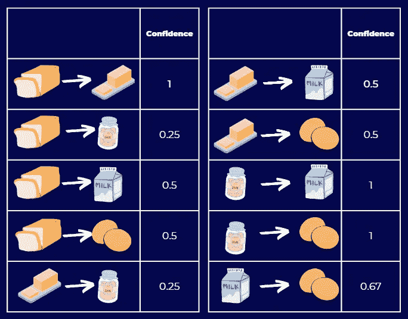

confidence of some rules

> 高置信度意味着包含 A 的篮子也可能包含 B。

然而，仅仅考虑信心的价值不足以做出任何商业决策。如果 B(跟随项集)是一个非常频繁的项集，那么与 B 相关的置信度总是很高。提升是另一个与信心一起考虑的指标。

## 3.电梯

> 交易中有没有 A 项，对 B 项有多大影响？

Lift 是给定 A 存在的情况下 B 发生的概率**与不知道 A 存在的情况下 B 发生的概率**之比****

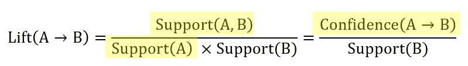

**Ex。**
升(面包→牛奶)= 0.5/0.4 = 1.25
升(牛奶→果酱)= 0.33/0.2 = 1.65

下表显示了一些规则的提升。

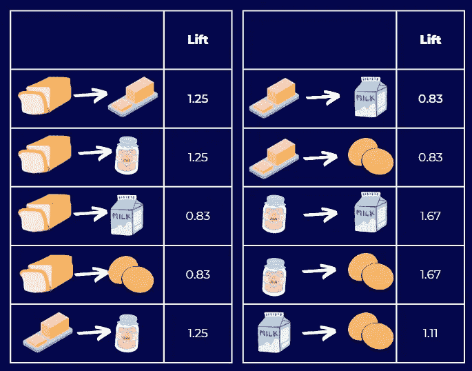

lift of some rules

> 如果 Lift 高于 1，则 A 在该事务中的出现导致 B 在同一事务中出现的概率更高。

有两个 matrics 可能不如前一个著名，但他们可以提供其他观点，所以知道他们是很好的。

## 4.杠杆作用

> 交易中有没有 A 项，对 B 项有多大影响？

杠杆计算 A 和 B 一起出现的概率，以及如果 A 和 B 是独立的，预期的频率。

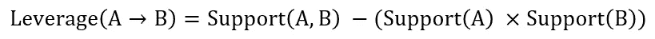

**Ex。**
杠杆(面包→牛奶)= 0.4-(0.8*0.6) = 0.08
杠杆(牛奶→果酱)= 0.2-(0.6*0.2) = 0.08

杠杆作用类似于升力，但更容易解释，因为它的范围是从-1 到 1，而升力的范围是从 0 到无穷大。

杠杆值为 0 表示独立。

## 5.定罪

> C 推理有助于判断该规则是否是偶然出现的。

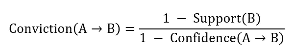

**例如。**
信念(面包→牛奶)=(1-0.4)/(1–0.5)= 1.2
信念(牛奶→果酱)=(1-0.2)(1–0.33)= 1.19

高确信值意味着后件高度依赖于前件(A)。可以解释为升力。

如果项目是独立的，信念是 1。

# Apriori 算法

由于项目集数量的增加会导致关联规则的指数增长，因此计算所有规则是没有效率的。如果我们有 10 项，则规则数为 57000！！！那么，100 件以上的超市呢？计算所有规则在计算上可能是昂贵的。

Apriori 算法旨在以最少的计算量发现重要的关联规则。

## 关联规则挖掘有两个步骤

1.  项目集生成
2.  规则生成

我们将看到 Apriori 算法如何在这两个步骤中帮助我们

## 1.项目集生成

> 我们只需要频繁项集。

频繁项集的支持度高于最小支持度。简单来说，它们是在所有事务中频繁出现的项目集。

最简单的方法是计算所有可能项目集的支持度。但是，项目集的数量随着项目的数量呈指数增长。

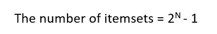

N =项目数量

例如，如果我们有 4 个项目，项目集的数量是 2⁴ -1 = 15。如果我们有 10 个项目，项目集的数量是 2 ⁰ -1 = 1023。

因此，计算所有项目集的支持度在计算上非常昂贵和耗时。

通过遵循 Apriori 原则，我们可以从支持度计算中删除许多项集。

> "项目集的超集对该项目集的支持度较低或相等"

它很直观，因为很难找到包含许多必需项目的交易。

**例如。**

这家商店有 4 种商品，包括面包、黄油、果酱和牛奶。

我们可以创建 15 个项目集，如下所示。

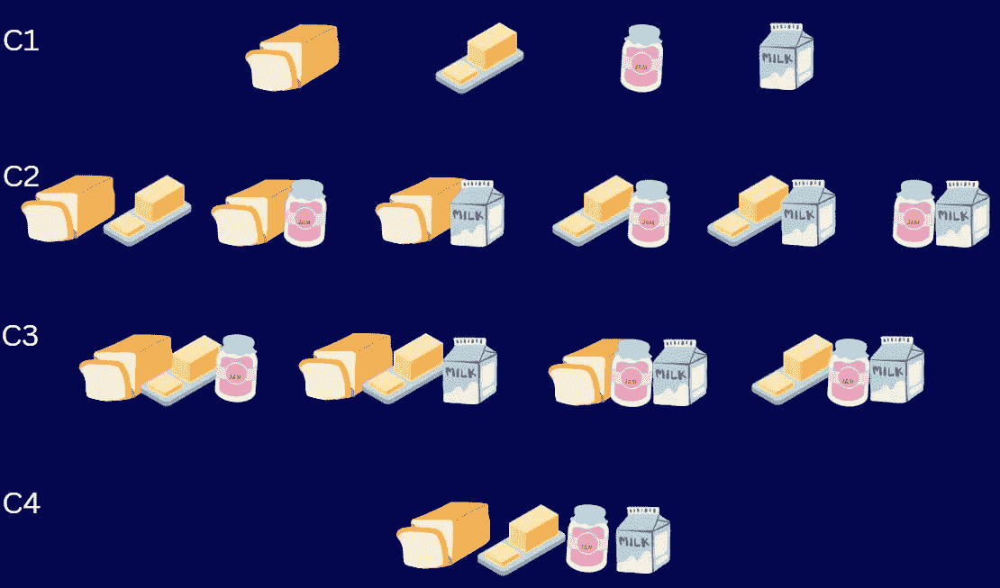

All itemsets

*   假设我们设置可接受的最小支持= 0.3。
*   如果面包的支持度小于 0.3，那么面包的所有超集的支持度也将小于 0.3。
*   然后，我们可以从支持度计算中排除所有的面包超集。我们称之为“基于支持的修剪”

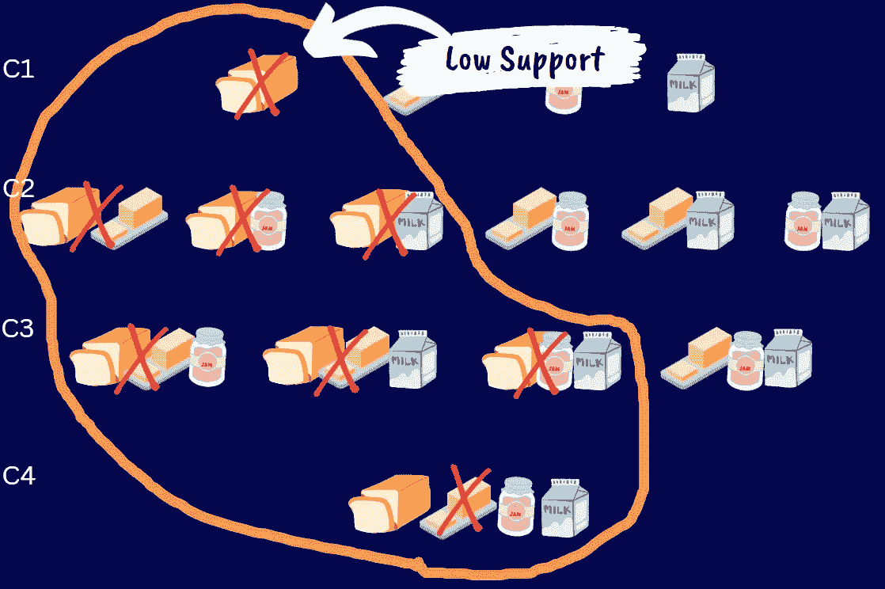

All itemset with the Apriori algorithm

计算量可以大大减少一半。

在下面创建一个流程图，使它更系统化。

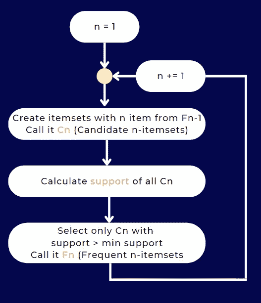

Apriori Itemset Generation Flowchart

F0 是商店中所有商品的列表。

有了频繁项集之后，我们现在可以创建一个关联规则。

## 2.规则生成

> 我们只需要高可信度的规则。

识别重要规则的一种方法是只过滤具有高置信度的规则，因为这意味着项目 A 和 B 之间的相关性很高。

然而，计算所有规则的置信度也是没有效率的(规则的数量甚至高于项目集的数量)。

通过遵循先验原则，我们可以从置信度计算中删除许多规则。

> “当结果项的数量较高时，来自同一项集的规则的可信度会较低”

例如，如果我们在项集中有 4 项:A，B，C，D .
(A，B，C→ D) ≥ (A，B → C，D) ≥ (A → B，C，D)的置信度。

为了证明这一点，我要回忆一下信心的公式。

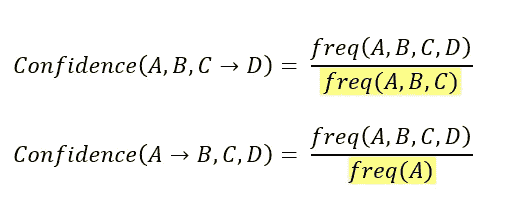

这两个规则之间的区别只是分母。
正如我们在步骤 1 中谈到的支持，更多的项目将导致更低的支持(更低的频率)，因此第一个规则具有更低的分母和更高的置信度。

我们可以像在步骤 1 中一样执行“基于置信度的修剪”。我们将从只有一个结果的规则开始。

一开始可能会很困惑。我的建议是只关注结果(箭头后面的项目),就像我们过去对待支持一样。

**Ex。**

这家商店有 4 种商品，包括面包、黄油、果酱和牛奶。

我们可以创建 14 条规则，如下图所示。

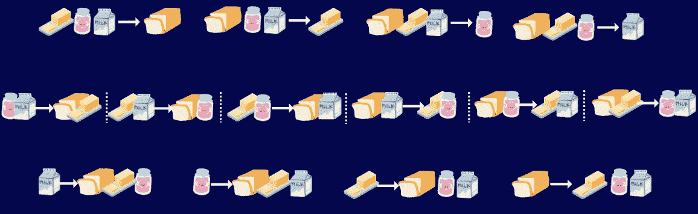

All rules

*   假设我们设定可接受的最小置信度= 0.3。
*   如果{黄油，果酱，牛奶}→{面包}的置信度小于 0.3，那么所有结果是面包超集的规则也将具有小于 0.3 的置信度。
*   然后，我们可以从置信度计算中排除所有结果是面包超集的规则。

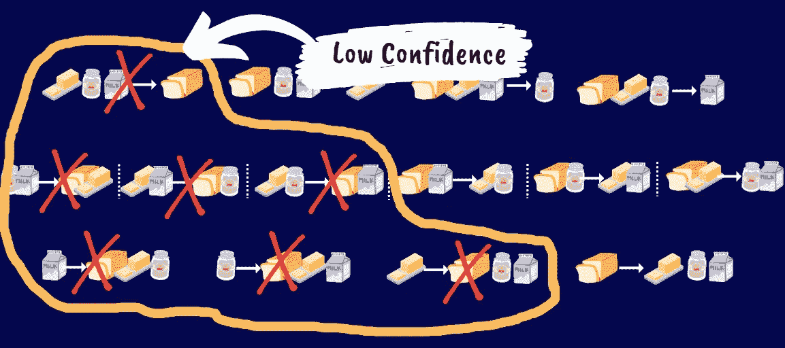

All rules with the Apriori algorithm

在我们完成 1 个项目集之后，我们转移到其他频繁项目集。

最后，我们将从剩余的规则中计算提升，并利用这些数据做出业务决策！

# 结论

在本文中，我将介绍市场篮子分析中的指标，包括支持、信心、提升、杠杆和信念。然后，介绍了 apriori 算法，该算法通过删除一些不符合标准的规则来减少关联规则的计算量。

希望你理解先验的概念。乍一看这似乎很难，但用 Python 或 R 编程实现时会非常简单。

如果你喜欢这篇文章，请关注我了解更多数据科学内容。

 [## Mlearning.ai 提交建议

### 如何成为 Mlearning.ai 上的作家

medium.com](/mlearning-ai/mlearning-ai-submission-suggestions-b51e2b130bfb)