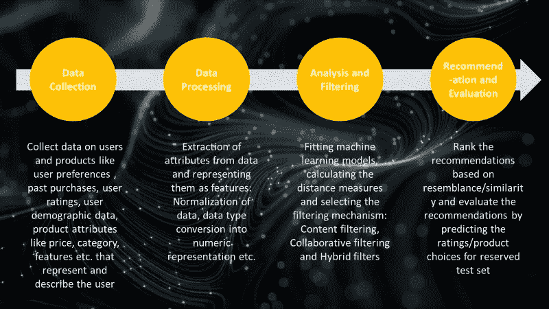
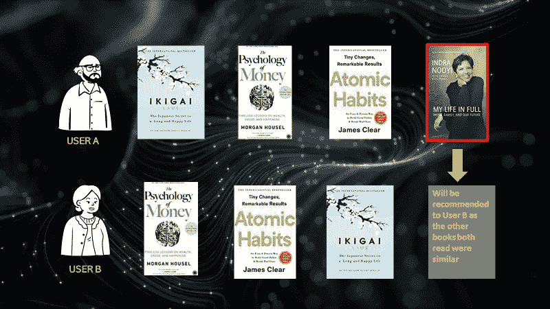
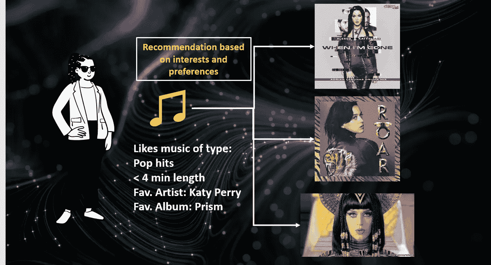

# 什么是推荐系统，他们如何在你知道之前就知道你想要什么

> 原文：<https://medium.com/mlearning-ai/what-are-recommendation-systems-and-how-do-they-know-exactly-what-you-want-even-before-you-do-c18eadc13f81?source=collection_archive---------7----------------------->

## 推荐系统是影响你购买决定的超级强大的秘密推销员

Image by [Geralt](https://pixabay.com/users/geralt-9301/) on [Pixabay](https://pixabay.com/illustrations/hands-smartphone-social-media-1167618/)

我和我的丈夫喜欢看恐怖/惊悚电影，网飞从不辜负我们对下一部电影的推荐。我的父母喜欢面向家庭和信仰的电影，当他们登录他们的个人资料时，他们就会得到这些类型的电影。作为一个拥有数百万游戏的大型 OTT 平台，网飞如何根据您的喜好准确推荐您正在寻找的内容？—它使用**推荐系统**进行推荐。向我推荐虔诚的电影或者向我的父母推荐心理惊悚片也不会出错。这些系统通过收集有关您的电影偏好、评级、观看/未观看的内容、语言偏好等数据，不断了解您的选择和偏好。现在让我们了解什么是推荐系统，以及它们是如何构建和使用的。

如今推荐系统无处不在，从网飞上的电影推荐到亚马逊上的产品推荐，甚至是 Medium 上的故事推荐。这些应用程序会根据你的观看和购买历史准确地推荐你正在寻找的东西，并说“既然你喜欢这个，你可能也会……”欢迎来到超个性化时代，这让你节省了浏览大量内容/无数商品的时间和痛苦，以找到最适合你的，有时也会欺骗你购买你根本不需要的东西。**简而言之，推荐系统是使用机器学习技术构建的，可以帮助用户根据他们的购买习惯、偏好和历史购买行为选择他们想要的东西**。他们通过个性化推荐和节省大量搜索时间来帮助用户

# 推荐系统是如何工作的:

推荐系统依赖于不同种类的关系和数据属性。它使用产品-产品关系、用户-用户和用户-产品关系来确定推荐。一旦考虑到这种关系，它就会寻找产品属性之间的相似性，如所选电影的演员阵容、电影的评级、流派等。将这些作为**功能**烘焙到推荐系统中。如果一个用户基于他的购买/观看历史与另一个用户相似，则系统基于第一个用户的选择来预测下一个选择。

无论是哪种类型的推荐系统(将在下一节中简要介绍)，大多数都使用**距离**度量来衡量用户或产品之间的相似性。有不同种类的距离度量，如曼哈顿距离、欧几里德距离、余弦相似性、雅克卡相似性、皮尔逊系数、Tf-IDF 等。，(你可以在我放在下面的第一个资源链接中了解每个距离)。当数据很大并且需要减少特征空间时，也可能涉及维数减少(PCA 和 SVD 通常用于此)

Key steps in building a recommendation system, Image by Author

# 推荐系统的类型

常用的推荐系统有 3 种类型:

1.  协同过滤
2.  内容过滤和
3.  混合系统

# **协同过滤**

它基于用户/商品之间的**相似性，基于他们购买的商品**。如果历史上用户 A 购买了 4 本书，其中 3 本与用户 B 相同，那么它将向用户 B 推荐第 4 本书。它们是两种类型的协同过滤:基于用户的过滤(其中测量用户相似性)和基于项目的过滤(其中考虑项目之间的项目相似性)

Collaborative Filtering, Image by Author

# **内容过滤**

它基于产品的内容相似性和用户的喜好和偏好，这意味着它考虑了**产品属性**(历史购买)**如电影/小说的类型、产品的实用性(如音乐)、推荐科学文献时内容/词语的相似性(通过 TF-IDF 测量)等。换句话说，基于内容的过滤考虑到了用户的属性和偏好，挖掘了用户与自己的关系。**

****

**Content-based filtering, Image by author**

# ****混合滤波****

**它使用用户偏好和用户之间的关系来设计推荐(协作和内容过滤的混合)**

****协作过滤和内容过滤的主要区别:****

**基于内容的推荐系统试图推荐与给定用户过去喜欢的项目相似的项目，而根据协作推荐范例设计的系统识别其偏好与给定用户的偏好相似的用户，并推荐他们喜欢的项目**

**一些先进的[推荐系统使用图形数据库](https://47billion.com/blog/recommendation-system-using-graph-database/)来跟踪用户和项目的依赖关系，并基于联系(强联系、弱联系等)进行推荐。,).还有基于邻居的、基于知识的、上下文感知的推荐系统，可以在这里[学习](https://www.cse.iitk.ac.in/users/nsrivast/HCC/Recommender_systems_handbook.pdf)**

**推荐系统的最后一步是测试/评估模型，根据测试数据(不可见且不用于建模的数据)预测用户选择/评级，以衡量您的预测与真实数据的接近程度。**

# **为您学习和构建自己的推荐系统预先选择的有用资源**

**广泛的/扩展的介绍和推荐系统使用的方法:[Francesco Ricci 等人的推荐系统手册](https://www.cse.iitk.ac.in/users/nsrivast/HCC/Recommender_systems_handbook.pdf)**

**构建推荐系统的详细概述和代码的最佳资源:[badre esh Shetty 的《推荐系统如何工作的深度指南》](https://builtin.com/data-science/recommender-systems)**

**在 LinkedIn Learning 上用 python 温和的介绍和构建推荐系统的视频课程:[用 Python 机器学习和 AI 构建推荐系统](https://www.linkedin.com/learning/building-a-recommendation-system-with-python-machine-learning-ai?u=2274545)**

** [## Mlearning.ai 提交建议

### 如何成为 Mlearning.ai 上的作家

medium.com](/mlearning-ai/mlearning-ai-submission-suggestions-b51e2b130bfb)**