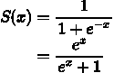
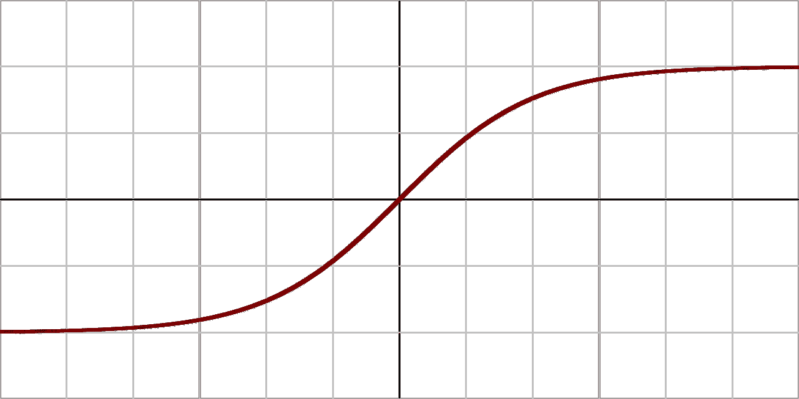
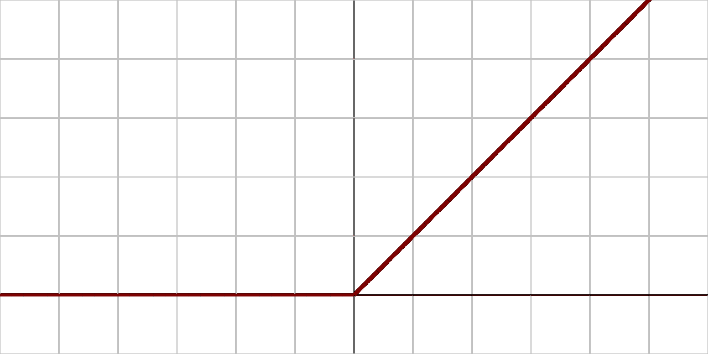
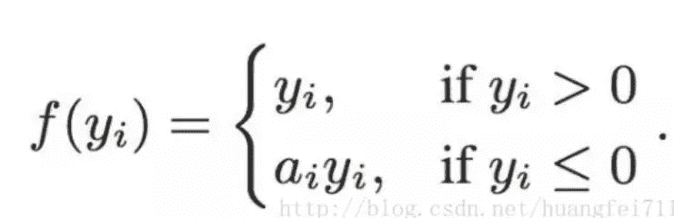
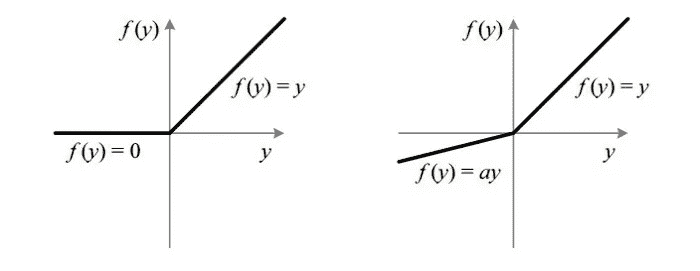

# 机器学习中的激活函数有哪些？

> 原文：<https://medium.com/mlearning-ai/what-are-the-activation-functions-in-machine-learning-37bae6888858?source=collection_archive---------5----------------------->

Photo by [Possessed Photography](https://unsplash.com/@possessedphotography?utm_source=medium&utm_medium=referral) on [Unsplash](https://unsplash.com?utm_source=medium&utm_medium=referral)

人们会对机器学习和数据科学的流行应用感到惊讶。有许多行业转向人工智能以增强其应用。据 **Forbes** 报道，数据科学被认为是当前就业市场上极具价值的工作。有公司寻求数据科学和人工智能方面的专业人士。

Photo by [Rock'n Roll Monkey](https://unsplash.com/@rocknrollmonkey?utm_source=medium&utm_medium=referral) on [Unsplash](https://unsplash.com?utm_source=medium&utm_medium=referral)

有了一个健壮的机器学习模型，就有可能为社会中一些错综复杂的问题提供解决方案。例如，来自算法的预测可以用于检测癌症的**存在或不存在。或者它们可以被部署在其他应用中，例如**通信网络**，其中这些可以被用来预测线路故障的可能性等等。随着人工智能研究和潜在应用的兴起，应用似乎是无止境的。**

因此，有必要了解这些算法工作背后的理论，以便实际做出预测，为许多应用产生最佳结果。机器学习中经常出现的东西是正在使用的激活函数，尤其是在深度学习中。因此，深入理解激活功能在深度学习领域也非常有用。现在让我们回顾一下正在使用的一些激活功能。

## **什么是激活功能？**

训练神经网络时，在网络中添加激活单元以确保模型表现良好是很重要的。激活函数增加了结构中的非线性，从而可以识别输入和输出之间的复杂关系。现在让我们回顾一下可以在我们的网络中使用的各种激活功能。

## 乙状结肠:

下面是 **sigmoid** 函数的数学表达式。它使用指数来计算输入的激活。对于**二级分类问题**，使用**s 形**最为合适。

Sigmoid Activation Function

[Sigmoid function — Wikipedia](https://en.wikipedia.org/wiki/Sigmoid_function)

高度负值的 **sigmoid** 函数的值趋向于 0。类似地，从图中可以看出，随着对它的输入的增加，它的值改变并趋向于 1。基于此，可以看出使用 **sigmoid** 函数来解决**二级分类问题**最为合适。

## **谭:**

从下面可以看出 **tanh** 激活与 **sigmoid** 功能的不同之处。有许多指数值，这也导致不同于 a**s 形**的曲线。

[Activation Functions — All You Need To Know! | by Sukanya Bag | Analytics Vidhya | Medium](/analytics-vidhya/activation-functions-all-you-need-to-know-355a850d025e)

[Activation function — Wikipedia](https://en.wikipedia.org/wiki/Activation_function)

双曲正切函数的值分别位于 **-1** 和 **1** 之间。随着输入值不断向正方向增加，来自 **tanh** 的输出将趋向于 1。类似地，随着输入不断减少，由 **tanh，**产生的输出也会减少，并趋向于-1。

## **ReLU:**

这个函数在深度学习应用中相当流行。当训练具有良好层数的大型深度神经网络时，在执行**反向传播**时，梯度可能会变为 0。结果，这就导致了一个叫做消失梯度的问题。

为了避免这种情况，使用 **ReLU** 来避免该问题，因为该值在 0 之后增加，以此类推。通过实验还得知 **ReLU** 在深度学习方面的表现优于 sigmoid。下面是 **ReLU** 的表达式。

[Activation Functions — All You Need To Know! | by Sukanya Bag | Analytics Vidhya | Medium](/analytics-vidhya/activation-functions-all-you-need-to-know-355a850d025e)

[Activation function — Wikipedia](https://en.wikipedia.org/wiki/Activation_function)

## **泄漏的 ReLU:**

该函数与 **ReLU** 函数非常相似，除了当其输入小于 0 时，会有一个小斜率，而不是值完全变为 0。结果，这导致消失梯度问题的良好减少。

[Activation Functions — All You Need To Know! | by Sukanya Bag | Analytics Vidhya | Medium](/analytics-vidhya/activation-functions-all-you-need-to-know-355a850d025e)

[Activation Functions — All You Need To Know! | by Sukanya Bag | Analytics Vidhya | Medium](/analytics-vidhya/activation-functions-all-you-need-to-know-355a850d025e)

从上面可以看出 **ReLU** 和**泄漏 ReLU** 之间的区别。随着输入值不断下降到 0 以下，输出也会有小幅下降。然而，在 **ReLU** 的情况下，这种减少导致输出等于 0。

## 结论

在看了这些函数之后，对于大多数深度学习功能来说，使用 **ReLU** 将是理想的。但是 S **igmoid** 可以用在二进制分类问题的最后一层。 **ReLU** 和 **Leaky ReLU** 是在许多应用中使用的相当流行的激活函数。

但是，请在您的一些应用程序中随意测试这些激活函数，通过比较实际输出和模型的预测输出，看看哪一个执行得最好！

希望这篇文章对你有所帮助。欢迎分享您的想法和反馈。谢了。

 [## Mlearning.ai 提交建议

### 如何成为 Mlearning.ai 上的作家

medium.com](/mlearning-ai/mlearning-ai-submission-suggestions-b51e2b130bfb)