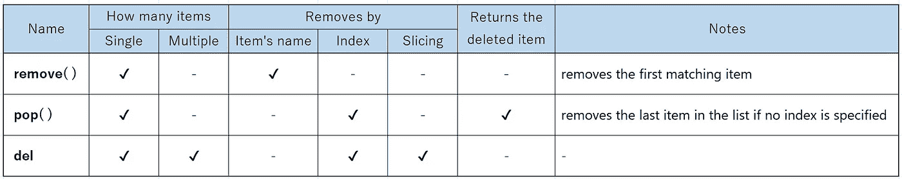

# Python 中的 remove()、pop()和 del 有什么区别？

> 原文：<https://medium.com/mlearning-ai/what-are-the-differences-between-remove-pop-and-del-in-python-f20dca97006b?source=collection_archive---------7----------------------->

## 通过示例代码了解


Photo by [Rubaitul Azad](https://unsplash.com/@rubaitulazad?utm_source=medium&utm_medium=referral) on [Unsplash](https://unsplash.com?utm_source=medium&utm_medium=referral)

# 介绍

您可能已经知道所有这些在 Python 中移除列表中的项目。

1.  移除()
2.  流行()
3.  倒三角形

**但是有什么区别呢？**

# 结论



Differences between item removing techniques in Python list

# 让我们编码并检查！

## 1.移除()

`remove`方法按名称删除单个项目(仅第一个匹配的项目)

```
letters = ['a', 'b', 'c', 'd', 'e']
letters.remove('b')
print(letters)-> ['a', 'c', 'd', 'e']
```

## 2.流行()

`pop`方法根据索引删除单个项目

```
letters = ['a', 'b', 'c', 'd', 'e']
letters.pop(1)
print(letters)-> ['a', 'c', 'd', 'e']
```

`pop`方法实际上返回了被移除的项

```
letters = ['a', 'b', 'c', 'd', 'e']
removed_item = letters.pop(1)
print(removed_item)-> b
```

注意`remove`和`del`不返回移除的项目。因此，当您尝试上述操作时，他们不会显示任何内容

```
letters = ['a', 'b', 'c', 'd', 'e']
removed_item = letters.remove('b')
print(removed_item)-> None
```

如果没有指定索引，方法删除列表中的最后一项

```
letters = ['a', 'b', 'c', 'd', 'e']
letters.pop()
print(letters)-> ['a', 'b', 'c', 'd']
```

## 3.倒三角形

`del`语句根据索引删除单个项目

```
letters = ['a', 'b', 'c', 'd', 'e']
del letters[1]
print(letters)-> ['a', 'c', 'd', 'e']
```

`del`语句通过切片移除多个项目

```
letters = ['a', 'b', 'c', 'd', 'e']
del letters[1:3]
print(letters)-> ['a', 'd', 'e']
```

结束:)

# 结束语

我想分享这个话题的原因是，我目前在工作中教授 Python，发现许多学生对这些差异感到困惑。所以我想和你分享一下也是有帮助的。

我希望你觉得这篇文章可读。如果你觉得有些地方遗漏了或者解释不清楚，我很抱歉。我想简单地解释一下，不想把事情弄得太复杂。无论如何，非常感谢你的阅读！

# 参考

[5。数据结构— Python 3.10.4 文档](https://docs.python.org/3/tutorial/datastructures.html)

[](/mlearning-ai/mlearning-ai-submission-suggestions-b51e2b130bfb) [## Mlearning.ai 提交建议

### 如何成为 Mlearning.ai 上的作家

medium.com](/mlearning-ai/mlearning-ai-submission-suggestions-b51e2b130bfb)