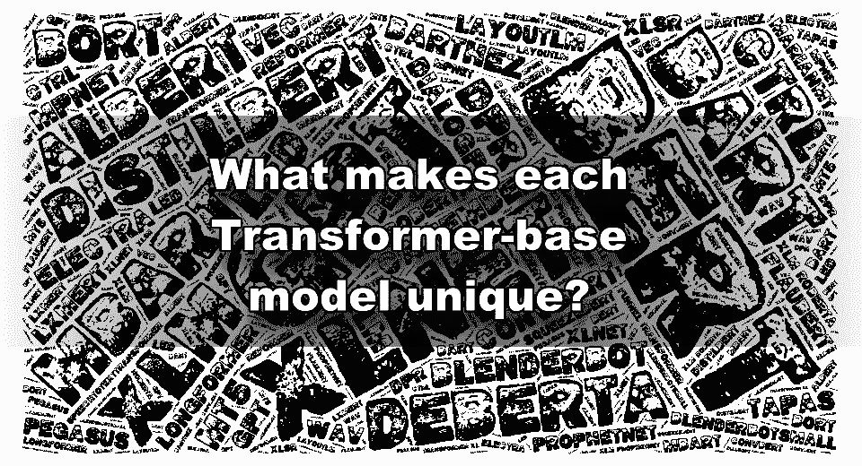

# 预先训练好的基于变压器的模型有什么不同，比如 BERT、DistilBERT、XLNet、GPT、XLNet 等等

> 原文：<https://medium.com/mlearning-ai/what-are-the-differences-in-pre-trained-transformer-base-models-like-bert-distilbert-xlnet-gpt-4b3ea30ef3d7?source=collection_archive---------0----------------------->

这篇文章是基于 Transformer 的著名模型的备忘单，并试图解释它们的独特性(尽管它们都基于相同的架构)。

Transformer 架构和迁移学习的结合正在主宰自然语言处理世界。那里…