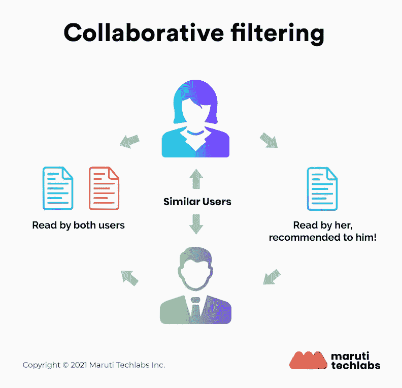
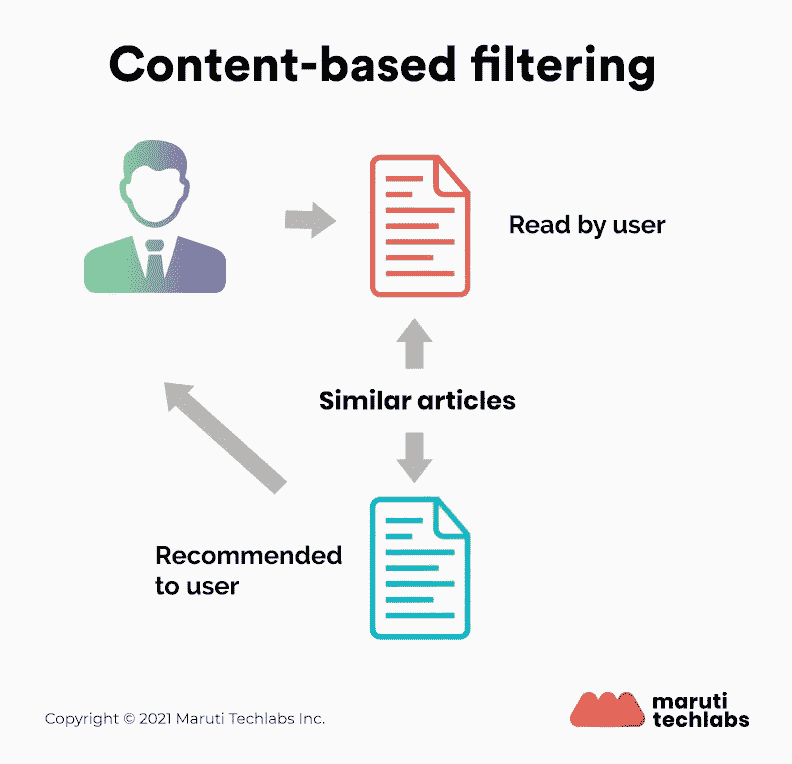
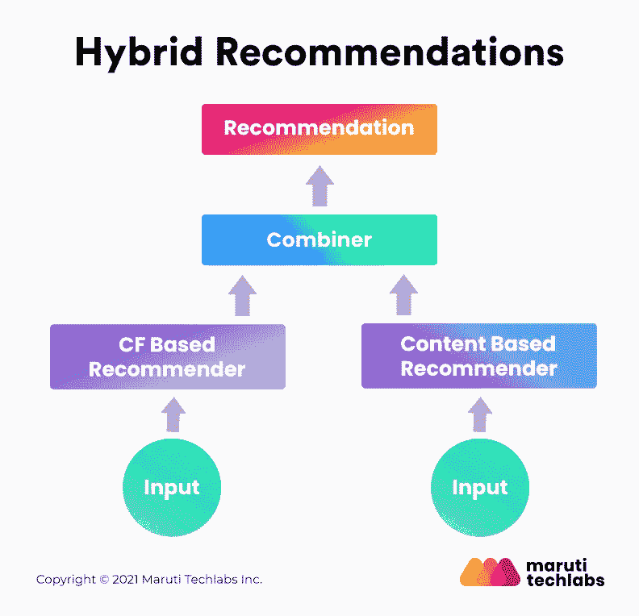

# 推荐系统的类型及其用例

> 原文：<https://medium.com/mlearning-ai/what-are-the-types-of-recommendation-systems-3487cbafa7c9?source=collection_archive---------0----------------------->

电子商务和零售公司正在利用数据的力量，借助在其网站上实施的推荐系统来促进销售。这些系统的使用案例一直在增加。没有比现在更好的时间来深入研究这种优秀的机器学习技术了。

随着网上购物的增加，对购买产品的信心的需求也增加了。这就是为什么推荐系统被建立。

> 这篇博客文章将着眼于流行的推荐系统的类型，它们是如何工作的，以及它们的使用案例。

嘿，你好！这篇博客差不多有 ***2500+字*** *长，可能要花* ***~10 分钟*** *才能走完整件事。我们理解你可能没有那么多时间。*

*这也正是我们做了一个* ***短视频*** *的原因。不到 2 分钟，总结了* ***推荐引擎是如何工作的？&有什么好处？我们希望这有助于你了解更多并节省你的时间。干杯！***

# 推荐系统是如何工作的？

推荐系统使用专门的算法和机器学习解决方案。在自动配置、协调和管理[机器学习预测分析算法](https://marutitech.com/machine-learning-predictive-analytics/?utm_source=medium&utm_medium=content_promotion&utm_campaign=Types_Of_Recommendation_Systems)的驱动下，推荐系统可以明智地选择哪些过滤器适用于特定用户的特定情况。它有助于营销人员最大限度地提高转化率和平均订单价值。

推荐系统可以预测用户评分，甚至在他们提供之前，这使他们成为一个有效的工具。推荐系统主要通过以下四个阶段处理数据

*   **收藏**

收集的数据可以是显性的(对产品的评分和评论)或隐性的(页面浏览量、订单历史等)。).

*   **储存**

用于创建建议的数据类型可以帮助您决定应该使用的存储类型——NoSQL 数据库、对象存储或标准 SQL 数据库。

*   **正在分析**

推荐系统在分析后找到具有相似用户参与度数据的项目。

*   **过滤**

这是最后一步，在这一步中，数据被过滤以访问向用户提供推荐所需的相关信息。要实现这一点，您需要选择一个适合推荐系统的算法。

# 推荐系统的类型

[机器学习解决了许多问题](https://marutitech.com/problems-solved-machine-learning/?utm_source=medium&utm_medium=content_promotion&utm_campaign=Types_Of_Recommendation_Systems)但是提出产品建议是机器学习的一个广为人知的应用。有三种主要类型的推荐系统

**1。协同过滤**

协作过滤方法基于收集和分析用户行为数据。这包括用户的在线活动，以及基于与其他用户的相似性来预测他们会喜欢什么。

例如，如果用户 A 喜欢苹果、香蕉和芒果，而用户 B 喜欢苹果、香蕉和菠萝蜜，他们有相似的兴趣。所以，很有可能 A 喜欢菠萝蜜，B 喜欢芒果。这就是协同过滤是如何发生的。

*使用的两种协同过滤技术是:*

*   用户-用户协同过滤
*   项目-项目协同过滤

这种推荐系统的一个主要优点是，它可以在不了解对象本身的情况下精确地推荐复杂的项目。不依赖机器可分析的内容。

**2。基于内容的过滤**

基于内容的过滤方法是基于产品的描述和用户偏好选择的概况。在这个推荐系统中，使用关键字来描述产品，并且建立用户简档来表达该用户喜欢的商品种类。

例如，如果用户喜欢看电影，如钢铁侠，推荐系统推荐超级英雄类型的电影或描述托尼·斯塔克的电影。

基于内容的过滤的中心假设是，如果你喜欢一个特定的项目，你也会喜欢一个类似的项目。

**3。混合推荐系统**

在混合推荐系统中，同时使用基于内容和协同过滤来推荐产品，以向客户推荐更广泛的产品。这个推荐系统是后起之秀，据说能提供比其他推荐系统更准确的推荐。

网飞是混合推荐系统的一个很好的例子。它通过并列用户的观看和搜索习惯，并在该平台上找到相似的用户来进行推荐。这样，网飞使用协同过滤。

通过推荐与用户评价高的节目/电影有相似特征的节目/电影，网飞使用了基于内容的过滤。他们还可以否决推荐系统中的常见问题，如冷启动和数据不足问题。

**总结**

在当今的数字时代，在系统中包含推荐是一项值得做的投资。推荐系统不仅能提升用户体验和参与度，还能为企业带来更多收入。

然而，开发一个推荐系统需要对数据有深刻的理解。你的推荐系统的有效性取决于它的设计。在马鲁蒂技术实验室，我们的机器学习专家可以在[机器学习服务](https://marutitech.com/machine-learning-services/?utm_source=medium&utm_medium=content_promotion&utm_campaign=Types_Of_Recommendation_Systems)的帮助下帮助您解决业务挑战。我们的专家精通[深度学习框架](https://marutitech.com/top-8-deep-learning-frameworks/?utm_source=medium&utm_medium=content_promotion&utm_campaign=Types_Of_Recommendation_Systems)、监督学习、非监督学习、强化学习等等。

如果您希望改进您的推荐系统以获得更好的业务产出，[今天就联系](https://marutitech.com/contact-us/?utm_source=medium&utm_medium=content_promotion&utm_campaign=Types_Of_Recommendation_Systems)我们。