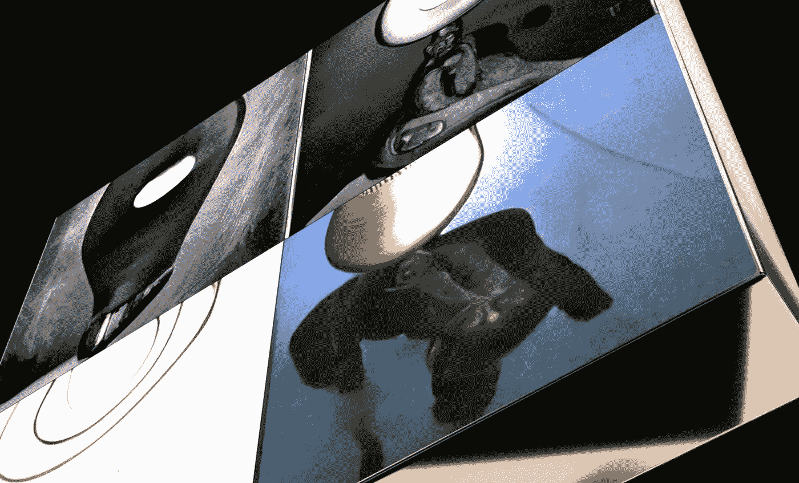

# 艺术能为 ai #2 做什么

> 原文：<https://medium.com/mlearning-ai/what-art-can-do-for-ai-2-a2f1663a457f?source=collection_archive---------4----------------------->

## 趋势

[It shines when nothing else will. The Light That Had Finally Escaped Itself.](https://www.hicetnunc.xyz/objkt/41700)

[OBJKT#41700](https://www.hicetnunc.xyz/objkt/41700)

这个星球上的艺术对人类社会来说一直是有争议的。这是一个许多人都有强烈感受的问题，并且经常对它的含义、应该如何使用、它的起源以及它在当今世界中的地位有不同意见。艺术为我们提供了多种方式来表达我们的创造力和情感。