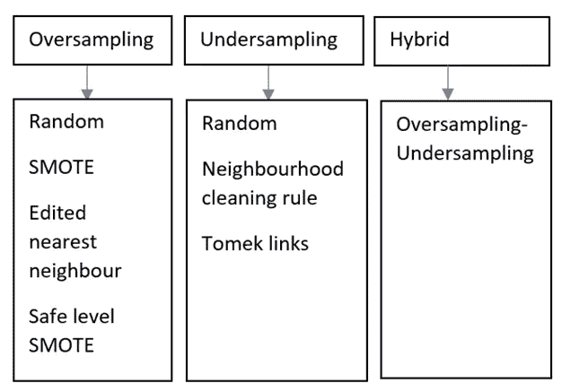

# 关于不平衡的数据集，数据科学家们一直忽略了什么

> 原文：<https://medium.com/mlearning-ai/what-data-scientists-keep-missing-about-imbalanced-datasets-d1f10e808297?source=collection_archive---------0----------------------->

Figure 1: ([https://unsplash.com/photos/JKUTrJ4vK00](https://unsplash.com/photos/JKUTrJ4vK00))

许多数据科学家未能完全理解不平衡数据集导致的问题以及缓解这些问题的方法。

作为数据科学家，我们会遇到许多不同的数据集，其中某些类型的数据实例(称为多数类)明显占优势，而其他类型的数据实例(少数类)则明显不足。这对于数据科学的实践具有重要意义，在数据科学中，简单地在具有这种特征的数据集上训练模型可能会导致偏向大多数类。例如，如果我们专注于预测心脏病，并有一个数据集，其中 20 人患有心脏病，80 人没有，我们可以有一个模型，每次都预测没有疾病，因此实现了 80%的可靠准确性得分和 88%的 F1 得分。

尽管这是一个众所周知的问题，但在太多的情况下，数据科学家忽略了这个问题，只是训练了一个模型，而没有真正理解数据集中的不平衡。这篇文章的目的是给你一些简单的方法来解决这个问题。请注意，没有一种方法是完美的，因此，你需要对问题有深刻的理解，并有广泛的解决方案。

*不平衡数据集的问题特征*

首先，重要的是要理解为什么不平衡数据集是一个需要解决的关键问题。我们可以从关键数据问题的角度来看这个问题:

1.小间断

- *解释*:当数据集的聚类错误分类率比总体错误分类率高得多时，就会出现小析取问题。

- *这怎么是个问题？*:这对于以分治为中心的算法是有问题的，例如决策树，其中某些实例类型，即那些具有少数类的实例类型，可能具有非常差的分类性能。

2.缺乏密度

- *解释*:缺少部分班级的资料。

- *这怎么是问题*？:归纳算法没有足够的数据来概括样本的分布，少数类别最有可能在模型中被歪曲。

3.噪声数据

- *解释*:数据集中噪声的存在对少数类的影响大于对其他类的影响。

- *这怎么是问题*？:噪声将在更大程度上影响少数类，从而显著影响模型。

4.数据集移位

- *解释*:当训练和测试数据集遵循不同的分布时，会出现这种情况。这是一个常见的问题，会影响各种分类问题，通常是样本选择偏差的结果。

- *这怎么成问题了？*:对于高度不平衡的数据集，少数类对分类错误特别敏感，因此受偏移的影响更大。

*数据引导技术解决此问题*

数据导向技术旨在通过增加转换数据集中少数类的表示(过采样)或减少多数类的表示(欠采样)来减少代表不足类和代表过多类之间的比率偏差，其中模型可以成功地在转换数据集中进行训练。下图给出了可以使用的各种技术的更详尽的列表，但是在本文中，我们将重点关注三种最常用的技术；随机过采样、随机欠采样和 SMOTE。

Figure 2: examples of data level approaches to the problem of imbalanced datasets

*随机过采样*

随机过采样是从少数类中随机复制样本并将其添加到训练数据集中的过程，目的是获得更加平衡的数据集。虽然这是一个相对简单的过程，但天下没有免费的午餐，过采样也不例外，因为它会导致模型过度拟合。

该方法的简单本质意味着它很容易使用 Python 实现。下面的函数显示了当我们的数据集中有一个二进制目标类(1 或 0)时，从头开始实现过采样。所有函数的代码和使用的[数据集](https://www.kaggle.com/arashnic/imbalanced-data-practice)可以在这个 [github 链接](https://github.com/patstew123/Imbalanced-datasets)中找到。

*随机欠采样*

随机欠采样是从多数类中随机移除实例的过程。这导致变换数据集中多数类的示例数量大大减少。与过采样相比，欠采样不太常用，在少数分类中存在大量实例的情况下，欠采样更为适用，因此仍然可以获得有用的模型。如前所述，天下没有免费的午餐，这种技术会丢失信息，因为被删除的多数类中的实例可能对定义明确的决策边界的生成至关重要。

下面的函数显示了当我们的数据集中有一个二进制目标类(1 或 0)时，欠采样的从头实现。所有函数的代码和使用的[数据集](https://www.kaggle.com/arashnic/imbalanced-data-practice)可以在这个 [github 链接](https://github.com/patstew123/Imbalanced-datasets)中找到。

*重击*

如前所述，随机过采样远非完美，更好的方法是在拟合模型之前综合少数类中的样本。合成少数过采样技术(SMOTE)是实现这一点的一种方法。

SMOTE 通过在少数类中随机选择一个实例来工作。然后找到该实例的 k 个最近邻居(例如 knn = 5)，随机选择这些最近邻居中的一个。由此，新的合成实例被创建为目标数据点和目标选择的最近邻数据点的凸组合。

这种方法已经被证明是有效的，但是当少数民族和多数民族之间有明显的重叠时，这种方法就不那么适用了。在这种情况下，如果经常使用的最近邻是相反的类别，则创建的合成数据可能有些不明确。

下面的代码展示了如何使用不平衡学习包(pip install unbalanced-learn)实现 SMOTE。所有函数的代码和使用的[数据集](https://www.kaggle.com/arashnic/imbalanced-data-practice)可以在这个 [github 链接](https://github.com/patstew123/Imbalanced-datasets)找到。

*结论*

现在，你知道了，这篇文章向你展示了三种简单的方法来改善不平衡数据集的问题。请注意，这些方法没有一个是放之四海而皆准的，很好地掌握图 2 中提到的一系列技术是必不可少的。此外，在算法、成本敏感和/或特征级别，还有其他更广泛的方法来处理不平衡数据集。

更多更新请关注我:[https://twitter.com/Patrick74925271](https://twitter.com/Patrick74925271)

 [## Mlearning.ai 提交建议

### 如何成为 Mlearning.ai 上的作家

medium.com](/mlearning-ai/mlearning-ai-submission-suggestions-b51e2b130bfb)