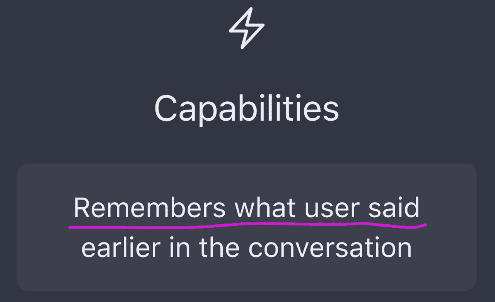

# “我刚才在谈话中说了什么？”

> 原文：<https://medium.com/mlearning-ai/what-did-i-say-earlier-in-the-conversation-a3322ee33212?source=collection_archive---------0----------------------->

## 我在名为 ChatGPT 的新模型中问的第一个问题

## ChatGPT — [参与赢取 500 美元](#032b)

[All of the most impressive cases of ChatGPT](https://mlearning.substack.com)

## 测试 OpenAI 的 GPT-3 聊天机器人 ChatGPT

[OpenAI](/mlearning-ai/is-gpt-3-for-free-7ec8c2d904b6) 开发了 ChatGPT 模型，对话式交互。ChatGPT 的休闲风格让它可以应对后续…