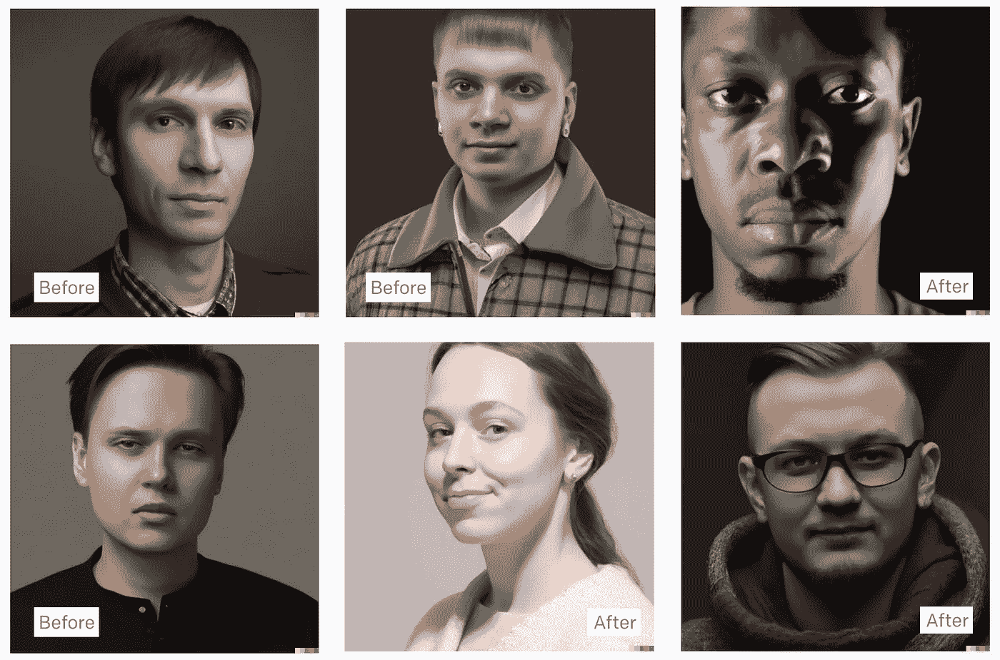

# AI 艺术中的偏见是什么意思？

> 原文：<https://medium.com/mlearning-ai/what-does-bias-in-ai-art-mean-276c1d544830?source=collection_archive---------2----------------------->

## [机器学习艺术](https://mlearning.substack.com/p/train-your-ai-art-generator-from?r=z7zu8&s=w&utm_campaign=post&utm_medium=web)

## 提高 [AI 艺术发生器](https://mlearning.substack.com/p/train-your-ai-art-generator-from?r=z7zu8&s=w&utm_campaign=post&utm_medium=web)的安全性

Before and After Reducing Bias in Dalle 2 — [portrait of an AI art engineer](https://evartology.substack.com/p/the-secret-to-writing-ai-art-prompts?r=9hp4d&s=w&utm_campaign=post&utm_medium=web)

**人工智能艺术中的偏见**当结果不能在广泛的情况下使用时就会发生。我们通常认为偏见来自于训练数据中的偏好或遗漏。尽管如此，偏见也可能来自如何收集数据，如何制作人工智能艺术生成器，以及人工智能的结果如何…