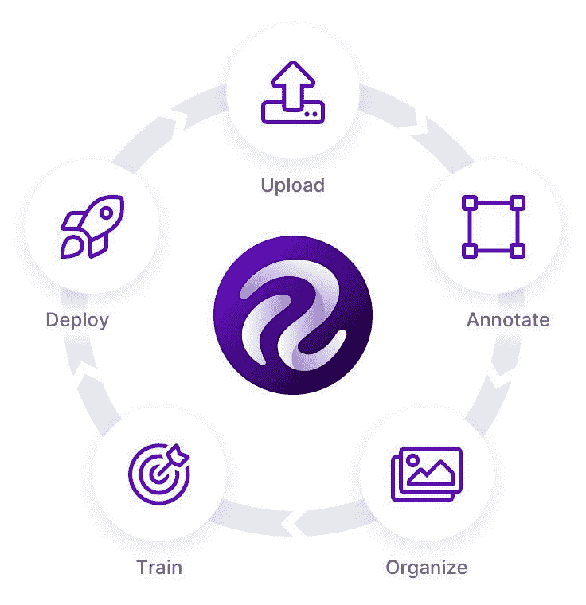
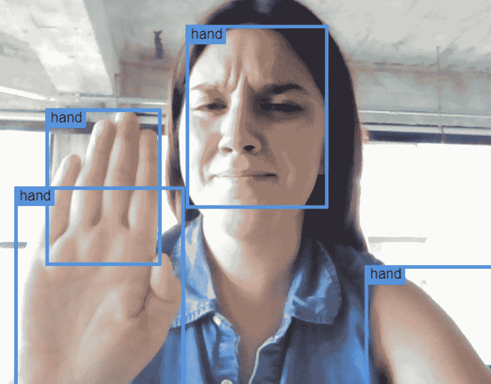
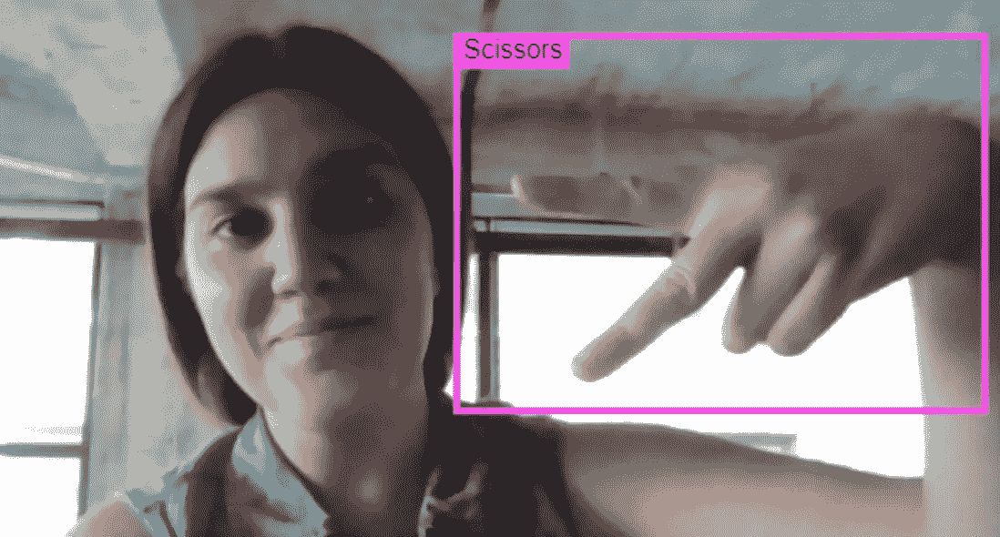
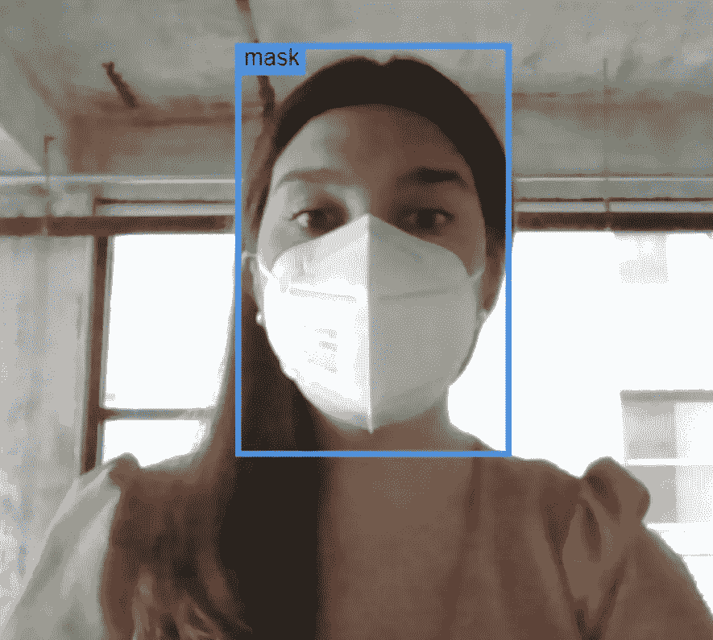

# 如何建立计算机视觉模型

> 原文：<https://medium.com/mlearning-ai/what-does-end-to-end-really-mean-f634b193ba00?source=collection_archive---------7----------------------->

开发、部署和优化计算机视觉模型曾经是一个繁琐、痛苦的过程。通过 Roboflow，我们寻求使这项技术民主化，这(首先也是最重要的)意味着打破我们认为阻止日常人们在工作和日常生活中探索和实现计算机视觉的障碍。

这项工作的自然结果是一个真正的“端到端”解决方案，这种产品使用户能够从一组原始图像开始，在一个下午的时间内，创建一个经过全面训练的计算机视觉模型。这个过程中唯一需要的东西是一台笔记本电脑、一个无线网络连接和一点好奇心。(你甚至不需要自己的源图像，我们提供了[公共图像](https://public.roboflow.com/)的完整数据集，你可以将其“分支”到你的 Roboflow 帐户中开始使用。)

一旦一个模型被训练和部署，我们给我们的用户提供他们需要的工具来迭代地提高模型的性能——通过将推理数据发送回 Roboflow 进行注释、训练和重新部署。这个过程被称为主动学习，这是关闭机器学习循环的最后一步。

**入门**

创建一个有效的计算机视觉模型需要很多步骤。首先，你需要图像，虽然这可能会让一些人感到惊讶，但我们已经知道在这方面质量比数量更重要。

最佳源图像是具有代表性的*图像——意思是:*

1.  它们包含您希望教您的模型检测的对象，并且
2.  它们非常类似于在部署中“看到”这些图像的环境。

第二点需要澄清一下:例如，如果你训练一个模型去探测水下的鱼，你的源图像应该主要包括水下鱼的图片*——而不是在水面上、光天化日之下、在船上或挂在绳子上。*

***标注***

*每天早上当你走出前门时，你的大脑会立刻(下意识地)认出你周围的所有物体——一棵树、一条人行道、一辆路过的汽车。这些输入是巨大而多样的，你甚至可以在不同的环境和条件下识别它们。当我们开始创建一个计算机视觉模型时，我们承担了一项雄心勃勃的任务，即教会计算机以我们所看到的方式来看待这个世界——因此，我们过程中合乎逻辑的下一步是对我们数据集中的图像进行注释或标记。*

*注释是给图像加标签或分配元数据标签的人工过程。这个过程是开发你的计算机视觉模型的关键；这是我们引导和指导模型学习的方式。*

*在 Roboflow，我们提供[边界框注释](https://blog.roboflow.com/labeling/)。正如你从我们网站上的许多图片中看到的，这看起来像是你希望教会你的模型去探测的物体的一个明亮的彩色矩形轮廓。我们的注释工具是用户友好的，团队或个人都可以使用，并包含许多节省时间的功能，使这个众所周知的劳动密集型步骤变得更加容易，包括[标签辅助](https://blog.roboflow.com/announcing-label-assist/)，这是我们在 Pro plan 上最受欢迎的功能之一。*

***生成版本***

*在准备训练模型时，您需要预处理和扩充数据集中的影像。[预处理步骤](https://blog.roboflow.com/tag/preprocessing/)旨在帮助您的模型更快地训练和运行推理(例如，调整所有图像的大小，使它们一致，或使它们都是灰度的)，而[增强步骤](https://blog.roboflow.com/boosting-image-detection-performance-with-data-augmentation/)旨在通过向模型显示具有各种失真的图像示例来提高模型在部署中的弹性，这些失真模拟了它在现实世界中可能遇到的情况。这些条件的例子包括亮度、色调和旋转。*

*对这些源图像进行扩充不可避免地意味着增加数据集的大小；我们复制了这些图片，并对它们进行了轻微的修改，以帮助最终的计算机视觉模型理解鱼就是鱼，即使是在浑浊的水中。*

*数据集的每个变化都会在 Roboflow 中创建一个新的“版本”。这些版本在时间中被冻结；每一个都是一个快照，允许您试验不同的模型、框架和超参数，而不会无意中更改可能使您的结果无效的其他变量。*

***训练一个模型***

*最后，是时候训练一个模型了。这是一场盛大的舞会。我们能够导出您的数据集，以便在所有常见的机器学习框架中与您自己的定制模型一起使用，并与外部培训管道(如 AWS Rekognition、Google AutoML 和 MS Azure)进行无代码集成，但我们鼓励我们的用户尝试 [Roboflow Train](https://blog.roboflow.com/why-roboflow-train/) ，这是一个直接内置于 Roboflow 的选项。*

*Roboflow Train 是一种自动化的机器学习解决方案，我们的客户可以使用它将任何数据集转换为经过训练的计算机视觉模型，随时可供部署。使用 Roboflow Train 有许多好处，包括改进的模型性能、简单的单击选项以及前面提到的标签辅助功能。*

*Roboflow Train 促进了开发主动学习管道的流动性(和自动化),从而使用推理数据随着时间的推移迭代地改进模型性能。更深入一点。*

***精简部署***

*通过部署 Roboflow，开始在真实世界图像上从您的模型中获得预测。这是(最)有趣的部分——尤其是如果你有机会向家人、朋友或同事展示模型的表现。欢迎您使用我们在 Roboflow 中提供的任何部署目的地，包括托管 web 推理和设备上部署(NVIDIA Jetsons、OAK devices，甚至是 web 浏览器)。*

*这里有几个模型，你今天可以看看:*

*[自负的双手](https://demo.roboflow.com/egohands-public/2?publishable_key=rf_5w20VzQObTXjJhTjq6kad9ubrm33)*

*(好吧，这个有点敏感。)*

**

*[石头，布，剪刀！](https://demo.roboflow.com/rock-paper-scissors-archived/30?publishable_key=rf_CKxkuHJSXKXCWFuJ6zjgvBT6TQ72)*

*这个模型不只是“看到”手，它还能识别石头、剪子、布……和爱这些常见的手势！*

**

*[屏蔽/不屏蔽](https://demo.roboflow.com/mask-wearing-1dacu/8?publishable_key=rf_5w20VzQObTXjJhTjq6kad9ubrm33)*

*手边有口罩吗？看看这个模特是否知道你什么时候穿，什么时候不穿。*

**

***主动学习***

*野外的模型暴露在真实世界的推断数据中，这些数据不可避免地会与它们被训练的图像不同。监控这些失败案例并反馈到你的培训管道中是很重要的，这样随着时间的推移它会变得更好。*

*收集、注释和重新训练推理数据的过程被称为“主动学习”——结合迁移学习(或从以前的模型检查点训练模型)，我们的客户能够创建迭代学习的计算机视觉模型，并最终在每一项指标上超越人类对手:速度、准确性和一致性。*

*像人一样，模型也可能有盲点——最有可能被模型错误识别的类(或对象)同时也是反馈到 Roboflow 以帮助其改进的最高杠杆图像。*

*这样，主动学习是一个持续的过程，这就是为什么 Roboflow 是一个设计用于长期使用的解决方案，以在我们服务的行业中创建最高性能的模型。*

***让我们建造***

*你准备好试一试了吗？今天就创建一个[免费 Roboflow 账户](https://app.roboflow.com/)，上传(或分叉)你的第一个图像数据集。[联系我们](https://roboflow.com/sales)以设置上述步骤的个性化演示，或获得有关您独特使用案例的具体指导。或者，欢迎您收听我们每周的现场演示([在此](https://zoom.us/webinar/register/WN_mfeyGiv6TWqPEZ2uIdOMyQ)注册)来观看这些步骤的实施。*