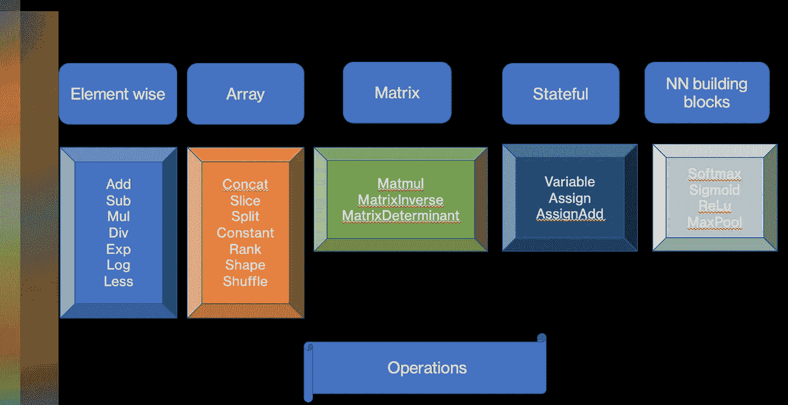
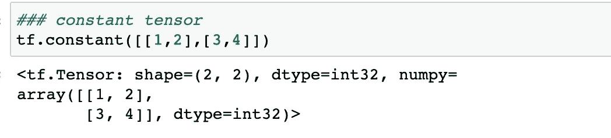
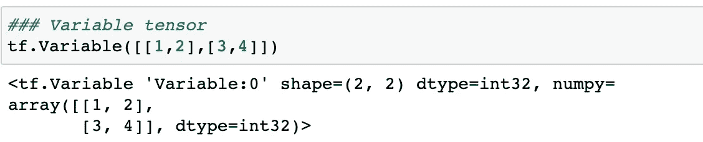
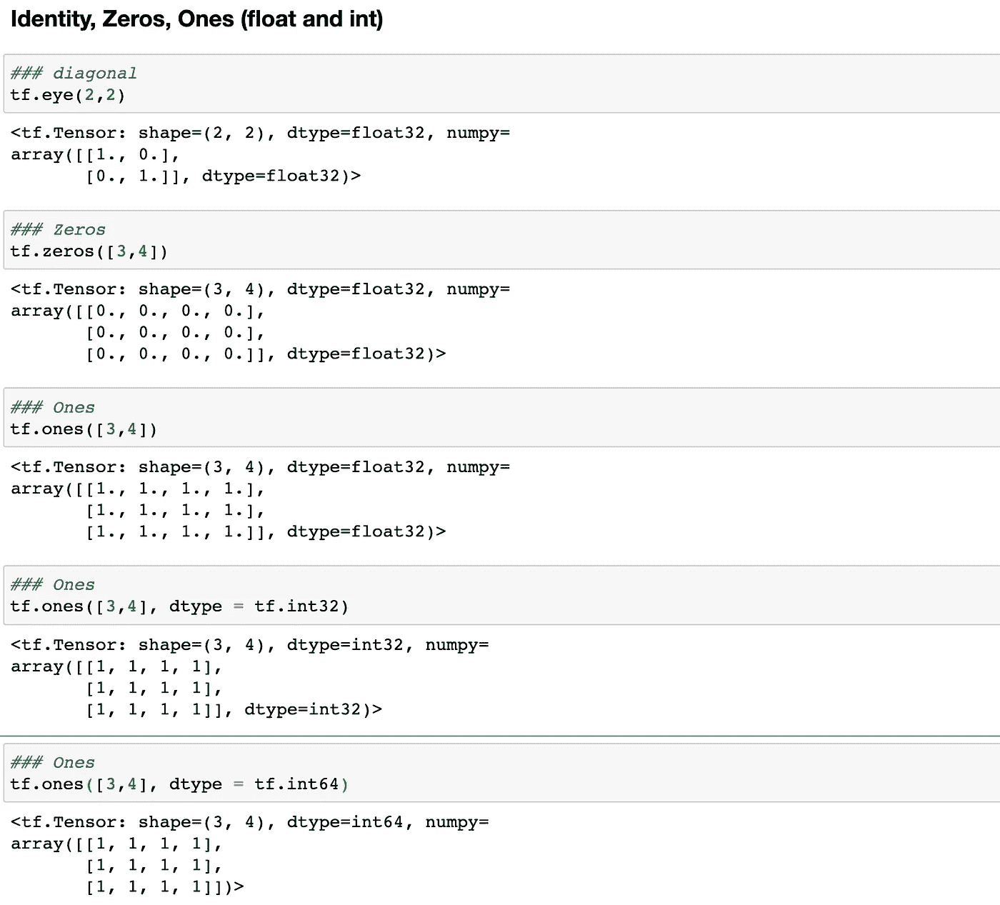

# TensorFlow 有什么特色？

> 原文：<https://medium.com/mlearning-ai/what-does-tensorflow-offer-characteristically-9b7f08d609e7?source=collection_archive---------10----------------------->

使用 Python 代码实现

Photo by [Compare Fibre](https://unsplash.com/@comparefibre?utm_source=unsplash&utm_medium=referral&utm_content=creditCopyText) on [Unsplash](https://unsplash.com/collections/-Jkf2Px5QZA/quantum?utm_source=unsplash&utm_medium=referral&utm_content=creditCopyText)

深度学习框架有 PyTorch、Keras、TensorFlow、Caffe、Theano 等几个。我们将讨论张量流，它的关键特征是什么，并以一个工作示例结束。

张量是多维数据阵列/张量，而流意味着操作中的数据流。因此，张量流定义了用图形进行数值计算的数据或张量流。

在这些图中，节点表示数学运算，而边表示在这些边之间传递的数据，通常是多维数据数组或张量。

控制依赖是没有数据流的特殊边，它们强制源节点在目的节点开始执行控制依赖之前完成执行。

使用 TensorFlow 的计算可以在手机和平板电脑等多个系统上执行，也可以在 GPU 等大规模分布式系统上执行。

张量流的主要特征:

*   用 python 编写的开源机器学习和深度学习框架，由 Google 开发
*   一个单一系统，可为广泛的应用提供计算可扩展性，例如从 Android、iOS 等移动设备平台到包含一个或多个 GPU 的单机中型系统，再到包含数千个 GPU 的大型系统。
*   它支持快速调试和建模
*   它可以有效地处理多维数组。
*   它可用于深度神经网络的训练和推理。它为研究工作的快速实施提供了便利，并提供了高性能和强大的生产系统。
*   它允许并行执行核心模型数据流图，其中不同的计算设备协作更新一组共享参数。
*   图像分类、RNN、自然语言处理、视频分类等。是它的一些普遍应用。
*   依我看，使用 TensorFlow 的关键原因是其庞大的社区

**操作:**

它是矩阵乘法或加法等计算的抽象名称。它具有在构建图形时实例化一个节点的属性。

Author

不同实体的形状和等级:

Author

**常数**

**变量:**

张量仅在图的单次执行期间存在，其中图经历多次计算，并且需要变量来处理图中多次执行期间的张量。例如，机器学习模型的参数存储在变量中的张量中。变量作为模型训练图运行的一部分被更新

**适应张量:**

**随机正态和均匀张量:**

我希望这篇文章能让你了解什么是张量，为什么 TensorFlow 是一个深度学习框架，因为它有自己的特点。

我们还学习了张量如何被用作基本的建筑构件。在下一篇文章中，我们将使用 TensorFlow 构建一个深度学习模型。

在那之前，祝你学习愉快。

参考:

[https://static . Google user content . com/media/research . Google . com/en//pubs/archive/45166 . pdf](https://static.googleusercontent.com/media/research.google.com/en/pubs/archive/45166.pdf)

 [## Mlearning.ai 提交建议

### 如何成为 Mlearning.ai 上的作家

medium.com](/mlearning-ai/mlearning-ai-submission-suggestions-b51e2b130bfb) 

🟠在 MLearning.ai 成为 [**作家**](/mlearning-ai/mlearning-ai-submission-suggestions-b51e2b130bfb)