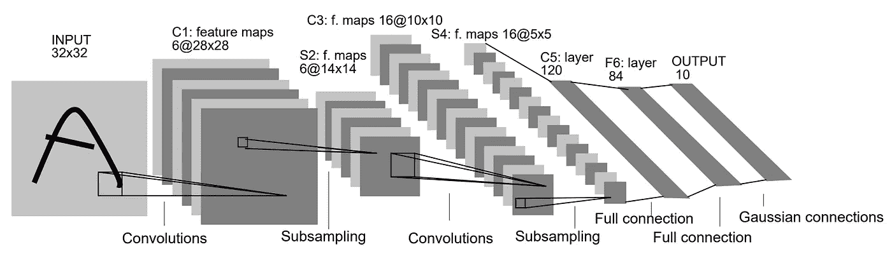
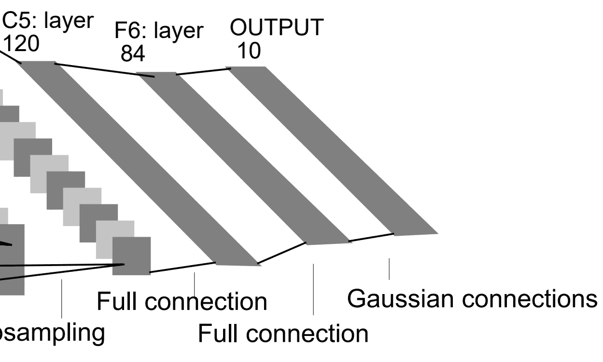
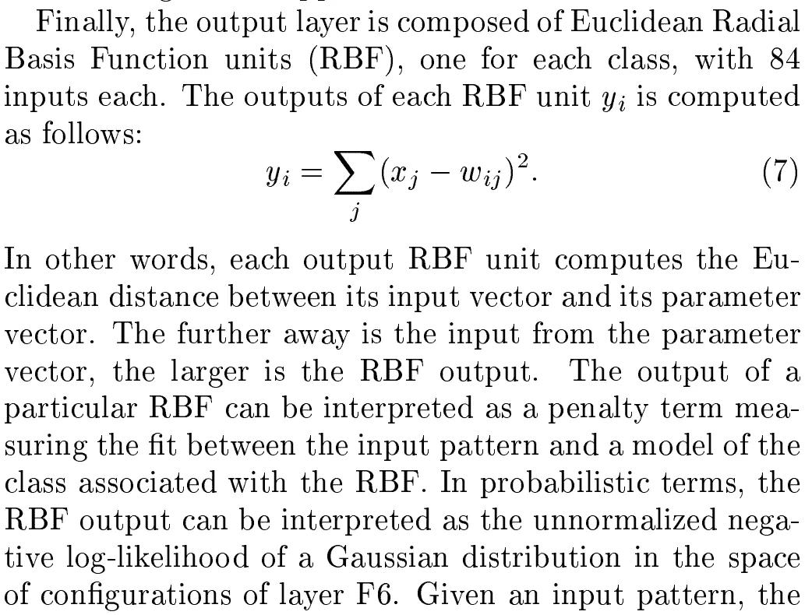
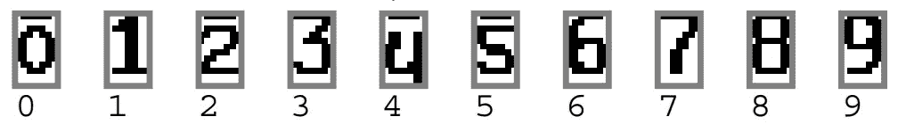

# “高斯连接”到底是什么？

> 原文：<https://medium.com/mlearning-ai/what-exactly-is-the-gaussian-connection-f0f09cbbe65e?source=collection_archive---------2----------------------->

> 高斯连接的创建可能是受“特征提取器”的启发，这是一种传统的图像识别技术。

## 背景知识

图像识别技术的发展包括以下三个阶段:

1.  **传统图像识别**
2.  **多层神经网络**
3.  **卷积神经网络**

在这里，让我们进入第一阶段。传统的图像识别技术由“特征提取器”和“可训练分类器”组成。具体来说，特征提取器应该由研究者来设计；他们需要通过观察和学习图像样本来获得经验，然后他们能够应用这些经验来设计特征提取器。这种“特征提取器”的局限性在于**它不可重用**；对于具有不同特征的不同图像样本，研究人员必须设计相应的特征提取器，以保证良好的图像识别性能。**事实上，“高斯连接”从“特征提取器”中提取了一页，**我将在下面的解释中对此进行更多的阐述。

# 高斯连接与完全连接

Fig 1\. Architecture of LetNet-5¹

有我对高斯连接的定义:从宏观角度来看，高斯连接是一种应该专门应用在全连接层和输出层之间的连接方法；**从微观角度来看，高斯连接是用一堆人为设计的固定权重计算欧几里德径向基函数。**

## *高斯连接

1.  高斯连接是稠密连接的。
2.  高斯连接的输出值不会被插入任何激活函数。相反，输出值将由输出层直接输出。

## *完全连接

1.  全连接是密集连接的
2.  通常，全连接层的输出值将被插入到激活函数中。

# 高斯联系的数学原理

Fig 2\. Gaussian connection and its former layer¹

我们注意到高斯连接位于 F6(即具有完全连接的第六层)和输出层之间。高斯连接的数学原理解释如下:

Fig 3\. Description of gaussian connection from the thesis: “GradientBased Learning Applied to Document Recognition”¹

*   ***x****(j)*(j = 0，1，2，…，83)是 F6(即全连接的第六层)的输出值，它可以被整形为 12 行 7 列的矩阵
*   ***w****【ij】*(I = 0，1，2，…，9，j = 0，1，2，…，83)是高斯连接内人为设计的固定权重，前面已经提到。以***w****【1j】*为例，这个权重也可以被整形为一个 12×7 的矩阵。这些权重(即 ***w*** *(0j)、****w****(1j)、****w****(2j)、…、****w****(9j)*)共同构成了高斯连接的“核心”，并且它们是分布的

权重将减去来自 F6 的输出值，并且差值的平方将被求和(即，欧几里德径向基函数的计算)。然后，输出层将输出最终结果。这就是高斯连接的全过程。

# 一些重要问题的答案

*   问:为什么高斯连接的这些权重(即***w****【ij】*)应该是人为设计的，不可更改的？

高斯连接的首次亮相是在 LetNet-5 深度学习模型中，这个模型是为识别手写阿拉伯数字而精心制作的:总共有 10 种模式(即' 0 '，' 1 '，' 2 '，…，' 9 ')。我们可以得出结论，图像样本的模式数量确实很少，并且这些模式的特征可以被人类容易地识别和学习。因此，LetNet-5 的作者很可能受到这些发现的启发，然后他们设计了如上所示的 10 个权重。如果我们将高斯连接的权重重新整形为 12 行 7 列的矩阵格式，它看起来是这样的:

Fig 4\. How the weights of Gaussian connection look like¹

正如我们所料，高斯连接的权重只是模拟每个阿拉伯数字的像素矩阵。**综上所述，我个人认为高斯连接的产生是应该由神经网络学习的图像的部分模式被人脑补偿了。**

*   问:特征提取器和高斯连接之间到底有什么联系？

现在，我们已经知道高斯连接的“核心”(即***w****(0j)****w****【1j】****w****【2j】…****w****【9j】*)是模拟阿拉伯数字的像素矩阵。作者创建高斯连接的方式类似于其他研究人员开发特征提取器的方式；这两种技术都需要人类基于学习和识别图像样本的经验。

# **参考和**图像源

[1]: LeCun Y，Bottou L，Bengio Y，等.基于梯度的学习在文档识别中的应用[J].IEEE 会议录，1998，86(11):2278–2324。

 [## Mlearning.ai 提交建议

### 如何成为 Mlearning.ai 上的作家

medium.com](/mlearning-ai/mlearning-ai-submission-suggestions-b51e2b130bfb)