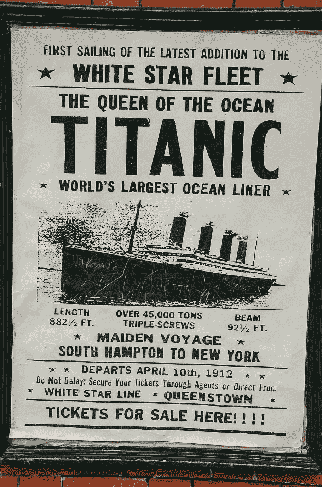

# 当我在泰坦尼克号数据集上试用 PyTorch 时发生了什么

> 原文：<https://medium.com/mlearning-ai/what-happened-when-i-tried-out-pytorch-on-the-titanic-dataset-f64d849e1ef0?source=collection_archive---------1----------------------->

我一直在学习新的编程技能，并决定参加 PyTorch 的免费在线课程，这是一个相对较新的(大约 2016 年)由脸书维护的开源库。我过去尝试过谷歌的 TensorFlow，但我从未能得到正确预测的模型，所以希望 PyTorch 能给我更好的结果。我从…中学到的一件事是