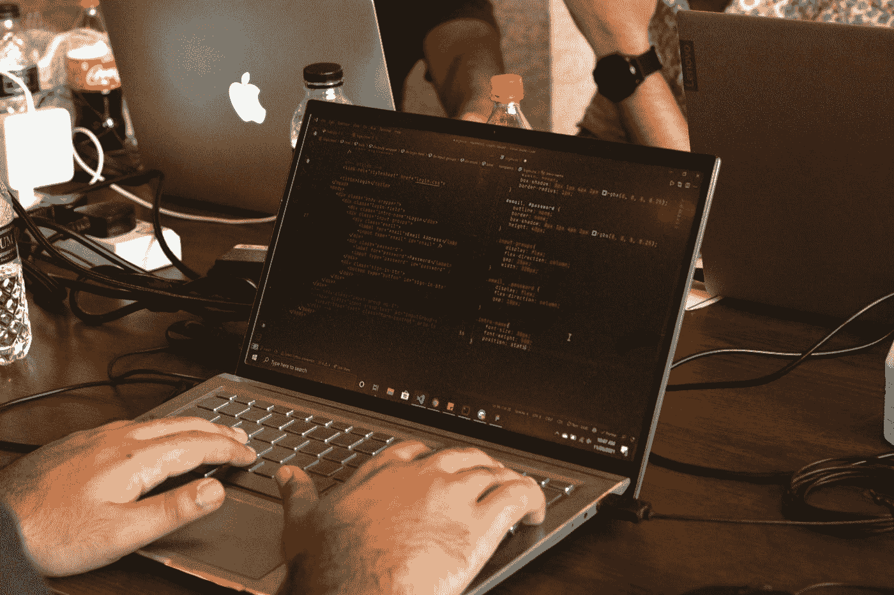
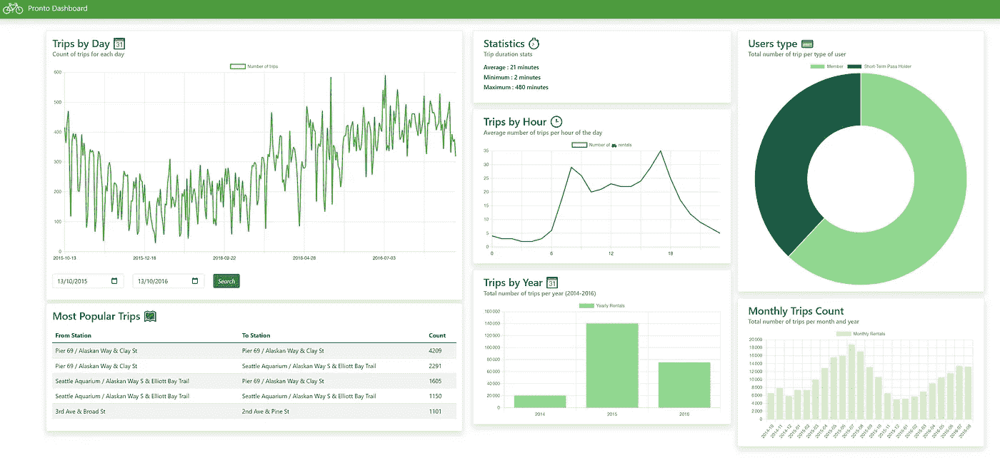

# 我在黑客马拉松中学到了什么

> 原文：<https://medium.com/mlearning-ai/what-i-learned-doing-and-winning-hackathons-6b35797124c?source=collection_archive---------7----------------------->

## 分享我参加并赢得黑客马拉松的心得。

Photo by [Fahim Muntashir](https://unsplash.com/@f12r?utm_source=medium&utm_medium=referral) on [Unsplash](https://unsplash.com?utm_source=medium&utm_medium=referral)

# 什么是黑客马拉松？

黑客马拉松是由协会或公司组织的在线或面对面的社交活动，参与者单独或作为团队创建项目来解决问题或使用特定的技术。最好的项目通常会得到现金、资金或好吃的东西的奖励。这些黑客马拉松的持续时间各不相同，大多数为 48 小时(因此有了 **-athon** ，来源于单词*)从周五晚上到周日下午，尽管一些在线马拉松给了参与者更多的时间(1-3 个月)。虽然最初黑客马拉松只在技术/IT 领域组织，但他们现在正在扩展到其他领域，如艺术、设计或商业。*

# *我对黑客马拉松的体验*

*到目前为止，我在 2020 年 4 月至 2022 年 12 月期间参加了 4 次黑客马拉松，由于新冠肺炎的情况，它们都是在线的。我的第一次经历是在我作为数据科学实习生实习的初创公司与同事相处。它是由拜耳公司组织的，旨在解决作物科学和世界饥饿问题。与我的团队一起，我们创建了一个移动应用程序，它可以通过拍摄叶子的照片来识别植物，并在基于 VGG16 的深度学习模型的帮助下预测可能疾病的存在。*

*不幸的是，我们没有进入决赛，但我们仍然得到了一些好吃的东西！但是在短时间内从零开始构建东西的乐趣和感觉让我开始了我的黑客马拉松之旅。*

*在这之后，我参加了其他三个黑客马拉松(由 Dev.to 和 Hashnode 组织),并最终获得了亚军奖，因为我使用 MongoDB(黑客马拉松的赞助商)构建了一个仪表板*

**

*Screenshot the winning Dashboard.*

# *我从黑客马拉松中学到了什么*

## *想法很重要*

*黑客马拉松最重要的部分是找到解决问题的方法，找到满足需求的项目。做一件事比制定计划要容易得多，所以你应该在这件事上花些时间，即使这会降低最终结果。*

## *关注主要特征*

*您必须首先为您的项目构建主要且最重要的功能，即回答问题的功能。当你的机器学习模型获得 0.5%的准确率时，不要把 90%的时间花在修复 UI 上。*

## *部署*

*有一点很重要，那就是当你的项目被部署，并且可以被其他人和评委使用和测试时，这是你可以为你的项目想出的最好的展示。如果没有部署在 GitHub 存储库中，它就不是一个端到端的项目。*

# *黑客马拉松给你带来了什么*

## *建立工作关系网*

*通过参加黑客马拉松，你可以认识和联系人们，与和你一样是技术爱好者的人扩大你的关系网。*

> *这也是联系公司和招聘人员的好方法*

## ***学习***

*在每个领域，甚至在计算机科学领域，你都是通过构建来学习的。建筑是黑客马拉松的关键词。你将在技术方面(语言、框架)和领域方面(作物科学)学习。*

# *哪里可以找到黑客马拉松*

*如果阅读这篇文章让你想参加一个，这里有一个小的网站列表可以找到他们，在线的和离线的；*

*   *[领英](http://linkedin.com)*
*   *【Hackathon.com *
*   *[bemayapp](https://www.bemyapp.com/events/)*
*   *[开发到](https://dev.to)*
*   *[哈希节点](https://hashnode.com)*
*   *[EventBrite](https://www.eventbrite.fr/d/online/hackathon/?page=1)*

* [## Mlearning.ai 提交建议

### 如何成为 Mlearning.ai 上的作家

medium.com](/mlearning-ai/mlearning-ai-submission-suggestions-b51e2b130bfb)*