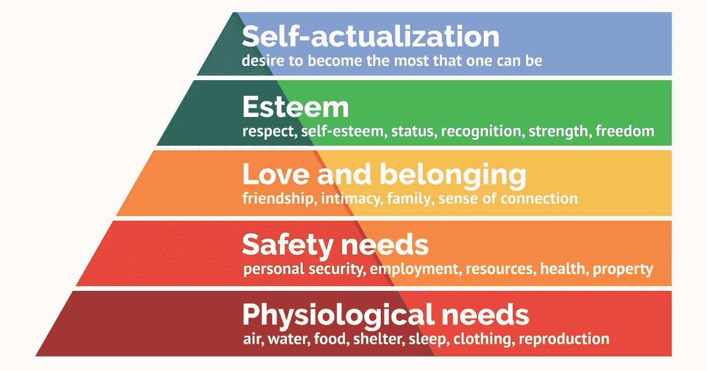

# 如果——客户是一个机器人呢？

> 原文：<https://medium.com/mlearning-ai/what-if-the-customer-is-a-robot-9820ec0a5e89?source=collection_archive---------3----------------------->

我最近在 LinkedIn feed 上收到了很多关于人工智能接管设计工作的帖子。

自从 1997 年人工智能击败卡斯帕罗夫以来，不时有人工智能新成就的新闻——deep mind 的 AlphaGo 在一个周末的围棋比赛中击败了人类世界冠军(这比国际象棋更不可预测)，人工智能弹钢琴比人类最好的钢琴家更好，人工智能开车比人类最好的司机更快更安全，等等。在这里，我们不是在谈论一个零到十，或者一个十到十，而是我们在谈论从零到十的缓慢但确定的进展。

最近，我在 AutoDesk 的创成式设计软件上看到一篇文章，文章设计了一个公园里的长凳，框架像一棵树。软件从人类设计师那里获取参数并为她/他设计。随后又有一篇文章质疑人工智能设计汽车的能力是否会超过人类最好的汽车设计师？尽管这看起来有些牵强，但来自汽车设计行业的这样一篇文章确实让我感到害怕！虽然我非常信任和尊重我的创意设计同事的设计感受，但最终的老板总是顾客。那么，如果用户调查和可用性测试的结果向一家公司的首席营销官和首席执行官证明，人工智能设计以很少的成本和时间获得了更好的可接受性，会怎么样呢？那么人类创意设计团队可能就没有多少机会了！如果首席执行官确实需要一个人来干预，他可能只需要一个首席创意官，坐在那里改变一个软件的参数，只需点击一下按钮，这个软件就会为他产生大量的概念。

我们都知道**“主观只是客观的一个复杂例子”，**如果它能发生在创意设计师身上，那么它肯定也能发生在数字雕塑家身上，与创意设计相比，数字雕塑家的工作要客观得多。对于一个最近因为病毒而丢了工作的人来说，我最不希望的事情，就是担心未来会因为 AI 而丢了工作。转念一想，在某种程度上，我有，因为**每次 ICEMSurf 或 Alias(我工作的 3D 设计软件)变得更好一点**(例如自动化拐角或更好的控制点对齐命令)，**我就会失去一点我的工作给代码！！**和如果创成式设计软件可以根据某些参数为设计者制作快速而肮脏的数字模型，那么有什么可能阻止它为产品质量制作同样的模型——A 级表面？

在完整的 AI+ML 辩论中，代码的能力退居二线，而提出的**更难的问题是哲学、法律和经济问题**。这就是为什么人工智能团队通常不是由程序员领导，而是由具有哲学背景的人领导。正是这些人可能希望以**艾萨克·阿西莫夫的人工智能四定律作为他们的指导原则，从**开始，并相应地指导编码人员，这样我们就不会以弗兰肯斯坦的怪物、特工史密斯等结束。对于那些不熟悉这些法律的人，我会在这里陈述它们本身，以避免谷歌搜索分心:

***阿西莫夫的机器人四定律:***

***第零定律:*** *机器人不得伤害人类，或者，通过不作为，允许人类受到伤害。*

***第一定律:*** *机器人不得伤害人类，也不得坐视人类受到伤害，除非这违反了机器人第零定律。*

***第二定律:*** *机器人必须服从人类给它的命令，除非这些命令与第一定律相冲突。*

***第三定律:*** *机器人必须保护自己的存在，只要这种保护与第一或第二定律不冲突。*

***第四、第五……*。随着我们的深入，法律将需要被制定，以处理复杂的问题——比如在那种情况下，哪个人该救，哪个人该死等等。**

依我看，这应该在那些哲学和法律的工作也偏向人工智能之前尽快解决！！！

但如果这种情况发生，更大的问题将是——**“如果每个人都因人工智能而失业，谁会购买这些智能机器人创造的产品？”我们不断被提醒，客户是最终的老板，但如果客户/用户也是人工智能机器人，那该怎么办？这是一个更大的问题。**我们有一个完全独立的领域，叫做用户体验研究和设计(这恰好也是我的第二个领域)，专注于基于同理心的用户研究和设计**。但是现在我们正在谈论机器人向机器人出售和从机器人那里购买，看看 UXD 领域会发生什么变化会很有趣。**

根据马斯洛的需求层次理论，人类有动机根据自己的需求以某种方式思考和行动。这因我们每个人而异，取决于他们在金字塔中的位置。对于机器人来说，相互买卖必须有一个动机来满足他们的需求。迄今为止，机器人是智能的，但没有知觉和无意识的生物，因此它们没有相互买卖的动机(或者至少我们人类认为有动机)。同样，为了避免谷歌搜索分散注意力，感知是主观感知、感受和体验的能力。意识是意识到你自己和你周围的环境。所以，要么他们的动机随着他们的需求被编码到他们身上，要么我们希望在未来看到有意识的机器人，就像非碳基生物一样。由于后者似乎有些牵强，我们应该对前者更感兴趣。****需求和编码在里面的激励因素将决定他们会成为什么样的机器人。****

**最初，这个机器人的顶头上司或父母将是编码员。但是，程序员可能会有一个哲学家、法律专家或其他程序员的老板。但是谁会是这个领导人工智能编码团队的哲学家、法律专家或程序员的老板呢？难道不是人类政治家和人类大企业主吗？难道他们不会游说和施压由谁领导的人工智能团队，为了他们自己的利益而编码机器人的需求，并可能违背经济，身体，智力和政治上不相关的大众的利益吗？那么，最后会不会只有少数人类财阀和他们的智能机器人大军留在诺亚的船上？在这种情况下，我们真的需要害怕谁——人工智能驱动的机器人还是人类科技财阀？**

****#人工智能****#深度学习**# icem surf # alias Autodesk # automotive design # generative design # user experience design**