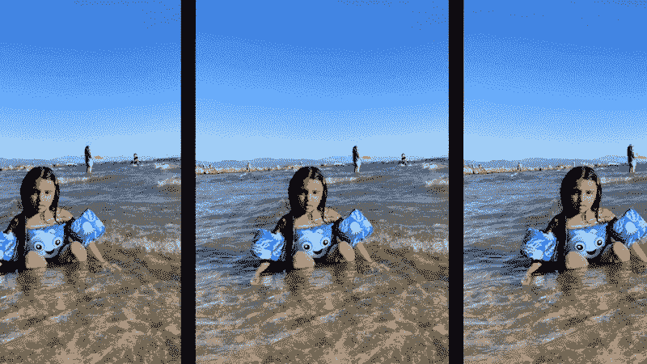

# 什么是 3D 沉浸感？

> 原文：<https://medium.com/mlearning-ai/what-is-3d-immersion-ef6d92b126df?source=collection_archive---------4----------------------->

## [机器学习艺术](https://mlearning.substack.com)

## 一种新的计算摄影效果

[https://mlearning.substack.com](https://mlearning.substack.com)

## 增强的 3D 感

这是一种新技术，通过深度学习网络在二维图像上诱导合成视角。该方法创建了具有运动视差和场景动态的照片般逼真的时空电影，并恢复了被…