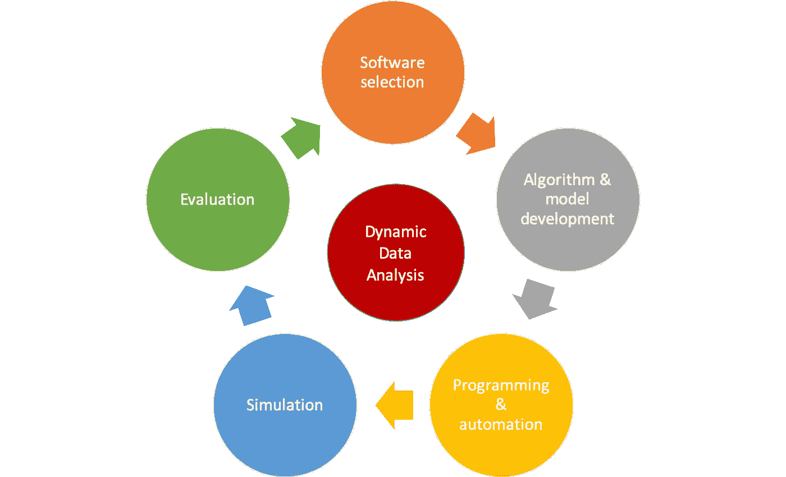

# 什么是数据湖，什么是数据湖体系结构，区分数据湖和数据仓库

> 原文：<https://medium.com/mlearning-ai/what-is-a-data-lake-what-is-data-lake-architecture-distinguish-between-data-lake-data-warehouse-7c422fcf2b70?source=collection_archive---------2----------------------->

数据仓库、数据湖、数据沼泽、数据池等是从多个来源收集数据的方法。每种方法都有自己独特的特点和操作策略，需要您首先以标准的方式加载数据，理解数据，对数据建模，然后让您的算法从…中检测模式