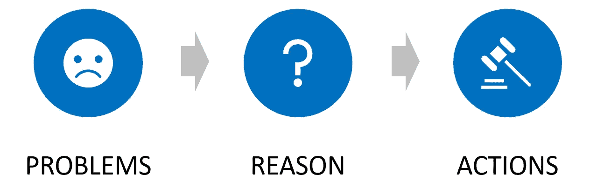
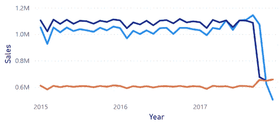
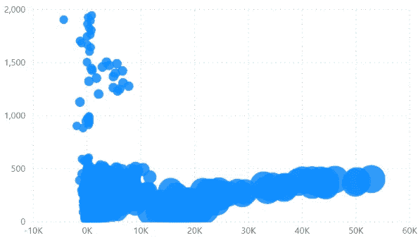
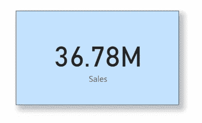

# 仪表板设计有什么好的做法？

> 原文：<https://medium.com/mlearning-ai/what-is-a-good-practice-for-dashboard-design-237e0c6333c8?source=collection_archive---------1----------------------->

Image by pikisuperstar on Freepik

使用 Power BI 或 Tableau 的拖放概念创建仪表板似乎很简单。然而，许多仪表板被创建但没有被使用，因为它们不能服务于用户的目标或者太难理解。在本文中，我将介绍仪表板设计的良好实践，从面向用户设计的概念到可视化排列。

## 本文的内容

*   谁是仪表板用户？
*   问题—原因—行动
*   可视化选择
*   可视化布置

# 谁是仪表板用户？

Image by pikisuperstar on Freepik

首先，您必须知道仪表板的主要用户。然后，您可以适当地设计一个仪表板来满足用户的期望。

这些是你应该能够回答的问题列表。

*   **他们是高管还是低层员工？**
    这个问题可以确定他们使用这个仪表盘的频率。如果他们是高管，他们使用仪表板的时间可能有限，因此仪表板应该尽可能简单，比如每页只有少量的可视化内容。
*   **用户对技术熟悉吗？**
    如果用户熟悉技术，可以包含可以使用下钻的图形，或者添加更多选项供用户自定义。相反，如果用户不精通技术，你应该避免在向下钻取中隐藏数据。您可以添加新的可视化效果或页面，这样用户就不需要自己深入图表。

# 问题—原因—行动

现在，你有了用户作为出发点。

接下来，通过使用问题—原因—行动框架来了解您的仪表板开发的方向是很重要的。

可以把仪表板想象成一个方向标志，引导用户朝着他们的目标前进。一个伟大的方向应该清楚地指定目的地，并有一个箭头显示如何去那个目的地，所以迷失的旅行者确切地知道他们必须做什么。

**问题**是用户不满意的用户现状。比如利润没有达到目标或者应用活跃用户数低。换句话说，就是用户想去的目的地。问题应该很容易在仪表板上看到。它通常位于最顶端或最左边。

**原因**是问题的源头。这些参数会影响问题。例如，每种产品的销售数量会影响公司利润。您可以通过多种方式对参数进行分组，例如按国家、产品类别或客户年龄分组。用户将获得问题的概述。

以下问题可能是确定原因的指南

*   哪些是可能影响他们决策的关键参数？
*   他们想测量什么？
*   你如何计算这个参数(问题的参数)？

**动作**就像一个起点。由于用户知道问题的原因，他们应该知道如何解决问题。行动部分应该足够详细，以便用户根据他们知道的数据实施计划。它可以显示用于营销目的的详细信息，例如哪些产品利润高但销量低。

# 可视化选择

你现在脑子里应该有仪表盘的骨架了。然后，是时候制作可视化了。

根据目标，可视化可分为 4 组:

1.显示随时间变化的趋势，如折线图、面积图

line chart

2.比较数据，如圆环图、饼图、条形图

Donut chart

3.找出相关性，如散点图、气泡图

Bubble plot

4.突出显示一个值，如卡片、仪表

Card

选择与目标相匹配的可视化是至关重要的。

# 可视化布置

您可以在仪表板中包含许多可视化拼图。可视化的位置是艺术和科学的结合。这三个原则是设计可视化位置的指南。

1.  5 秒规则
    用户应该在 5 秒钟内从仪表板中找到关键信息/指标。字体大小要足够大，颜色不能太分散，可视化对齐和大小要容易跟随。
2.  每页只有 5-9 个可视化效果
    [米勒定律](https://blog.uxtweak.com/millers-law/)指出，神奇的数字 7 是一个普通人可以处理的对象数量。这种 7×2 的容量是一种普遍现象，已经在几个实验中得到验证，并被 UX/UI 设计广泛采用。在仪表板设计中，从这个数字开始来限制仪表板的复杂性是非常好的。如果一个页面上可能有 9 个以上的可视化效果，您应该考虑拆分到一个新的页面。
3.  按阅读顺序排列
    通常，人们从左到右、从上到下阅读(英语)。仪表板也是如此。用户将从左到右和从上到下阅读图表。您可以从左到右或从上到下放置从问题到原因到行动的可视化效果，这样用户就可以知道问题，看到原因概述，并知道他们需要采取的行动。

# 结论

以用户为中心的仪表板必须从用户开始。然后，使用“问题—原因—行动”框架找到仪表板到用户目标的方向。然后选择与目的相匹配的可视化效果。最后，在牢记 5 分钟规则、米勒定律和阅读顺序的同时，将可视化效果放在仪表盘上。

这篇文章是根据我的亲身经历写的。如果你有任何建议，欢迎在评论中分享。

这篇文章的灵感来自于 [Thanachart Ritbumroong](https://medium.com/u/d83e27d0a896?source=post_page-----237e0c6333c8--------------------------------)

[仪表盘:问题-原因-行动理论](/madt-and-bads-nida/ควรแสดงอะไรบน-dashboard-theory-of-problem-reason-action-625f2951e382)

[仪表板设计的 4 大原则](/madt-and-bads-nida/4-principles-of-dashboard-design-หัวใจ-4-ข้อสำหรับการออกแบบ-dashboard-957b79e0179a)

> 如果您想阅读更多数据分析内容，请鼓掌并关注我。

 [## Mlearning.ai 提交建议

### 如何成为 Mlearning.ai 上的作家

medium.com](/mlearning-ai/mlearning-ai-submission-suggestions-b51e2b130bfb)