# 什么是神经网络？今天就开始你的深度学习之旅吧！！！

> 原文：<https://medium.com/mlearning-ai/what-is-a-neural-netwok-start-your-deep-learning-journey-today-9ea88fe69d9b?source=collection_archive---------3----------------------->

大家好，希望你们都过得好。今天，在这个博客中，我们将尝试获得对神经网络的强烈直觉，这对于开始深度学习非常重要。此外，我们将制定一个初级项目，以巩固我们的学习。

> 这篇博客写的所有代码都在我的 github-[https://github . com/harshmishra 2002/movie _ review _ classification _ DL](https://github.com/HarshMishra2002/movie_review_classification_DL)

**深度学习中的“深”**

一般来说，深度学习是一个连续层的系统，根据提供的输入特征来预测输出。*每一层都从数据中提取一些有意义的信息，并创建一个有意义的数据表示*。深度学习中的深度并不意味着有任何更深的理解；更确切地说，它代表了连续的表现层次的概念。有多少层对数据的模型有贡献被称为数据的*深度*。

在深度学习中，这些分层表示是通过称为**神经网络的模型来学习的。**

因此，神经网络意味着建立一个具有一组层(如上所述)的网络，其中每一层都有一定数量的节点来保存数据。最终目标是理解数据并给出期望的输出。一层的输出成为下一层的输入。

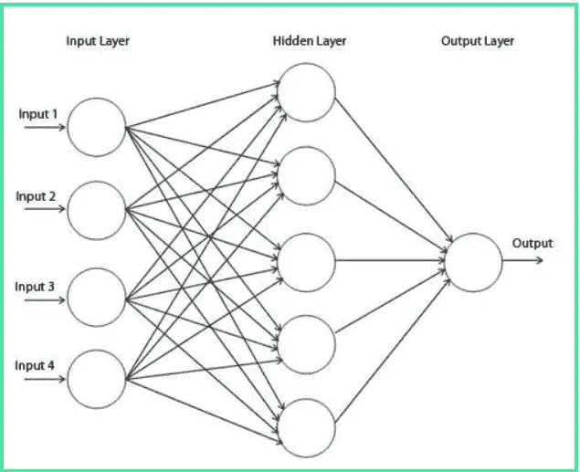

**神经网络的解剖**

神经网络主要围绕这四件事:

1.  层
2.  输入数据和相应的目标
3.  损失函数
4.  【计算机】优化程序

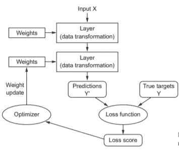

**Layers** : Layer 是一个数据处理模块，它将一个或多个张量作为输入，并输出一个或多个张量(tensor 一词来自拉丁语 tendere，意为“拉伸”)。零阶张量是一个标量(简单的数字)。一阶张量(一阶张量)是一个线性映射，它将每个向量映射成一个标量。向量是一阶张量。}并输出一个或多个张量。

对于不同的张量格式(输入数据),我们需要不同类型的层

2D 张量(样本、特征)→致密层

3D 张量(样本、时间戳、特征)→ LSTM 层

4D 张量(图像数据)→ 2D 卷积层

**损失函数和优化器**:损失函数代表手头任务成功的量度。在训练期间，这个数量将被最小化。优化器基于损失函数确定网络将如何更新。

现在我们有足够的信息来开始这个项目。我们将用 python 实现一切，并将使用 keras 库。

**电影评论分类**

关于数据集:

您将使用 IMDB 数据集:一组来自互联网电影数据库的 50，000 条高度分化的评论。它们被分成 25，000 条用于训练的评论和 25，000 条用于测试的评论，每组由 50%的负面评论和 50%的正面评论组成。

让我们首先导入数据集和 keras 库

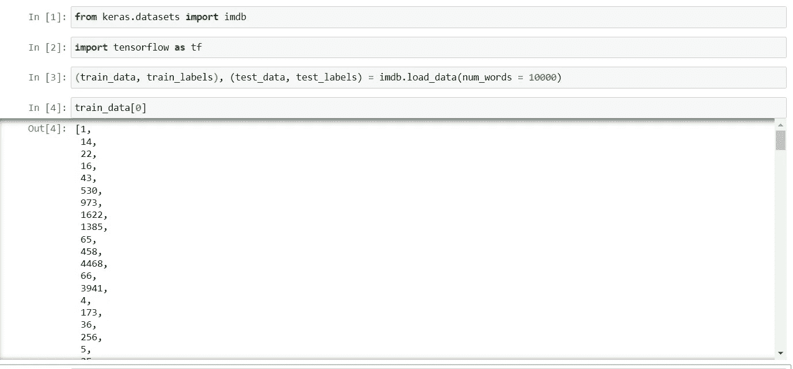

参数 num_words=10000 意味着您将只保留训练数据中出现频率最高的前 10，000 个单词。生僻字会被丢弃。

正如我们前面看到的，神经网络层只接受张量作为输入，但在我们现在拥有的数据中，它是一个整数列表。我们的下一个任务是将整数列表转换成张量。

最好的方法是一次热编码。它会把我们的列表变成 0 和 1 的向量。举例来说，这意味着将序列[3，5]转换为一个 10，000 维的向量，除了索引 3 和 5 为 1 之外，其他都为 0。然后，您可以将能够处理浮点矢量数据的密集层用作网络的第一层。

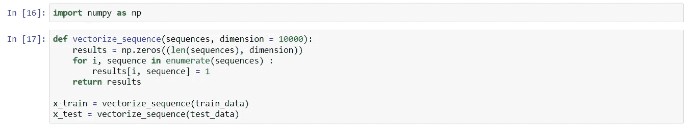

向量化标签非常简单:

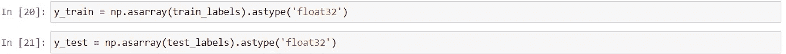

现在是时候建立我们的网络了。我们之前已经看到，根据我们的数据，密集层将是首选层。我们将使用“relu”作为我们的激活功能。Dense(16，activation='relu ')。传递给每个密集层(16)的参数是该层的隐藏单元(节点)的数量。隐藏单元是层的表示空间中的一个维度。

带有 relu 激活的稠密层实现了下面的张量运算链: *output = relu(dot(W，input) + b)。*具有 16 个隐藏单元意味着权重矩阵 W 将具有形状(input_dimension，16):与 W 的点积将输入数据投影到 16 维表示空间上(然后您将添加偏差向量 b 并应用 relu 操作)。你可以直观地将你的表征空间的维度理解为“当学习内部表征时，你允许网络有多少自由。”拥有更多隐藏单元(更高维的表示空间)可以让网络学习更复杂的表示，但这会使网络的计算成本更高，并可能导致学习不需要的模式。

对于这样一个密集层堆栈，需要做出两个关键的架构决策:

要用多少层

每层选择多少个隐藏单元

目前，你必须信任我的以下架构选择:

两个中间层，每个有 16 个隐藏单元

第三层，其将输出关于当前评论的情绪的标量预测

中间层将使用 relu 作为它们的激活函数，并且最后一层将使用 sigmoid 激活，以便输出概率(0 和 1 之间的分数，表示样本具有目标“1”的可能性有多大:评论是正面的可能性有多大)

relu(校正线性单位)是一个旨在消除负值的函数，而 sigmoid 将任意值“挤压”到[0，1]区间，输出可以解释为概率的东西。

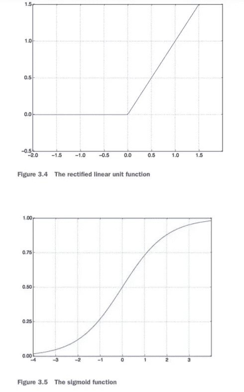

所以我们的网络看起来会像这样:

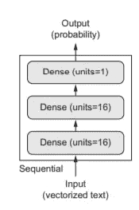

什么是激活功能，为什么它们是必需的？

如果没有像 relu 这样的激活函数，密集层将只有两个线性操作可以处理，那就是点积和加法

输出=点(w，输入)+ b

因此该层只能学习数据的线性变换。该层的*假设空间*将由输入数据到 16 维空间的所有可能线性变换的集合组成。这种假设空间太受限制，并且不会从多层表示中受益，因为线性层的深层堆栈仍将实现线性操作:添加更多层不会扩展假设空间。为了进入一个更丰富的假设空间，从深层表现中获益，你需要一个非线性的，或者激活函数

现在回到我们的项目，我们最终需要选择一个损失函数和一个优化器。对于输出概率的模型，交叉熵损失将是最好的选择。交叉熵是实际输出和模型预测之间的差异。为了优化，我们将使用 rmsprop。

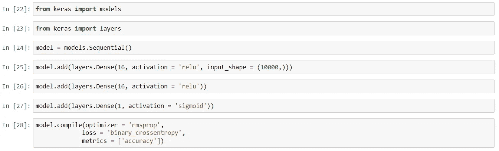

为了在训练期间监控模型对以前从未见过的数据的准确性，我们将通过从原始训练数据中分离出 10，000 个样本来创建验证集。

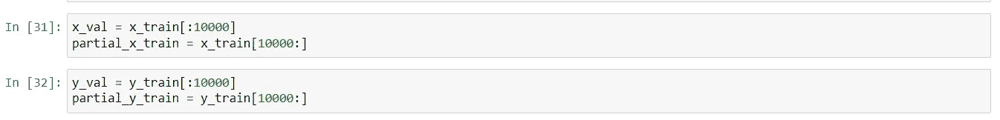

我们现在将在 512 个样本的小批量中为 20 个时期训练模型(对 x_train 和 y_train 张量中的所有样本进行 20 次迭代)。与此同时，我们将监控您分离的 10，000 个样本的损失和准确性。您可以通过将验证数据作为 validation_data 参数来传递。

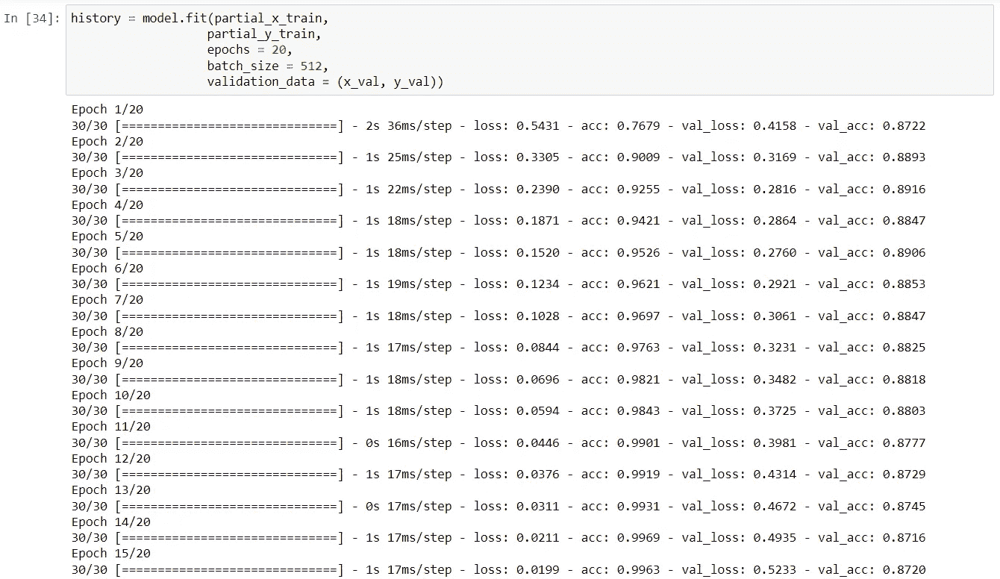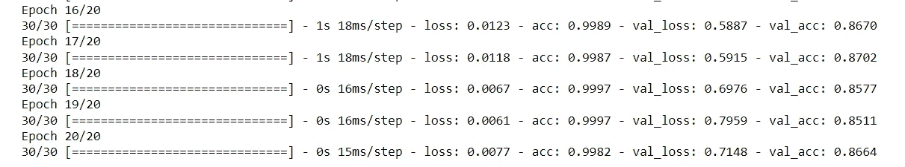

历史变量存储了所有的信息，同时在每个时期后训练数据的准确性。

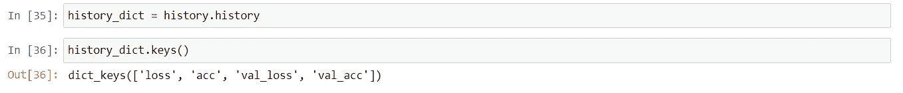

让我们使用 Matplotlib 并排绘制训练和验证损失，以及训练和验证准确性

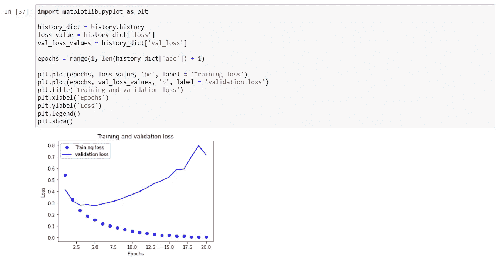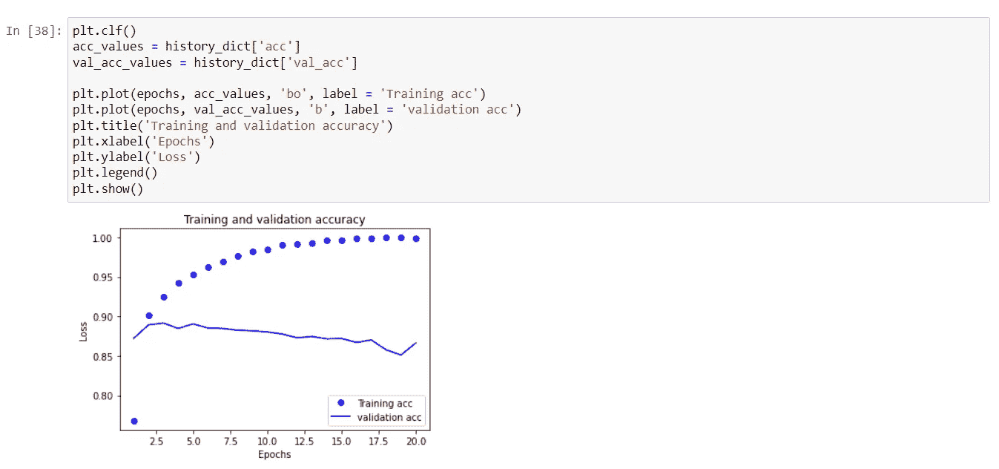

我们看验证损失，在 4 个时期之后，它开始增加而不是减少。类似地，验证准确性降低。所以在第四纪元后，我们面临着**过度拟合的问题。**

现在，我们将再次训练我们的模型，但这次只有 4 个历元，输入数据将是整个训练数据

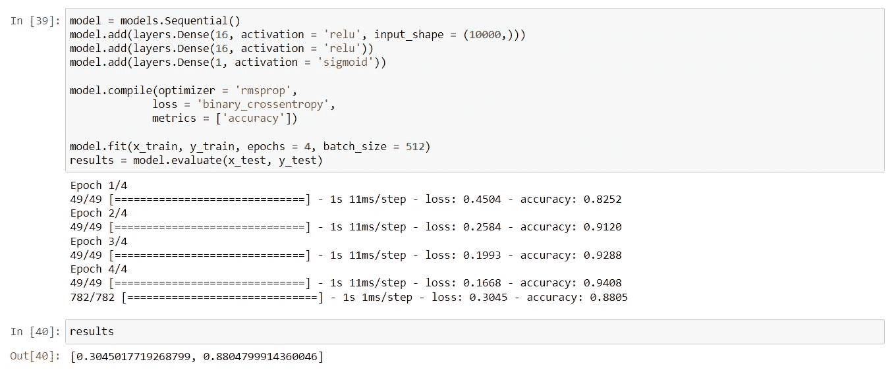

我们得到了 88%的准确率。现在我们将使用预测方法对测试数据进行预测

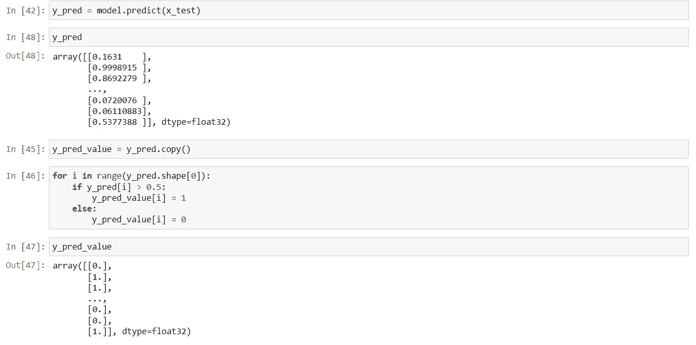

> 所以我们在这里结束我们非常基本的第一个深度学习项目。今天就到这里，伙计们。
> 
> 我希望你们能学到一些新东西，并喜欢这个博客。如果你确实喜欢它，那就和你的朋友分享吧。保重。不断学习。
> 
> 你也可以通过我的 Linkedin 账户找到我-[https://www.linkedin.com/in/harsh-mishra-4b79031b3/](https://www.linkedin.com/in/harsh-mishra-4b79031b3/)

 [## Mlearning.ai 提交建议

### 如何成为 Mlearning.ai 上的作家

medium.com](/mlearning-ai/mlearning-ai-submission-suggestions-b51e2b130bfb)