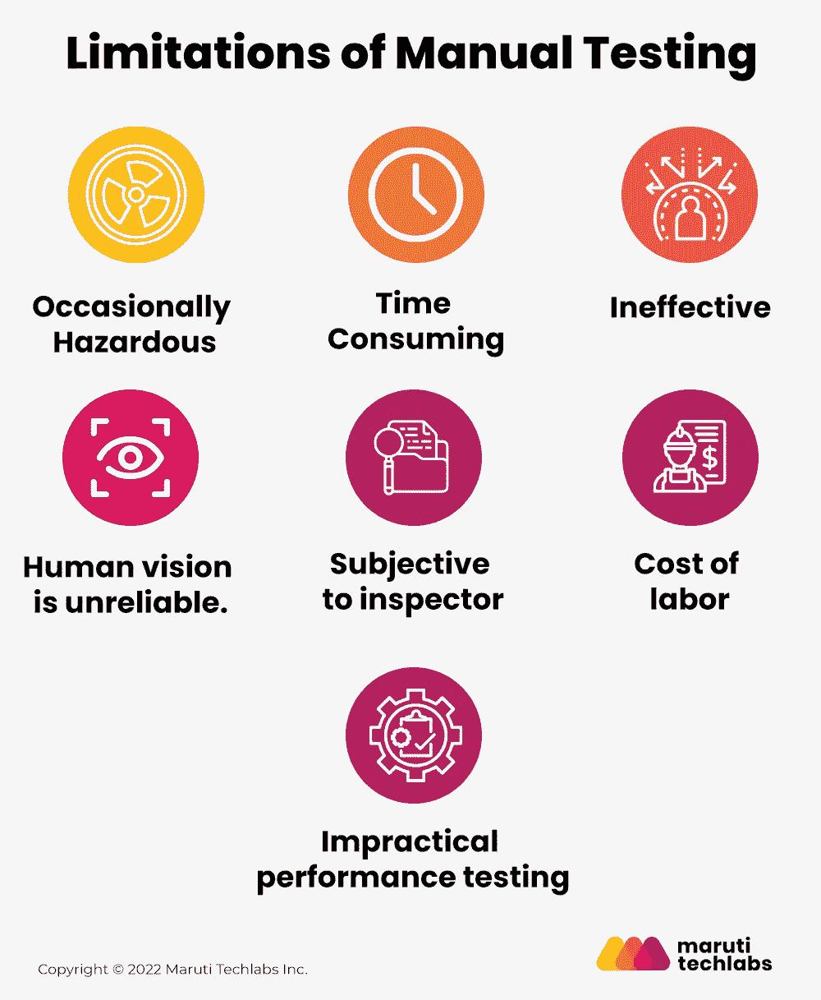

# 什么是用于缺陷检测的 AI 视觉检测？

> 原文：<https://medium.com/mlearning-ai/what-is-ai-visual-inspection-for-defect-detection-711aa1e8cd2d?source=collection_archive---------1----------------------->

人工智能对企业来说是一个至关重要的差异化因素，几乎在每个领域都有大量的应用。从自动驾驶汽车到 Siri 和 Alexa，人工智能是改变我们生活方式的下一代服务的关键推动者。

人工智能可以使系统根据过去的数据做出智能决策，从决定客户可能最喜欢的产品到在潜在的医疗问题升级为紧急情况之前识别它们。在全球范围内广泛的人工智能应用中，自动化视觉检测受到高度重视。

# 什么是基于人工智能的视觉检测？

视觉检测是生产过程中最常用的方法之一。它需要对装配线的组件进行目视检查，以检测和修复问题。

然而，当描述基于人工智能的视觉检测时，它通常是关于基于深度学习和计算机视觉的某种形式的光学检测技术。它监控和检查制造或服务操作，以确保产品符合预定的规格。

计算机用于捕捉、记录和存储图像和对象。因此，它节省了时间，也提高了效率。例如，如果一名检查员检查一条装配线，他们可能需要几个小时来完成检查过程，而人工智能软件将在几分钟内扫描装配线。

# 目测什么是深度学习？

深度学习技术在各个行业的使用越来越普遍。它的主要好处是允许机器通过例子学习，而不是显式编程。这样做使它成为难以自动化的任务的强大工具，例如视觉检测。

深度学习的基本原理是通过向神经网络提供带标签的样本，来教会机器识别特定的模式。一旦设备学习了这些模式，它就可以将它们应用到新数据中来识别缺陷。

将深度学习算法与自动化视觉检查技术相结合，可以区分组件、异常和字符，在运行计算机化系统的同时模拟人类视觉检查。

# 手动测试的局限性

许多公司依赖手工测试作为他们唯一的质量控制措施，但是这种方法有局限性。让我们探讨一下这些限制:

**1。偶尔危险**

不是每次检查缺陷检测实体都是安全的。在评估行李检查或飞机维护等要素时，在正常情况下检查这些实体涉及多种风险。

**2。耗时**

在财产和意外事故业务中，研究和评估建筑物或汽车的损失通常需要时间。因此，检查和理赔过程相当漫长。因为这些活动或场景中的大部分都是重复进行的，所以手工测试需要花费相当多的时间。

在这种情况下，计算机视觉可以显著加快过程，最大限度地减少错误，防止欺诈。此外，您可以使用卫星图像、无人机和大数据来进行这些计算机辅助检查。

典型的机器学习应用程序分析行为数据，如承保期间的面部表情或声调。例如，在健康保险的情况下，预计行为监控将提供超过 40%的风险信息。

但是，行为数据在非寿险中也是必不可少的。例如，识别一个人如何操作机器的特定趋势可能暗示导致保险索赔的过程问题。

**3。无效**

人工检查容易犯两种形式的错误，要么不能发现错误，要么识别不存在的缺陷。这种无效的视觉检测会导致无效的估计和员工努力的浪费。

**4。人类的视觉是不可靠的。**

视错觉是人眼不可信的一个例子。此外，当比较两个尺寸较小的相似物体时，人眼有可能无法识别尺寸上的微小差异。不是说手工检查没用；这表明仅仅依赖它不是一个好主意。

**5。检查员的主观判断**

手动测试程序是不一致的，因为每个人的测试方法和策略各不相同。因为这在相同的测试中产生不同的结果，所以测试方法的差异是不可避免的。

**6。不切实际的性能测试**

任何客户机-服务器应用程序的性能测试都需要使用人和计算机。客户端程序必须安装在几台 PC 上，并由一个人测试以确定软件的整体性能，这是一项耗时且具有挑战性的工作。

**7。劳动力成本**

由于大规模的个人无法处理质量检查，公司倾向于雇用多名熟练的培训师，因此，人工检查仍然是一项昂贵的工作。根据 Glassdoor 的说法，人工检测操作员每年可以赚 50，000 美元到 60，000 美元。

阅读全文[自动视觉检测的优势](https://marutitech.com/ai-visual-inspection-for-defect-detection/?utm_source=medium&utm_medium=referral&utm_campaign=ai-visual-inspection-for-defect-detection)

 [## Mlearning.ai 提交建议

### 如何成为 Mlearning.ai 上的作家

medium.com](/mlearning-ai/mlearning-ai-submission-suggestions-b51e2b130bfb)