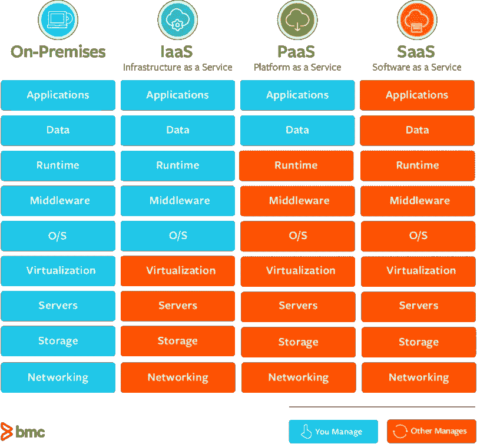
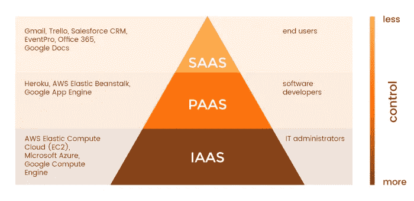
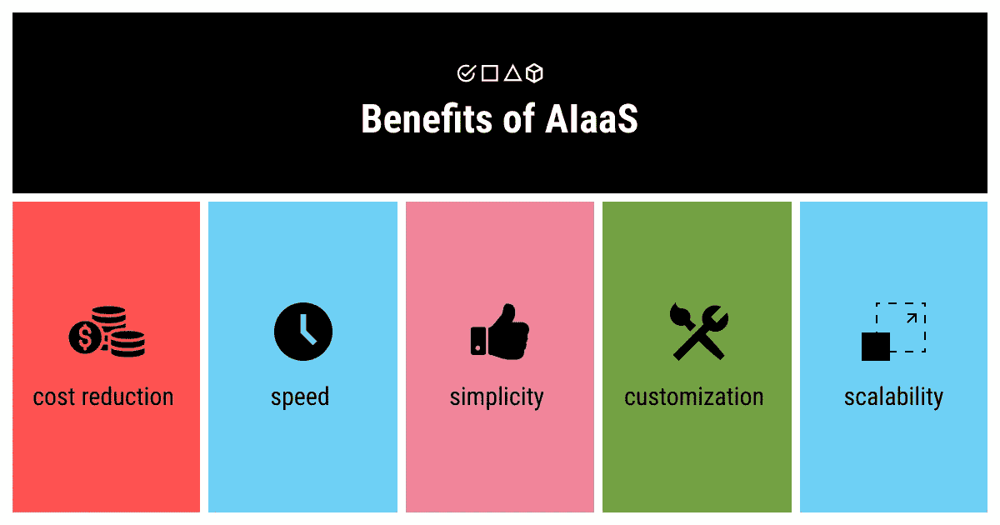
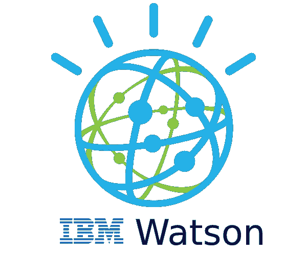

# 什么是 AIaaS？

> 原文：<https://medium.com/mlearning-ai/what-is-aiaas-c1652ea0561c?source=collection_archive---------0----------------------->

AIaaS 代表人工智能即服务，今天我们将了解它到底是什么，以及许多其他相关主题。

*这些文章中使用的图像是各自组织的财产，仅用于参考和说明目的。*

*   AIaaS 是人工智能即服务(Artificial Intelligence as a Service)的简称，指的是提供开箱即用的人工智能解决方案的公司。

AIaaS 允许个人和公司出于各种目的试验人工智能，而无需大量的初始投资和更高的风险。

它指的是现成的人工智能工具，使公司能够以很小的成本实现和扩展人工智能技术。
在很长一段时间里，人工智能的成本高得令人望而却步，因此大多数公司都买不起。

*   这些机器又大又笨重又昂贵。在这种机器上工作的程序员供不应求，因此要求高薪。许多公司缺乏足够的数据和信息。

# 什么是“AAS”(即服务)？

*   **"AAS** 是“作为服务**”**的缩写，指的是以服务的形式向内部或外部客户提供的东西。“作为服务，或 XaaS(任何作为服务的东西)(我们使用‘X’，因为它被认为是一个变量)产品为客户提供终端，通常由 API 驱动，但通常可以通过用户 web 浏览器中的 web 控制台进行控制。”—维基百科。

# AAS 的类型。

*由于今天文章的主题限制，我在这里简单描述了几种类型。有关更多信息，请参考提供的超链接。*

# [IaaS](https://azure.microsoft.com/en-in/overview/what-is-iaas/)

*   IaaS 代表基础设施即服务。
*   它是一种云计算服务，以按需购买的方式按需提供基本的计算、存储和网络资源。

# [平台即服务](https://azure.microsoft.com/en-in/overview/what-is-paas/)

*   PaaS 代表平台即服务。
*   您可以从云服务提供商那里购买所需的资源，并通过安全的互联网连接进行访问。

# [SaaS](https://azure.microsoft.com/en-in/overview/what-is-saas/)

*   SaaS 代表软件即服务。
*   它允许用户通过互联网连接和使用基于云的应用程序。常见的例子有电子邮件、日历和办公工具(如 Microsoft Office 365)。

# [AIaaS](https://searchenterpriseai.techtarget.com/definition/Artificial-Intelligence-as-a-Service-AIaaS#:~:text=Artificial%20Intelligence%20as%20a%20Service%20(AIaaS)%20is%20the%20third%20party,investment%20and%20with%20lower%20risk.)

*   人工智能即服务，是指提供开箱即用的人工智能解决方案的公司。
*   不同的人工智能提供商平台提供了几种类型的机器学习和人工智能。

# AIaaS 的类型

AIaaS 有许多广泛使用的用例，其中一些包括:

# 虚拟助手和聊天机器人

*   这些可以包括聊天机器人，它们使用 NLP 算法从与人类的对话中学习，并模仿语言模式、音调和俚语，同时提供答案。这使得客户服务员工可以专注于更复杂的任务。聊天机器人使用人工智能算法来模拟人类对话。它们结合了 NLP 和 ML 能力来理解用户的查询并提供相关的响应。

# ML 框架

ML 框架是开发人员可以用来构建自己的模型的工具，该模型可以随着时间的推移从现有的公司数据中学习。这些框架提供了一种在不需要使用大数据的情况下构建机器学习任务的方法。

# 应用编程接口(API)

API 是服务内部通信的一种很好的方式。API 允许开发人员将特定的技术或服务添加到他们正在构建的应用程序中，而无需从头开始编写代码。API 的常见选项包括:

*   自然语言处理
*   计算机语音和计算机视觉
*   语言翻译
*   知识图谱
*   搜索
*   情感分析(情感检测)

# AIaaS 的优缺点。

# 优势

*   成本低廉的先进基础设施。成功的 AI 和 ML 需要许多并行机和快速图形处理器单元(GPU)。在 AIaaS 之前，公司可能会过多地决定初始投资和持续维护。现在，AIaaS 意味着公司可以以低得多的成本利用 ML 的力量，这意味着你可以继续致力于你的核心业务，而不是在仅部分支持决策的领域进行培训和支出。
*   **灵活性。**随着成本的降低，AIaaS 内部有了很多透明度:按使用量付费。虽然机器学习需要大量的计算能力来运行，但你可能只需要在很短的时间内需要这种能力——你不必不停地运行人工智能。
*   **可用性。虽然许多人工智能选项是开源的，但它们并不总是用户友好的。这意味着您的开发人员正在花费时间安装和开发 ML 技术。相反，AIaaS 是现成的——所以你可以利用人工智能的力量，而不必先成为技术专家。**
*   **可扩展性。** AIaaS 允许您从较小的项目开始，以了解它是否适合您的需求。随着您对自己的数据获得经验，您可以调整您的服务，并随着项目需求的变化而扩大或缩小规模。

# 不足之处

*   **安全性降低:**人工智能和机器学习依赖于大量的数据，这意味着你的公司必须与第三方供应商共享这些数据。数据存储、访问和传输到服务器必须受到保护，以确保数据不会被不当访问、共享或篡改。
*   **依赖问题:**因为你与一个或多个第三方合作，你依赖他们提供你需要的信息。这本身并不是一个问题，但如果出现任何问题，它会导致延迟时间或其他问题。
*   **透明度降低:**在 AIaaS 中，你购买的是服务，而不是访问权。有些人认为这是一种服务产品，特别是 ML 中的产品，就像一个黑匣子——你知道输入和输出，但你不了解内部的工作原理，比如正在使用哪些算法，算法是否更新，以及哪个版本适用于哪些数据。这可能会导致关于数据或输出稳定性的混乱或误解。
*   **数据治理:**行业可能会限制数据是否或如何存储在云中，这可能会完全禁止您的公司利用某些类型的 AIaaS。
*   **长期成本:**所有“即服务”产品的成本都会迅速攀升，AIaaS 也不例外。随着你更深入地研究人工智能和机器学习，你可能会寻求更复杂的产品，这可能会花费更多的钱，并要求你雇佣和培训具有更具体经验的员工。不过，和任何事情一样，这些成本对你的公司来说可能是明智的投资。

# 一些顶级 AIaaS 提供商:

# [微软 Azure](https://azure.microsoft.com/en-in/)

*   Azure 是微软的公共云计算平台。作为 AIaaS 提供商的巨头，Azure 为相关开发者提供了一个 AI 和 ML 解决方案的商店。
*   有了 [Azure Cognitive Services](https://azure.microsoft.com/en-in/services/cognitive-services/) ，你可以使用 API 向你的应用添加不同的人工智能功能(如计算机视觉或文本提取)。你可能还想使用 Azure 机器人服务，允许你直观地构建任何类型的机器人，从集成机器人到你自己品牌的虚拟助手。

# [IBM 沃森](https://www.ibm.com/in-en/watson)

*   IBM Watson 有很多 AI 工具可以帮助大公司充分利用他们的数据。开发人员可以使用 [IBM Watson Studio](https://www.ibm.com/in-en/cloud/watson-studio) 在任何云上构建、训练和部署 ML 模型。
*   有许多预先构建的应用程序，像 [IBM Watson Assistant](https://www.ibm.com/in-en/products/watson-assistant) (构建虚拟助手)和[Watson Natural Language Understand](https://www.ibm.com/in-en/cloud/watson-natural-language-understanding)(执行高级文本分析任务)。

感谢阅读，快乐学习！