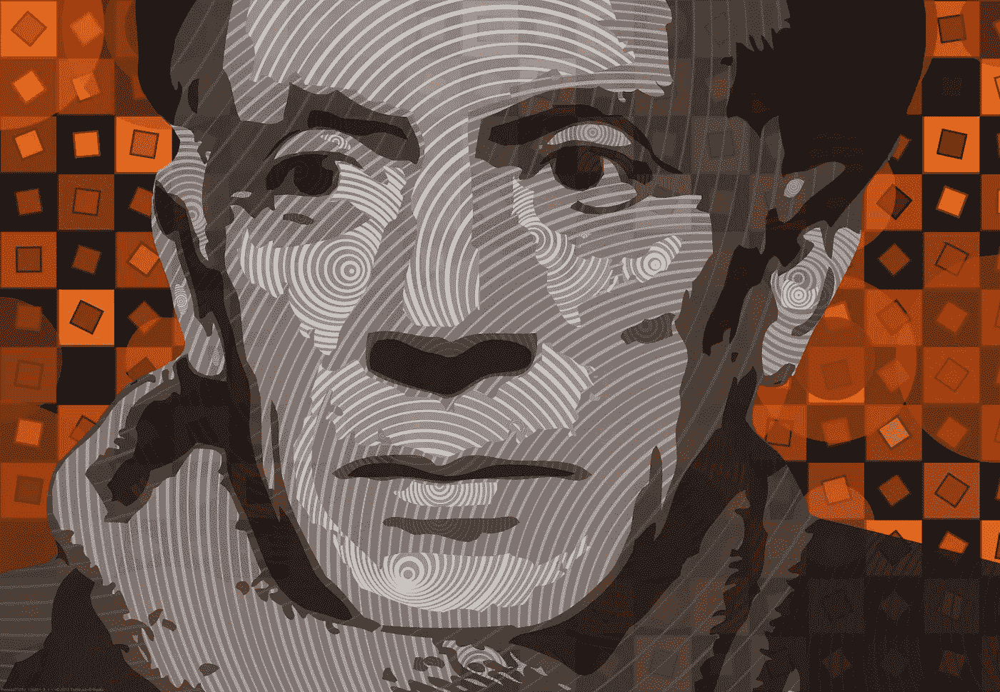

# 什么是艺术家？

> 原文：<https://medium.com/mlearning-ai/what-is-an-artist-36f789b0f521?source=collection_archive---------5----------------------->

Generative portrait of Picasso made with Art Fountain

因为艾，关于什么是艺术和什么是艺术家的争论愈演愈烈，有时甚至尖酸刻薄。作为一个哲学类型的人，我发现这场辩论很有趣，因为这个话题已经以各种形式讨论了几个世纪，例如美学研究、事物如何获得其意义、艺术的允许技术、秘密象征、艺术的社会背景等。现在我们已经成功地将数千年的艺术知识填充到机器学习中…