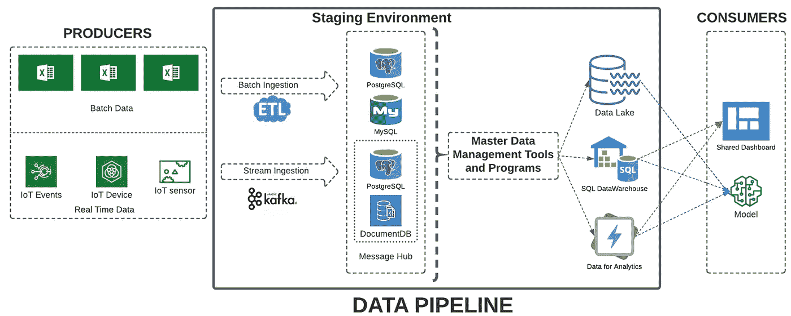

# 什么是数据管道？

> 原文：<https://medium.com/mlearning-ai/what-is-data-pipeline-d8acdc8cd1ce?source=collection_archive---------3----------------------->

Engineer creating Data Pipeline :D Photo by [SELİM ARDA ERYILMAZ](https://unsplash.com/@selimarda?utm_source=unsplash&utm_medium=referral&utm_content=creditCopyText) on [Unsplash](https://unsplash.com/s/photos/pipeline?utm_source=unsplash&utm_medium=referral&utm_content=creditCopyText)

在当今世界，我们从各种来源获取数据。这些数据来自内部来源，如安装在汽车上的物联网设备、商店中的 POS 机、零售店的库存数据，以及外部来源，如印度的[https://data.gov.in/](https://data.gov.in/)、美国的[https://www.data.gov/](https://www.data.gov/)等。(我不考虑从物理调查和访谈等直接来源收集的数据，而只考虑在内部或外部系统中以数字形式生成或存储的数据。最终，以数字格式存储的调查和访谈数据将成为内部或外部系统的一部分。)还有各种类型的数据—结构化的和非结构化的—如文本、视频、音频、图像、XML 文件、记录、来自网站的 HTML 数据等。

# 生产者和消费者

生成数据的代理或进程称为生产者，使用数据的称为消费者。安装在汽车上的物联网设备是生产者，而预测引擎故障的机器学习程序是消费者。

# 为什么需要数据管道？

在大多数情况下，消费者不理解产生数据的数据格式。比如预测销量的机器学习程序(消费者)并不直接摄取 POS 机(生产者)产生的数据。为了生成机器学习模型，我们必须清理从 POS 机捕获的数据，用来自其他来源(如商品库存)的数据丰富它，并添加新功能。

# 什么是数据管道？

数据清理、数据丰富、数据治理和数据处理所需的步骤统称为数据管道。数据管道确保生产者生成的数据以正确和期望的格式到达消费者。在生产者和消费者之间的这些中间步骤中，数据以多种形式被转换和存储。数据管道的设计取决于各种因素

*   商业问题
*   生产者的类型—批处理或实时
*   消费者类型—报告、ML 模型或仪表板
*   中间数据存储—文件、NoSQL 或 SQL 数据库

让我们用一个例子来讨论这个问题——假设我们为一家汽车公司工作，该公司每天都有来自每个工厂的 excel 文件形式的零件库存相关数据。此外，实时数据是从安装在发动机、制动器和汽车其他部件上的各种物联网设备中生成的。除此之外，还会实时生成与服务器性能和使用情况相关的日志。

因此，一些数据是以批处理模式生成的(一天结束时的零件库存)，一些数据是实时生成的(物联网设备和日志)。

我们希望为用户创建一个系统，以了解零件的使用情况，预测每个工厂的库存需求，根据日志显示服务器上的负载，并预测引擎的故障。

我们的数据管道会是什么样子？

# 暂存环境

对于每天结束时来自每个工厂的 excel 文件形式的零件库存，我们可以在批量摄取中使用传统的 ETL 设计。这些数据可以存储在操作数据存储中，操作数据存储可以是关系数据库，如 MySQL 或 PostgreSQL。

对于实时数据，我们必须实现像 Apache Kafka 这样的分布式事件流平台。来自物联网设备的消息可以存储在消息中心，该中心可以是 MongoDB 等 NoSQL 数据库，也可以是 MySQL 或 PostgreSQL 等关系数据库。

# 主数据管理（Master Data Management 的缩写）

当数据以原始(或接近原始)形式存储在暂存环境中时，MDM 将监控进入管道的数据。主数据管理(MDM)是根据业务规则管理、集中、组织、分类、本地化、同步和丰富主数据的核心流程。它有助于为所有关键业务数据创建一个单一的主参考源，从而减少业务流程中的冗余和错误。中央存储库中主数据的高效管理为您提供了一个权威的信息视图，并消除了由数据孤岛导致的成本高昂的低效问题。

MDM 将结合各种工具和程序来创建中央存储库。根据需要，数据可以从 MDM 流向数据湖或数据仓库。

从数据湖和数据仓库中，数据将提供给各种仪表板和 ML 程序的用户，以创建模型，然后该模型可以使用事件流平台的暂存数据库进行预测。

这都在下面的图片中描述

From Producers to Consumers through Data Pipeline