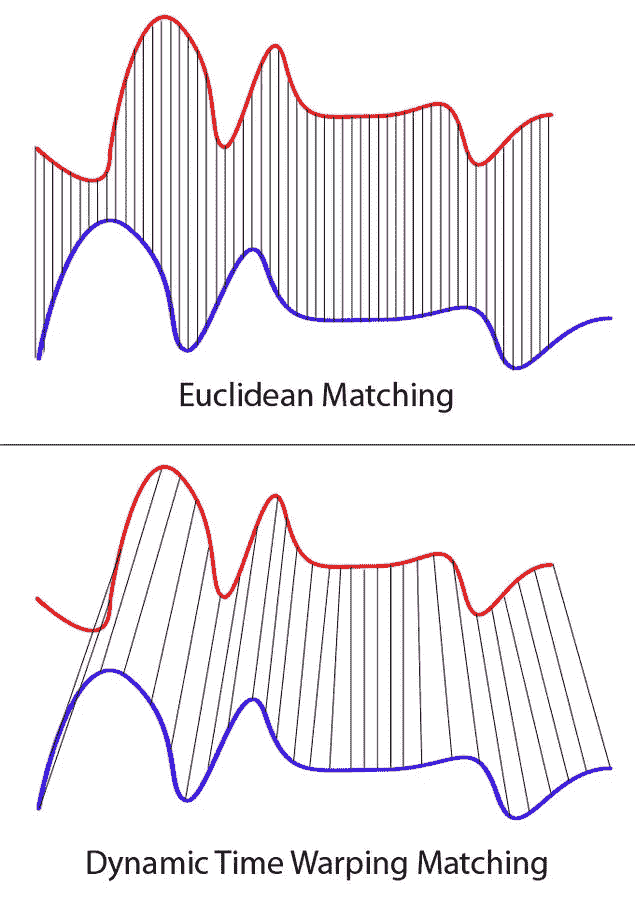
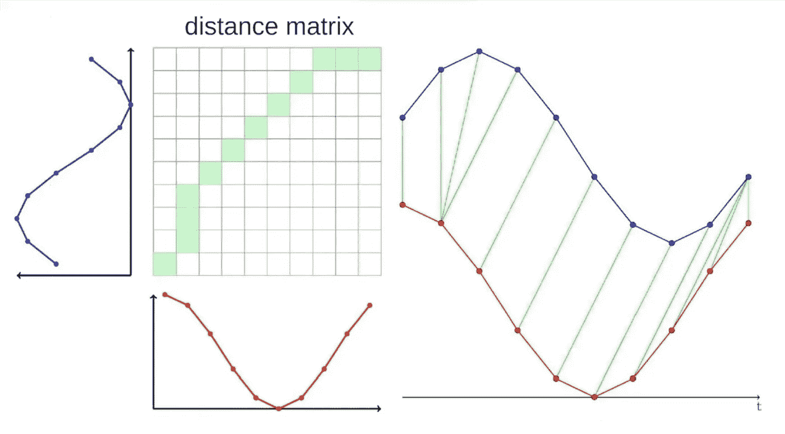
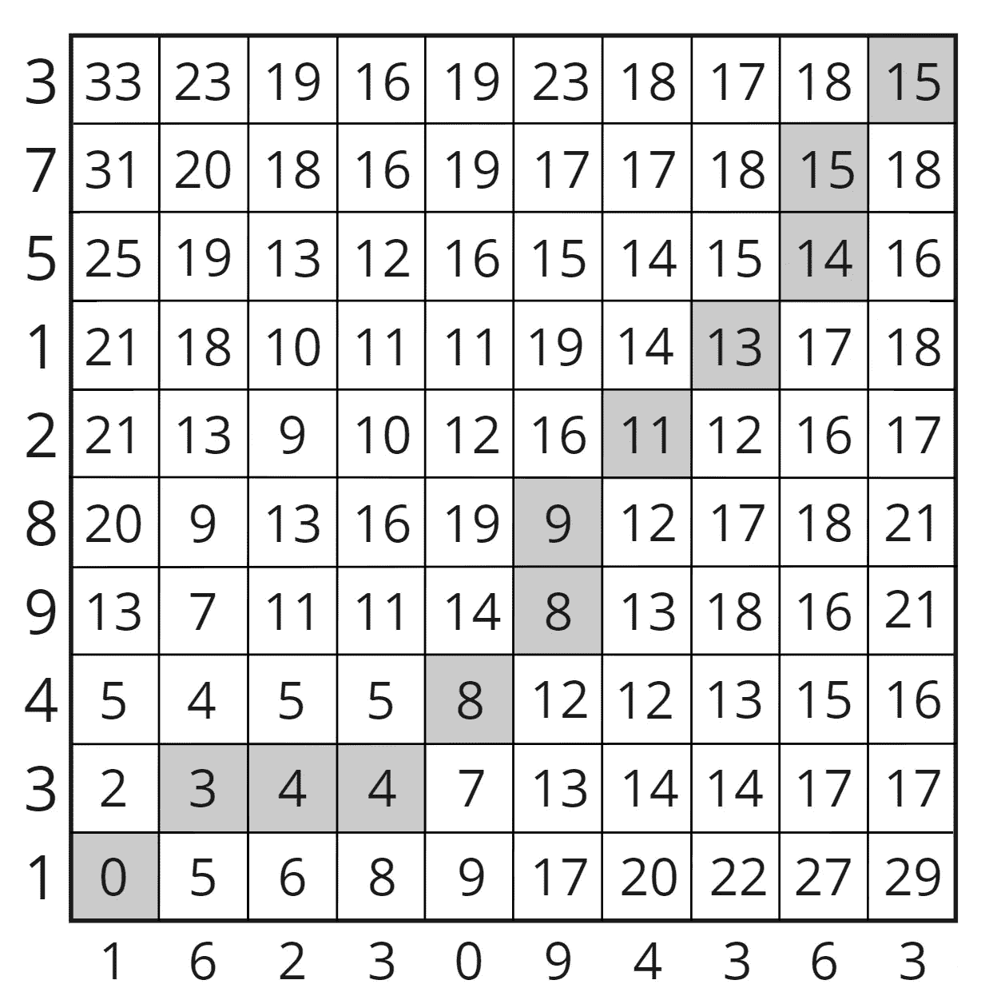
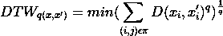
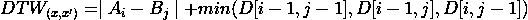

# 什么是动态时间扭曲？

> 原文：<https://medium.com/mlearning-ai/what-is-dynamic-time-warping-253a6880ad12?source=collection_archive---------1----------------------->

[**动态时间扭曲**](https://dtaidistance.readthedocs.io/en/latest/usage/dtw.html)【DTW】听起来可能很酷，很有未来感，但实际上并非如此。它用于比较两个不同长度的时间序列或数组之间的相似性或距离。

那么，动态时间扭曲距离和欧氏距离有什么区别呢？
答案很简单，动态时间扭曲允许*多对一*比较来创建最佳可能的对齐，利用它们之间的时间扭曲，而欧几里德允许*一对一*点比较。这就是为什么动态时间弯曲被用于两个可变长度的数组或时间序列。最初，它是为自动语音识别而设计的。

**动态时间弯曲**是一种用于测量两个时间时序序列之间相似性的算法。它们可以有不同的速度。它计算两个序列之间匹配的相似元素的距离。它在动态规划中用于寻找最佳路径。

这一切意味着什么？这里有一个常见的例子，假设你和你的朋友想要找到你和托马斯·谢尔比的行走之间的相似之处。

如果你使用动态时间扭曲，那么你不需要匹配你和 Cillian 的行走速度。DTW 会帮你处理那部分。
DTW 的另一个众所周知的应用是语音识别。你显然是想把“hellllooooooo”检测成 hello，而不是别的。类似地，我们可以使用 DTW 进行签名识别、形状匹配等等。

# **幕后**

这是你开始在纸上做时的样子

假设你有两个时间序列。TS-A 和 TS-B.
TS-A = [1，3，4，9，8，2，1，5，7，3]
TS-B = [1，6，2，3，0，9，4，3，6，3]

现在它们可以被绘制成这样:

其中根据先前的计算来计算新的单元。

k 是 x 和 x’的索引对的集合。π是 k 的一组指数序列。
或者，这个方程的更简单形式可以写成:

其中 A 和 B 分别代表 TS-A 和 TS-B。I 和 j 属于π。
对于单元格(0，0)，公式给出，D(0，0)= | 1–1 |。因此(0，0)是 0。类似地，对于单元格(4，4)，公式给出 D(4，4)= | 9–3 |+min(D(3，3)，D(3，4)，D(4，3))。因此，D(4，4) = 11，而对于其他单元则为 s00 开。

# **下一步**

好了，现在我们创建了一个距离矩阵，现在呢？？为了找到最优路径，你从最后一点开始回溯，消耗最低的一项。这到底是什么意思？我的意思是，从最后一个单元格(在本例中为(10，10))开始，添加您在 3 个相邻单元格中遇到的最低项。

比如这里，你从 cel (10，10)开始，也就是 15。然后，检查索引等于或小于当前单元格索引(D[i-1，j-1]，D[i，j-1]，D[i-1，j])的 3 个项中哪个项最低。我们可以清楚地看到，最低项是 15，所以我们在前面的 15 上加上 15。我们继续这样做，直到我们到达起点。这将给出起点和终点之间最短的时间。

# **用例**

现在，在您深入了解之前，您应该知道它在哪里使用。就像我之前说的，它在很多情况下都起着关键作用。其中有:
声音模式识别
股市预测
相关幂分析
金融与计量经济学

**参考文献** 1。[https://towards data science . com/dynamic-time-warping-3933 f 25 fcdd](https://towardsdatascience.com/dynamic-time-warping-3933f25fcdd)
2。[https://dtaidistance . readthedocs . io/en/latest/usage/DTW . html](https://dtaidistance.readthedocs.io/en/latest/usage/dtw.html)
3 .[https://en . Wikipedia . org/wiki/Dynamic _ time _ warping #应用](https://en.wikipedia.org/wiki/Dynamic_time_warping#Applications)

 [## Mlearning.ai 提交建议

### 如何成为 Mlearning.ai 上的作家

medium.com](/mlearning-ai/mlearning-ai-submission-suggestions-b51e2b130bfb)