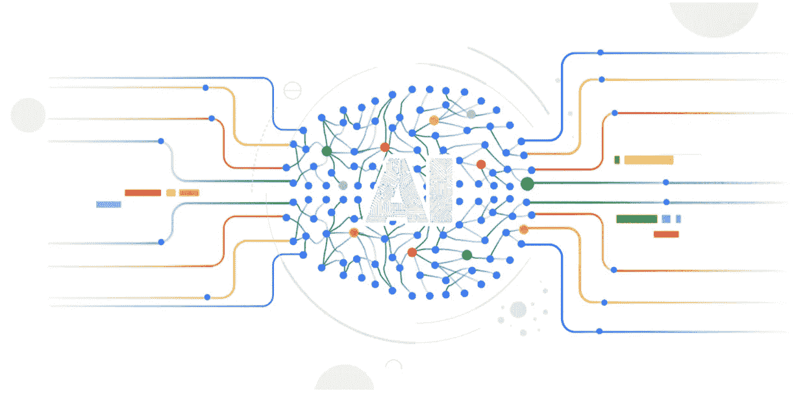
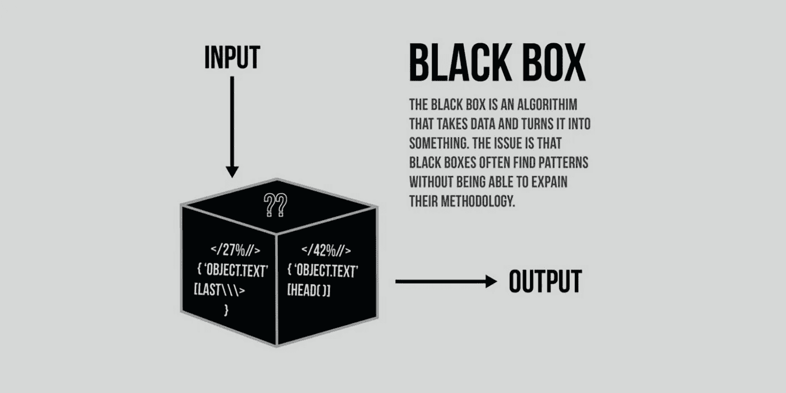

# 什么是可解释的人工智能，为什么对它大肆宣传

> 原文：<https://medium.com/mlearning-ai/what-is-explainable-ai-and-why-the-hype-for-it-55430557d2c2?source=collection_archive---------3----------------------->

可解释的人工智能是最近几年经常听到的一个术语。这个 ExAI 的到来改变了 ML 从业者和行业解释和理解 ML 模型的方式。这个概念已经扩展了 ML 模型如何工作的定义——从输入、模型和输出到我们为什么接收特定的值和输出以及哪个输入促成了它。在这篇文章中，我们将讨论可解释的人工智能，是什么导致了人工智能的产生及其应用。

**追溯人工智能的历史**

在传统的人工智能中，对于为什么我们会收到特定的输出，线性模型没有具体的解释。最初，人工智能模型被认为是“黑箱”模型，除了在引擎盖下工作的数学之外，它获得特定输出的原因没有明确的定义。整个 ML 系统被描述为一个三组件图——输入特征、模型和输出。

Traditional ML Systems ([https://www.topbots.com/interpretable-machine-learning/](https://www.topbots.com/interpretable-machine-learning/))

**什么是可解释的人工智能**

现在让我们看看可解释的人工智能如何使 ML 模型更加透明和可理解。可解释的人工智能有助于理解哪个输入对输出的贡献更大。通过这种方式，我们可以深入了解哪个要素产生了特定的输出值，哪个要素的贡献较小。这对于解决关键问题和涉及许多特征值的模型来说是非常必要的。这种技术使得 ML 模型更加“白盒”和可解释。

**ExAI 的应用端**

让我们来看看可解释人工智能的应用方面。考虑一个心脏病预测系统。许多医学值中单个医学参数的较大贡献可能触发心脏病预测，但是它可能是不一定是心脏病的较大变化。这种情况需要白盒技术来帮助医学专家了解是什么导致模型触发心脏病。

感谢您的阅读！

## 有用的链接:

在 LinkedIn 上找到我:[https://www.linkedin.com/in/vishnuu0399](https://www.linkedin.com/in/vishnuu0399)

更了解我:[https://bit.ly/vishnu-u](https://bit.ly/vishnu-u)

 [## Mlearning.ai 提交建议

### 如何成为 Mlearning.ai 上的作家

medium.com](/mlearning-ai/mlearning-ai-submission-suggestions-b51e2b130bfb)