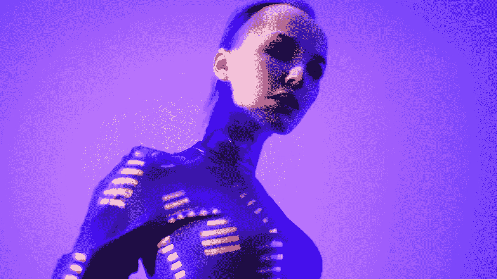

# 什么是“微调”？

> 原文：<https://medium.com/mlearning-ai/what-is-fine-tuning-da591885d81b?source=collection_archive---------3----------------------->

## [调整你的人工智能艺术](https://mlearning.substack.com/p/tune-your-private-ai-art-generator?r=z7zu8&utm_campaign=post&utm_medium=web)

## 重新训练一个人工智能艺术生成器

[Uncovering the Secrets of AI Art Generator](https://mlearning.substack.com/p/tune-your-private-ai-art-generator?r=z7zu8&utm_campaign=post&utm_medium=web)

在 NLP 中，[微调](https://mlearning.substack.com/p/tune-your-private-ai-art-generator?r=z7zu8&utm_campaign=post&utm_medium=web)是使用你自己的数据重新训练一个已经训练好的语言模型的过程。在微调过程中，原始模型的权重会发生变化，以考虑领域数据和您感兴趣的任务的特征。