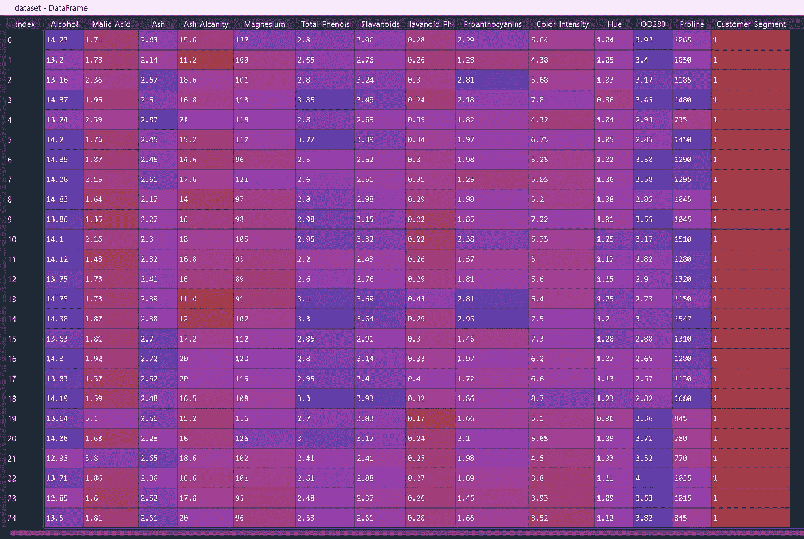
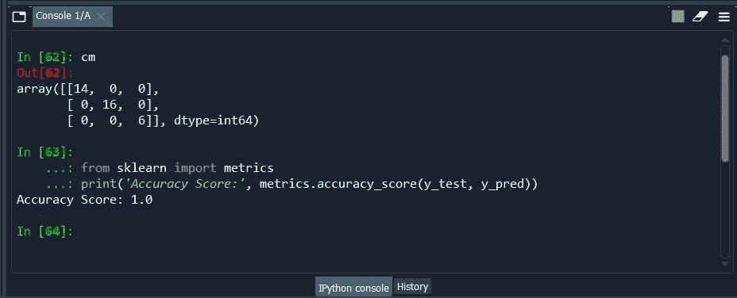
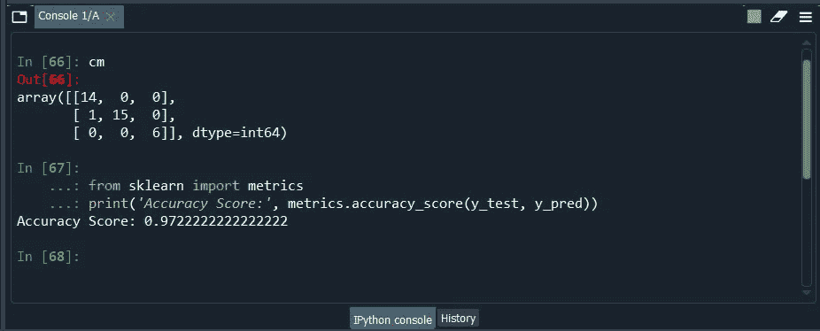
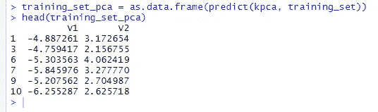
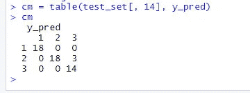

# 什么是核主成分分析？使用研发 Python

> 原文：<https://medium.com/mlearning-ai/what-is-kernel-pca-using-r-python-4864c2471e62?source=collection_archive---------1----------------------->

## 在艾里面

4 行简单代码，对非线性可分离数据应用最先进的 PCA。


什么是 PCA 首先？

主成分分析是一种统计过程，允许我们**汇总/提取**解释整个数据集的唯一重要数据。

主成分分析是当今最流行的多元统计技术之一。PCA 是 MVDA 多元数据分析的基本方法

它已被广泛应用于模式识别和信号处理领域以及统计分析中，以降低维数，换句话说，只理解和提取解释整个数据的重要因素。从而有助于避免处理不必要的数据。

既然我们对 pca 有了基本的了解。

让我们了解什么是**核主成分分析。**

核 PCA 利用 rbf 径向基函数将非线性可分数据转换到更高维度，使其可分。因此，它在非线性数据中表现更好。

让我们加载我们的数据，定义 X 和 Y，将数据集分解成序列&测试并缩放它，以减少数据点的数量。您可以保存我们在应用任何模型之前经常需要使用的数据预处理模板。

在本例中，我们将使用一个著名的可用数据集“wine_quality ”,假设我们有葡萄酒及其客户的关键组成因素。



Wine Data set

```
#Importing the libraries
import numpy as np
import matplotlib.pyplot as plt
import pandas as pd#Importing the dataset
dataset = pd.read_csv('Wine.csv')
X = dataset.iloc[:, 0:13].values
y = dataset.iloc[:, 13].values#Splitting the dataset into the Training set and Test set
from sklearn.model_selection import train_test_split
X_train, X_test, y_train, y_test = train_test_split(X, y, test_size = 0.2, random_state = 0)#Feature Scaling
from sklearn.preprocessing import StandardScaler
sc = StandardScaler()
X_train = sc.fit_transform(X_train)
X_test = sc.transform(X_test)
```

> 应用核主成分分析的时间

```
#Applying Kernel PCA
from sklearn.decomposition import KernelPCA
kpca = KernelPCA(n_components = 2, kernel = 'rbf')
X_train = kpca.fit_transform(X_train)
X_test = kpca.transform(X_test)
```

我们所需要的只是 n_components = 2 即主成分的个数和核**‘RBF’**，其余的都一样。是的，前面提到的“kpca.fit_transform”我们不需要写**“kpca . fit”**就可以了，正如 python 自己知道 kpca 用于转换一样。

然后，我们将在我们的模型中拟合 2 个主 n 分量。

```
#Fitting Logistic Regression to the Training set
from sklearn.linear_model import LogisticRegression
classifier = LogisticRegression(random_state = 0)
classifier.fit(X_train, y_train)
```

让我们用测试(未知)数据来预测我们的模型，以获得 n_components = 2 的模型的精度

```
#Predicting the Test set results
y_pred = classifier.predict(X_test)#Making the Confusion Matrix
from sklearn.metrics import confusion_matrix
cm = confusion_matrix(y_test, y_pred)#Another evaluation Metrics
from sklearn import metrics
print('Accuracy Score:', metrics.accuracy_score(y_test, y_pred))
```



Kernel PCA model accuracy score

不错。我们的模型对我们的测试数据集(看不见的)数据有 100%的准确度，在混淆矩阵(cm)中有完全分离/识别的类

让我们用简单的 PCA 重做一遍，然后比较性能。

```
#Simple PCA-------------------------------------
#Splitting the dataset into the Training set and Test set
from sklearn.model_selection import train_test_split
X_train, X_test, y_train, y_test = train_test_split(X, y, test_size = 0.2, random_state = 0)#Feature Scaling
from sklearn.preprocessing import StandardScaler
sc = StandardScaler()
X_train = sc.fit_transform(X_train)
X_test = sc.transform(X_test)#Applying PCA
from sklearn.decomposition import PCA
pca = PCA(n_components = 2)
X_train = pca.fit_transform(X_train)
X_test = pca.transform(X_test)#Fitting Logistic Regression to the Training set
from sklearn.linear_model import LogisticRegression
classifier = LogisticRegression(random_state = 0)
classifier.fit(X_train, y_train)#Predicting the Test set results
y_pred = classifier.predict(X_test)#Making the Confusion Matrix
from sklearn.metrics import confusion_matrix
cm = confusion_matrix(y_test, y_pred)#Another evaluation Metrics
from sklearn import metrics
print('Accuracy Score:', metrics.accuracy_score(y_test, y_pred))
```



Simple PCA model accuracy score

哦，是的！现在，我们的模型有 2 个 n _ 分量，准确率为 97%。

那么，到目前为止，我们学到了什么？基于径向的函数' rbf '在从非线性可分离数据中正确识别类别方面表现更好

> 经验法则:当我们的数据是线性可分的时，使用简单的主成分分析；当我们的数据是复杂的、非线性可分的时，使用核“rbf”主成分分析。

让我们把所有的碎片放在一起

```
#Importing the libraries
import numpy as np
import matplotlib.pyplot as plt
import pandas as pd#Importing the dataset
dataset = pd.read_csv('Wine.csv')
X = dataset.iloc[:, 0:13].values
y = dataset.iloc[:, 13].values#Splitting the dataset into the Training set and Test set
from sklearn.model_selection import train_test_split
X_train, X_test, y_train, y_test = train_test_split(X, y, test_size = 0.2, random_state = 0)#Feature Scaling
from sklearn.preprocessing import StandardScaler
sc = StandardScaler()
X_train = sc.fit_transform(X_train)
X_test = sc.transform(X_test)#Applying Kernel PCA
from sklearn.decomposition import KernelPCA
kpca = KernelPCA(n_components = 2, kernel = 'rbf')
X_train = kpca.fit_transform(X_train)
X_test = kpca.transform(X_test)#Fitting Logistic Regression to the Training set
from sklearn.linear_model import LogisticRegression
classifier = LogisticRegression(random_state = 0)
classifier.fit(X_train, y_train)#Predicting the Test set results
y_pred = classifier.predict(X_test)#Making the Confusion Matrix
from sklearn.metrics import confusion_matrix
cm = confusion_matrix(y_test, y_pred)#Another evaluation Metrics 
from sklearn import metrics
print('Accuracy Score:', metrics.accuracy_score(y_test, y_pred))#----------------------------------------
#simple PCA#Splitting the dataset into the Training set and Test set
from sklearn.model_selection import train_test_split
X_train, X_test, y_train, y_test = train_test_split(X, y, test_size = 0.2, random_state = 0)#Feature Scaling
from sklearn.preprocessing import StandardScaler
sc = StandardScaler()
X_train = sc.fit_transform(X_train)
X_test = sc.transform(X_test)#Applying PCA
from sklearn.decomposition import PCA
pca = PCA(n_components = 2)
X_train = pca.fit_transform(X_train)
X_test = pca.transform(X_test)
explained_variance = pca.explained_variance_ratio_#Fitting Logistic Regression to the Training set
from sklearn.linear_model import LogisticRegression
classifier = LogisticRegression(random_state = 0)
classifier.fit(X_train, y_train)#Predicting the Test set results
y_pred = classifier.predict(X_test)#Making the Confusion Matrix
from sklearn.metrics import confusion_matrix
cm = confusion_matrix(y_test, y_pred)#Another evaluation Metrics 
from sklearn import metrics
print('Accuracy Score:', metrics.accuracy_score(y_test, y_pred))
```

我建议使用这个模板来应用两者，并观察差异，如果差异很小，我们可以使用简单的主成分分析或者内核主成分分析。在我们的例子中，我们与 1–0.97 有 0.3%的差异，所以我们可以使用 3 或 2 个 n_components 来构建我们的模型。

# 现在让我们对 R 执行相同的内核 PCA

最初，我们将从数据预处理步骤开始，从导入数据到将数据分成训练集和测试集，然后进行特征缩放，然后我们必须应用这 4 行代码来应用内核 pca。

```
#Applying Kernel PCA
#install.packages('kernlab')
library(kernlab)
kpca = kpca(~., data = training_set[-14], kernel = 'rbfdot', features = 2)
training_set_pca = as.data.frame(predict(kpca, training_set))
head(training_set_pca)training_set_pca$Customer_Segment = training_set$Customer_Segmenttest_set_pca = as.data.frame(predict(kpca, test_set))
test_set_pca$Customer_Segment = test_set$Customer_Segment
```

首先要应用内核 pca，我们需要 kernellab 包，其后的波浪号' ~ '是 DV ~ IV 的分隔符，后跟点'.'指包括所有的列(iv)。

然后，我们必须调用主成分数为 2 的核= 'rbfdot ',即特征= 2

一旦完成，我们将使用从训练集中预测两个最重要的主成分



head(training_set_pca)

但是，如果您发现我们新保存的结果 training_set_pca 没有因变量列，我们将添加它，然后我们将对测试集重复同样的 2 个步骤…..搞定了。

在我们的训练和测试数据集中，有两个最重要的主成分。现在是时候建立一个模型并预测它的准确性了。

```
#Fitting our data to a svm model
library(e1071)
classifier = svm(formula = Customer_Segment ~ .,data = training_set,type = 'C-classification',kernel = 'linear')#Predicting the Test set results
y_pred = predict(classifier, newdata = test_set[-14])#the Confusion Matrix
cm = table(test_set[, 14], y_pred)
```



Confusion Matrix Results in R

> 很好，我们有完美的混淆矩阵结果。

让我们把所有的 R 代码放在一起

```
#Kernel PCA#Importing the dataset
dataset = read.csv(file.choose())#Splitting the dataset into the Training set and Test set
#install.packages('caTools')
library(caTools)
set.seed(123)
split = sample.split(dataset$Customer_Segment, SplitRatio = 0.7)
training_set = subset(dataset, split == TRUE)
test_set = subset(dataset, split == FALSE)
nrow(training_set)/nrow(dataset)
nrow(test_set)/nrow(dataset)#Feature Scaling [-14] refers exclude the 14th column i.e.DV
training_set[-14] = scale(training_set[-14])
test_set[-14] = scale(test_set[-14])#Applying Kernel PCA
#install.packages('kernlab')
library(kernlab)
kpca = kpca(~., data = training_set[-14], kernel = 'rbfdot', features = 2)training_set_pca = as.data.frame(predict(kpca, training_set))
head(training_set_pca)
training_set_pca$Customer_Segment = training_set$Customer_Segmenttest_set_pca = as.data.frame(predict(kpca, test_set))
test_set_pca$Customer_Segment = test_set$Customer_Segment#fitting data to a svm model
library(e1071)
classifier = svm(formula = Customer_Segment ~ .,
                 data = training_set,
                 type = 'C-classification',
                 kernel = 'linear')#Predicting the Test set results
y_pred = predict(classifier, newdata = test_set[-14])#The Confusion Matrix
cm = table(test_set[, 14], y_pred)
```

> 现在，对于那些希望用 R 编程实现更多 PCA 的人，我有一个全新的课程来实现各种类型的 PCA。大数据 PCA，随机森林 PCA 进一步分为分类和回归，广义 Boosted 模型 PCA(GBM)，广义线性模型 PCA(GLMNET)，集成 PCA，fs caret PCA 等等。

感谢您抽出时间阅读完。我尽我所能保持它的简短，记住在我们的日常生活中使用这个代码。

我希望你喜欢它。

请随意提问，因为“好奇心导致完美”

我的另类网络存在，脸书，博客， [Linkedin](https://www.linkedin.com/in/bobrupak/) ，Instagram，ISSUU

也可以在 https://www.quora.com/profile/Rupak-Bob-Roy 的 Quora @ [上找到](https://www.quora.com/profile/Rupak-Bob-Roy)

敬请关注更多更新。！祝你有愉快的一天…


[https://www.quora.com/profile/Rupak-Bob-Roy](https://www.quora.com/profile/Rupak-Bob-Roy)

# ~开心享受！


Pexel

[](/mlearning-ai/mlearning-ai-submission-suggestions-b51e2b130bfb) [## Mlearning.ai 提交建议

### 如何成为 Mlearning.ai 上的作家

medium.com](/mlearning-ai/mlearning-ai-submission-suggestions-b51e2b130bfb)