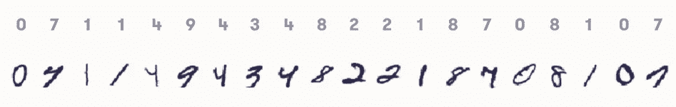
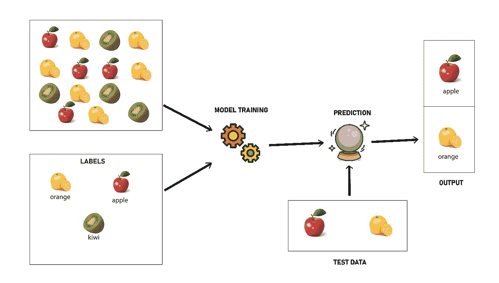
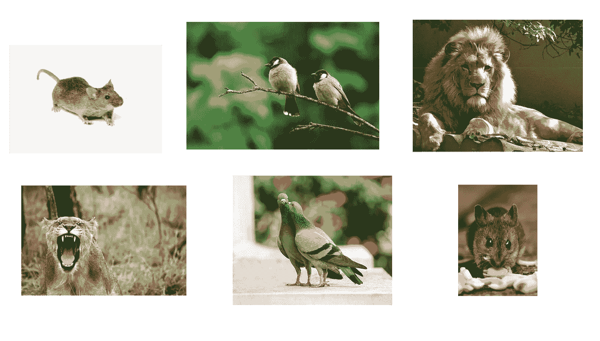

# 什么是机器学习？

> 原文：<https://medium.com/mlearning-ai/what-is-machine-learning-96e40309dbde?source=collection_archive---------7----------------------->

Source:[https://www.freepik.com/free-photo/ai-nuclear-energy-background-future-innovation-disruptive-technology_17850501.htm#query=technology&position=7&from_view=search](https://www.freepik.com/free-photo/ai-nuclear-energy-background-future-innovation-disruptive-technology_17850501.htm#query=technology&position=7&from_view=search)

无论你是不是计算机科学专业的学生，你可能以前听过人们谈论“机器学习”，或者你可能在社交媒体、电视、书籍等地方看到过它……但你真的知道它到底是什么意思吗？好吧，如果你的答案是“是”,并且你对此有很深的了解，那么，恭喜你，你已经学会了科技世界中最热门的趋势和最需要的技能之一。然而，如果你只有关于这个话题的基本知识，或者你完全忽略了这是怎么回事，学习永远不会太迟。

如果你对机器学习很好奇，但你完全迷失了，不知道从哪里开始，也不知道该遵循什么路线图，那么这个博客将有望成为你满足好奇心的方式。事实上，我正计划写一系列关于 ML 的博客，分享我在这一领域的知识，并且，显然，要遵守我在第一篇博客中所做的承诺(去查看[这个链接](/@jinaneB/what-should-motivate-you-to-start-blogging-ab64f86a0d75)了解我在说什么)。在开始之前，如果你已经是一个 ML 专家，请随意阅读这篇文章，并给我留下你所有的评论和意见，我将非常感激。

我们开始吧！

# **什么是机器学习？**

"机器学习是一种无需明确编程就能赋予计算机学习能力的技术."这是第一个使用“机器学习”这个术语的人[亚瑟·塞缪尔](https://en.wikipedia.org/wiki/Arthur_Samuel)给出的定义。在我找到的众多定义中，这一个似乎是最容易得到的，也是最准确的一个，所以我不打算在我的文本中加入更多冗长乏味的科学陈述，这样你就不会失去重点，继续阅读。

无论你去哪里学习机器学习，你遇到的第一个例子就是手写数字。当然，我的文章也不例外。

上图显示了一些手写数字及其对应的正确标签。你可能会想，这跟机器学习有什么关系？事实上，由于机器学习，我们可以建立一个模型，可以给一个手写的数字，并自动返回其正确的标签。

# 什么是机器学习类型？

根据所处理的问题类型，机器学习可以分为两个主要的子区域。

**监督学习:**这里我们用标记数据工作。这是什么意思？让我给你举个例子。想象你小时候的机器学习模型，带一些水果，教他所有不同元素的名称(这就是所谓的模型训练)。在那之后，他肯定能从橘子、苹果、猕猴桃中对它们进行分类，无论何时他被要求这样做。

**无监督学习:**和有监督的不一样，这里我们没有标签。没有标签？这怎么可能呢？当我第一次听说这种类型的 ML 时，我也问过同样的问题。让我们回到我们的“孩子”的例子。现在把你的孩子带到你旁边，给他这组动物图片，然后让他把它们分成 3 个不同的组。

不出意外的话，他的作品可能会是这样的:

这个孩子所做的是，他试图寻找动物之间的一些共同特征，并将它们分成包含相似元素的组(看起来有点相似的动物)，所以他将鸟类放在一起，狮子和母狮放在一组，最后将大鼠和小鼠放在一起，这就是我们所说的“聚类”。

现在，让我们回到手写数字的例子。你会把它归为哪一类机器学习？如果你认为这是一个监督学习，那么你猜对了，我很自豪你做到了。

如果你已经走了这么远，那么恭喜你向机器学习领域迈出了第一步。现在，你的下一步是学习更多关于最大似然算法的知识，这也是我下一篇博客将要讨论的内容。那里见！

 [## Mlearning.ai 提交建议

### 如何成为 Mlearning.ai 上的作家

medium.com](/mlearning-ai/mlearning-ai-submission-suggestions-b51e2b130bfb)