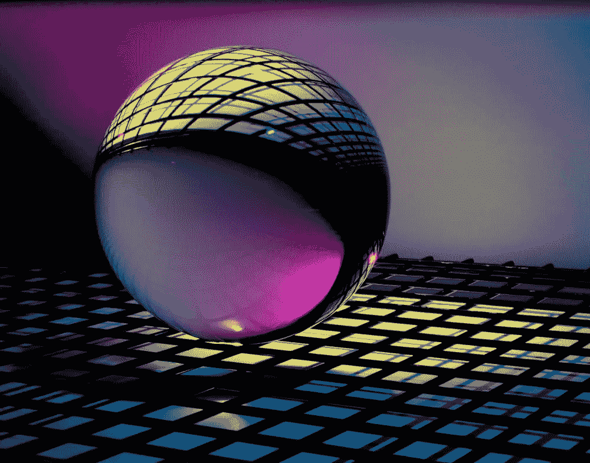
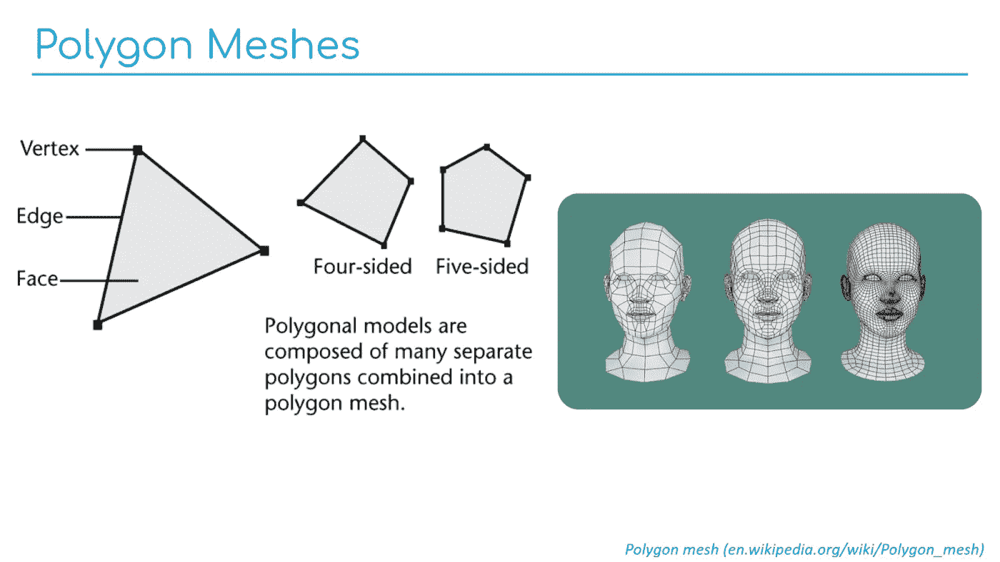
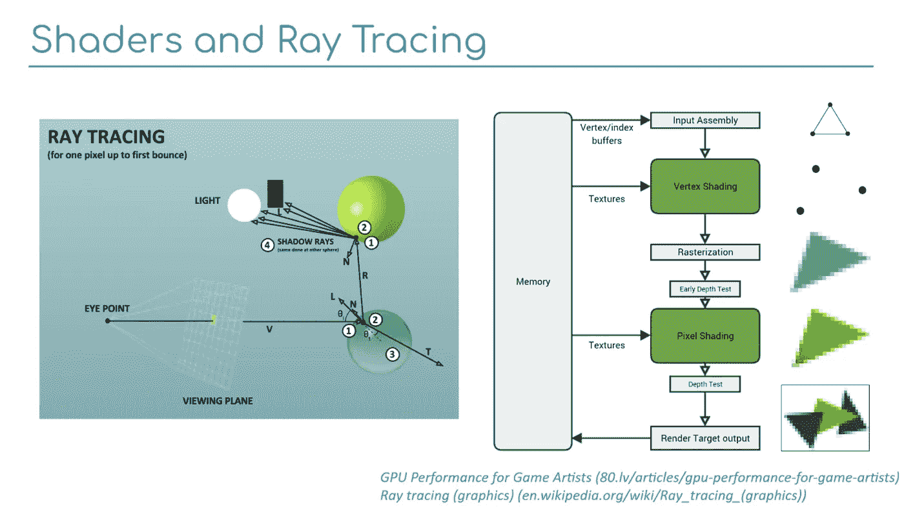

# 什么是神经渲染？

> 原文：<https://medium.com/mlearning-ai/what-is-neural-rendering-e25371afc771?source=collection_archive---------5----------------------->

随着我们的世界变得越来越数字化，我们渲染这些虚拟世界的方法也在迅速变化。通过利用生成机器学习技术，神经渲染在改善渲染管道的许多方面具有巨大的潜力。什么是神经渲染？在本文中，我们将介绍这个概念，将其与经典计算机图形学进行比较，并讨论它对未来的意义。

**经典渲染**

如今，创建 3D 虚拟世界是一个复杂的过程。虚拟场景中的每个项目或资源都由一个多边形网格表示(幻灯片 1)。这种多边形网格既可以由艺术家来建模，也可以通过扫描来生成:这两个过程都是手动且耗时的。我们希望该特定资源越详细，网格就有越多的多边形。

多边形网格只是开始。这个 3D 世界中的每个曲面也有相应的材质，这决定了网格的外观。在运行时，对象的材质和网格用作着色器程序的输入，着色器程序在给定的光照条件和特定的摄像机角度下计算对象的外观(幻灯片 2)。多年来，已经开发了许多不同的着色器程序，尽管基本原理是相同的:使用物理定律来计算对象的外观。这在被称为光线追踪的方法中最为明显，在该方法中，每条光线从其源头向下追踪到其反射的每个表面。

这种渲染管道可以创造出惊人的效果:你看过的每部电影中的每种 CGI 效果，你玩过的每款游戏都使用了某种形式的这种“经典计算机图形”管道。这种管道的主要难点是显式定义每个对象和每个材质所需的大量工作，以及渲染真实或复杂场景所需的大量计算。这就引出了一个问题:如果我们不必定义每一个物体并计算每一次光线反弹，会怎么样？

**进入神经渲染**

那么，什么是神经渲染呢？虽然仍然是一个非常年轻的领域，但它已经发展到包含大量技术——GANs 是神经渲染的一种形式。神经渲染方法背后的关键概念是它们是可微分的。可微函数是其导数存在于定义域中每一点的函数。这很重要，因为机器学习基本上是额外步骤的链式法则:可微分的渲染函数可以通过数据学习，一次一个梯度下降步骤。通过数据统计地学习渲染函数与我们上面描述的经典渲染方法有根本的不同，经典渲染方法根据已知的物理定律进行计算和推断。

神经渲染最酷的风格之一是新颖的视图合成。在这个问题中，神经网络学习从任意视点渲染场景。幻灯片 3 和 4 是关于这个主题的两篇伟大论文的图表:一篇来自谷歌研究[1]，另一篇来自脸书现实实验室[2]。这两项工作都使用了一种称为光线行进的体绘制技术。光线行进是当你从观察者(相机)射出一条光线穿过空间中的 3D 体积，并询问一个函数:空间中这个特定点的颜色和不透明度是什么？神经渲染的下一步是使用神经网络来近似这个函数。

**渲染的未来**

当谈到神经渲染时，我们真的只是触及了表面。如果你想了解更多，我们推荐这篇超级广泛的总结论文[3]。但在我们离开之前，这对未来意味着什么？

使用神经渲染，我们不再需要对场景进行物理建模和模拟光传输，因为这些知识现在隐含地存储在神经网络的权重中。这意味着它将有可能渲染你的脸，而它是在一个虚拟现实耳机(幻灯片 5)，而不必存储或扭曲你的脸的三维多边形网格！

使用神经渲染，渲染图像所需的计算也不再依赖于场景的复杂性(对象、灯光和材质的数量)，而是依赖于神经网络的大小(执行向前传递所需的时间)。这为以极快的帧速率进行真正高质量的渲染打开了大门。

如果你对机器学习和 3D 的交叉感兴趣，请查看我们的[开源合成数据工具包 zpy](https://github.com/ZumoLabs/zpy)【5】。您的反馈、提交和功能请求将是无价的，因为我们将继续构建一套更强大的工具来生成合成数据。谁知道呢？也许下一个伟大的神经渲染模型将使用 zpy 生成的数据进行训练。

**参考文献**

[1] NeRF:将场景表示为用于视图合成的神经辐射场(arxiv.org/pdf/2003.08934.pdf)

[2]神经体积:从图像中学习动态可渲染体积(arxiv.org/pdf/1906.07751.pdf)

[3]神经渲染的最新技术水平(arxiv.org/pdf/2004.03805.pdf)

[4] [zpy](http://github.com/ZumoLabs/zpy) :一个开源的合成数据工具包。

*原载于 2021 年 5 月 4 日*[*https://www . zumo labs . ai*](https://www.zumolabs.ai/post/what-is-neural-rendering)*。*