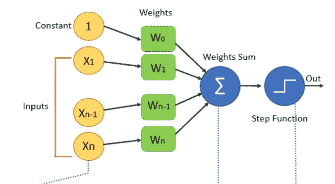
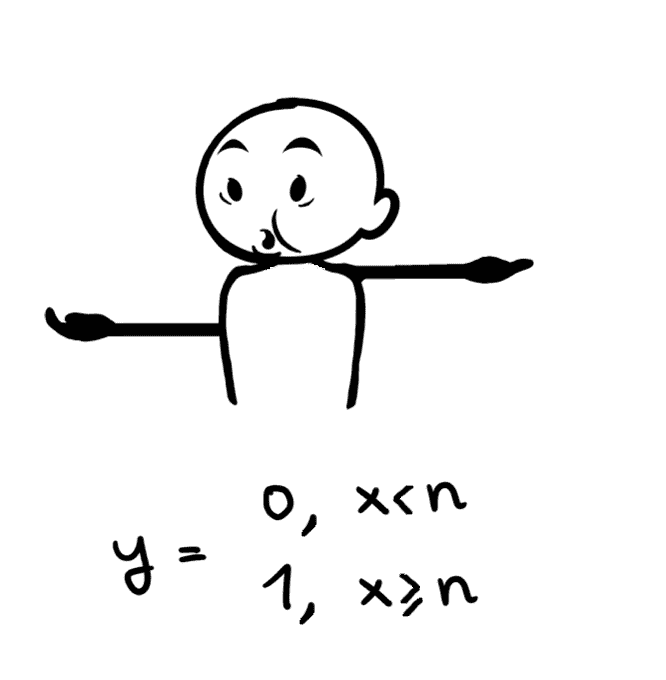
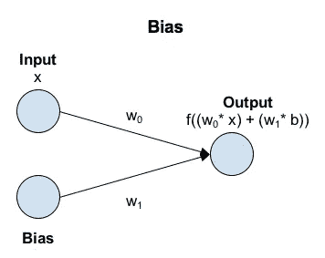
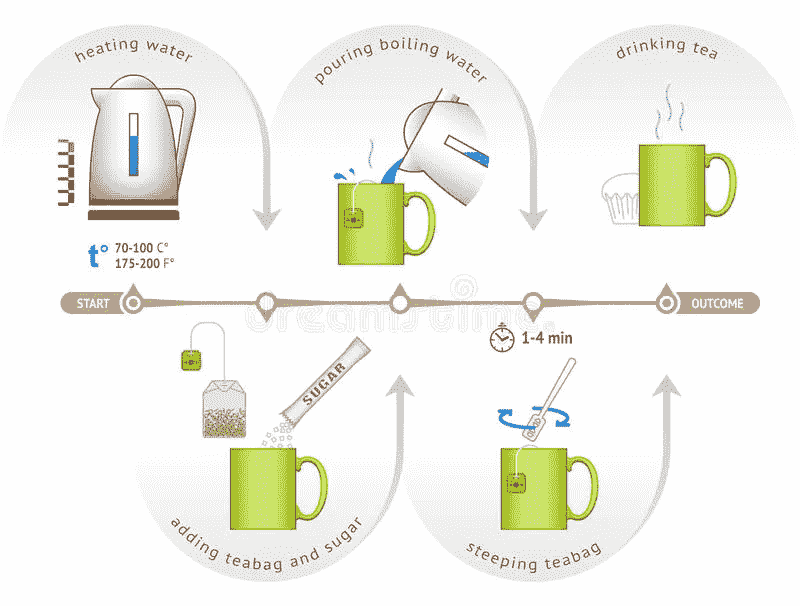
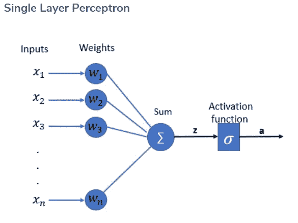
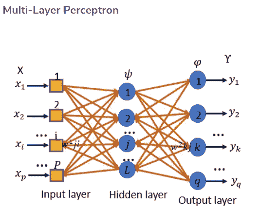
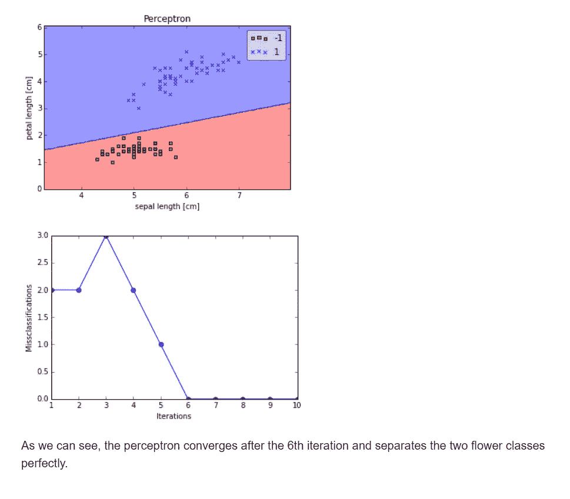

# 什么是感知器:感知器的入门指南

> 原文：<https://medium.com/mlearning-ai/what-is-perceptron-a-beginnerstutorial-for-perceptron-632539884146?source=collection_archive---------3----------------------->

用于分类的有监督机器学习的感知器算法。有两种分类。人们将通过画一条称为线性二元分类器的直线来对数据进行分类。另一种将不能通过画直线来分类的数据称为非线性二元分类器。

**人工神经元**

在当今世界，发明的同一阶段时间过得很快。人工智能解决方案为机器提供了一个像人脑一样思考的新平台。人工神经网络在这里起着至关重要的作用，基本上，它的功能与生物神经元为人类工作的方式相同。为了使它成为一个简单上下文，ANN 保存两个或更多个具有加权值的输入，并将它们与数学函数合并以产生输出。让我们看看生物神经元是如何工作的。

**生物神经元**

神经元是我们人脑中最重要的功能。当我们感受到外界的一些活动时，信号就会传递给神经元。一旦从神经元接收到信号，就产生相应的输出。输出作为响应被接收回 activity。

**感知器**

该框图将输入序列表示为 X1，X2，…Xn，其权重为 W1，W2…..Wn。此外，通过应用 W1*X1+W2*X2+…Wn*Xn 计算权重之和。最后将权重之和传递给激活函数。从函数产生输出。

**激活功能**

激活函数是神经网络的决策。这个函数产生一个二进制输出。这就是它被称为二元阶跃函数的原因。这里通过验证加权和的值来引入阈值。如果值> 0，则应用分类为 1 或 True。如果该值是< 0, then applied classification as 0 or False.

**偏差**

偏置允许您通过在输入中添加一个常数(即给定的偏置)来改变激活函数。神经网络中的偏差可以被认为类似于线性函数中常数的作用，从而线被常数值有效地转置。

在有偏差的情况下，激活函数的输入是“x”乘以连接权重“w0”加上偏差乘以偏差“w1”的连接权重。这具有将激活函数移动恒定量(b * w1)的效果。

有了所有的解释，我会在现实世界中更好地理解。通常，我们会为我们所爱的人准备茶，尤其是在早上。

以“泡茶”为例。把这个例子看作是准备好茶的感知器。

*   第一步是加热水，将开水倒入杯中。
*   加入茶包和糖，获得完美的香味
*   最后，搅拌茶叶，取出袋泡茶。
*   如果产量没有改变好茶。
*   如果输出不良，需要反向繁殖以改变糖/水的量。
*   然后检查输出。

此处输入被视为水，重量被视为袋泡茶和糖。如果输出出现误差，我们需要相应地调整重量。这里说是坏茶。

希望你能在这里联系到真实世界的例子。

**反向传播**

反向传播是神经网络训练的本质。这是一种基于前一个时期(即迭代)获得的错误率微调神经网络权重的方法。通过适当调整权重，您可以降低错误率，并通过提高模型的泛化能力来提高模型的可靠性。

**感知器类型**

感知器算法可以分为两种类型，它们是单层感知器和多层感知器。

在单层感知器中，神经元组织在一层中，而在多层感知器中，一组神经元将组织在多层中。第一层中的每个神经元都会接收输入信号，并向第二层中的神经元发送响应，依此类推。

**Python 实现**

在这一节中，我们将在 Python 中实现简单的感知器学习规则来对 Iris 数据集中的花进行分类。

对于下面的例子，我们将从 [UCI 机器学习库](http://archive.ics.uci.edu/ml/)加载虹膜数据集，并且只关注两个花卉品种 *Setosa* 和 *Versicolor* 。此外，我们将仅使用两个特征*萼片长度*和*花瓣长度*用于可视化目的。

希望这篇文章能让你对感知器有更好的了解。

下一篇文章再见:)