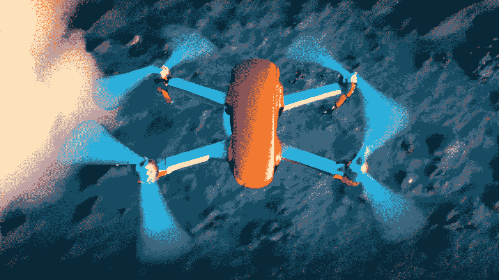

# 什么是机器学习中的机器人导航？

> 原文：<https://medium.com/mlearning-ai/what-is-robot-navigation-in-machine-learning-c6d0d1c1d6ff?source=collection_archive---------9----------------------->

## [机器学习艺术](https://mlearning.substack.com)

## 3D 数据的场景理解|编码和训练模型

[How ML tools can Enhance your Creativity](https://mlearning.substack.com/p/-how-ml-tools-can-enhance-your-creativity?r=z7zu8&s=w&utm_campaign=post&utm_medium=web)

[机器人导航](/mlearning-ai/how-do-we-control-robots-6d0fb4de3962)是指机器人能够计算出自己在自己的参照系中的位置，然后规划出一条路线到达某个目标。

## [机器人让生活变得更简单，所以让我们一起努力](https://mlearning.substack.com/p/i-am-a-shepherd-of-ai-art-robots?r=z7zu8&s=w&utm_campaign=post&utm_medium=web)