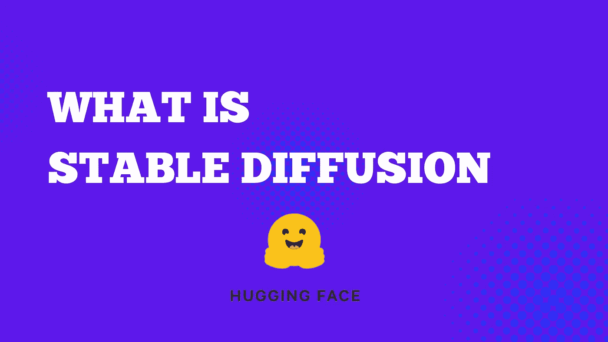

# 什么是稳定扩散？

> 原文：<https://medium.com/mlearning-ai/what-is-stable-diffusion-806b5243f0f9?source=collection_archive---------3----------------------->

由于稳定的扩散模型，现在可以从简单的文本指令中创建图像。

您可以点击下面的链接尝试生成图像

 [## 稳定扩散——稳定的拥抱面空间

### 发现由社区制作的令人惊叹的 ML 应用程序

huggingface.co](https://huggingface.co/spaces/stabilityai/stable-diffusion) 

**稳定扩散的好处**

我在 YouTube 上看到了朱利安·西蒙的一个视频，他演示了我们如何使用稳定扩散来生成图像数据集。创建数据集可能需要时间和精力，但稳定扩散可以为您生成照片数据集。

CompVis、Stability AI 和 LAION 的研究人员和工程师开发了一种称为稳定扩散的文本到图像潜在扩散模型。LAION-5B 数据库的 512x512 图像的子集用于训练它。目前最大的公开多模态数据集是 LAION-5B。

稳定扩散的好处不仅仅是为博客写作提供数据集。现在没有版权问题了，你可以根据你写的文本来创建图像。

**参考文献:**

 [## 关于稳定扩散的 10 款超赞 Google Colab 笔记本

### 用于学习和使用稳定扩散的 Google Colab 笔记本列表

analyticsindiamag.com](https://analyticsindiamag.com/10-awesome-google-colab-notebooks-on-stable-diffusion/)  [## Mlearning.ai 提交建议

### 如何成为 Mlearning.ai 上的作家

medium.com](/mlearning-ai/mlearning-ai-submission-suggestions-b51e2b130bfb)