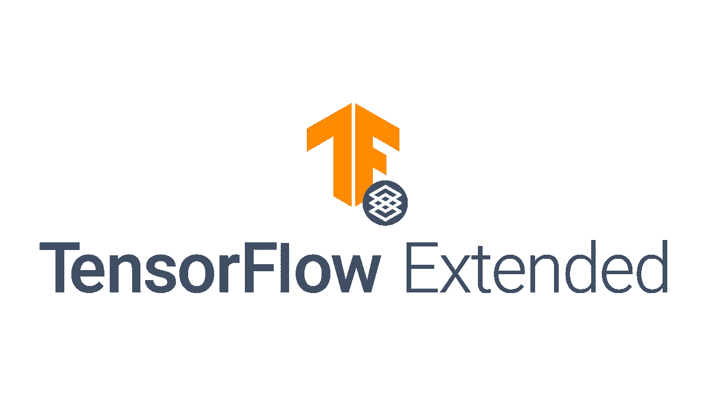
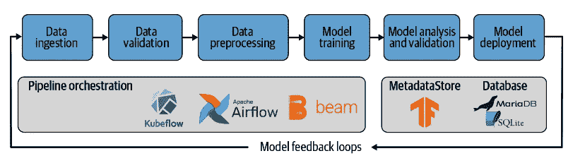
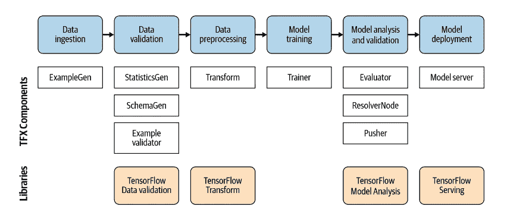
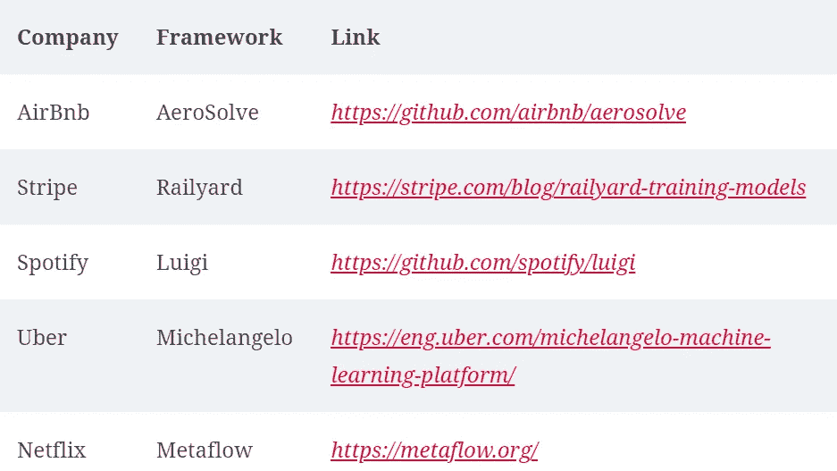

# 什么是 TensorFlow Extended (TFX)？

> 原文：<https://medium.com/mlearning-ai/what-is-tensorflow-extended-tfx-e5a07b209f0a?source=collection_archive---------3----------------------->

## Google 的开源 ML 管道框架



Image by tensorflow.org

与传统的软件工程不同，部署生产就绪的 ML 管道并不是一项非常简单的任务。机器学习管道可以包括各种任务，如数据摄取、验证、预处理、模型训练和训练后任务。在大多数情况下，数据科学家或 ML 工程师最终会编写大量样板代码来执行这些任务，并将代码粘合在一起。这些胶水代码通常很脆弱，会导致管道故障。

随着时间的推移，机器学习管道可能会变得非常复杂，并消耗大量开销来管理任务依赖性。编写自己的锅炉和胶水代码有其缺点。需要频繁的人工干预来适应输入数据格式的任何变化。粘合代码依赖于平台，平台的变化可能需要完全重构。在为计算机视觉或 NLP 项目处理大型数据集时，自定义粘合代码可能无法利用分布式系统的能力。

TFX 是谷歌的开源 ML 管道框架。TFX 有助于简化管道定义，并最小化为每个任务编写的样板代码。TFX 拥有执行各种管道任务的库，并将代码粘合在一起，为 Apache Airflow、Apache Beam 和 Kubeflow 管道等编排工具自动创建管道定义。*参考下面的图 1*



Figure 1 : ML pipeline architecture

TFX 库提供了执行机器学习流水线任务的组件。然后，这些任务可以通过管道编排器(如 Apache Airflow 或 Kubeflow)来执行。数据存储用于跟踪中间流水线结果。各个组件与该数据存储进行交互，以接收它们的输入并返回结果。简而言之，TFX 提供了结合所有这些工具的层，并为主要的管道任务提供了单独的组件。

TFX 提供各种组件来执行大多数数据管道任务。下面提到了其中的一些。

*   使用*示例生成*的数据摄取
*   用 *StatisticsGen* 、 *SchemaGen* 和 *ExampleValidator* 进行数据验证
*   使用*变换进行数据预处理*
*   使用*训练器进行模型训练*
*   使用*解析器节点*检查先前训练的模型
*   使用*评估器*进行模型分析和验证
*   带*推进器*的模型展开



Figure 2 : TFX components and libraries

从上图中我们可以看到，TFX 有组件和库来完成几乎所有的数据管道任务。我们将在以后的文章中详细讨论这些组件和库。

## TFX 的安装和使用

TFX 是一个 python 包。这可以作为任何其他 python 包安装，以使用内置的管道组件。

```
$ pip install tfx
```

一旦安装了 TFX，我们就可以导入相应的 TFX 组件来构建管道，如下所示

```
from tfx.components import ExampleValidator
from tfx.components import Evaluator
from tfx.components import Transform
...
```

## TFX 的局限性

由于 TFX 是由谷歌建立的，TFX 架构和数据结构希望你使用 TensorFlow (Keras)作为机器学习框架。一些 TFX 组件可以和其他 ML 框架一起使用。例如，可以使用 TFX 数据验证组件验证数据，然后使用 scikit-learn 构建模型。到目前为止，TFX 框架与 Tensorflow 紧密相关。

## TFX 的替代品

下表显示了其他组织开发的替代数据管道框架



Figure 3 : Alternatives to TFX

在下一篇文章中，我们将看到 TFX 如何在内部工作。这将包括研究 TFX 的各个组成部分和数据存储方法。

[](/mlearning-ai/mlearning-ai-submission-suggestions-b51e2b130bfb) [## Mlearning.ai 提交建议

### 如何成为 Mlearning.ai 上的作家

medium.com](/mlearning-ai/mlearning-ai-submission-suggestions-b51e2b130bfb)