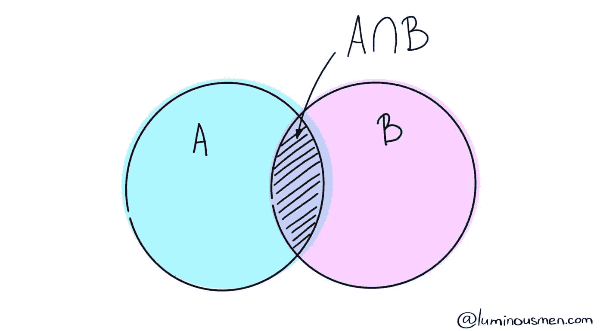
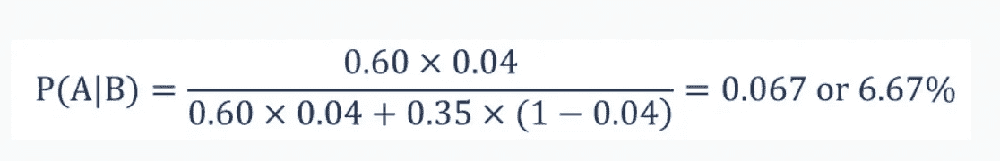

# 什么是贝叶斯定理？

> 原文：<https://medium.com/mlearning-ai/what-is-the-bayes-theorem-545a2ef0b91c?source=collection_archive---------1----------------------->

Image Credit: ([https://luminousmen.com/post/data-science-bayes-theorem](https://luminousmen.com/post/data-science-bayes-theorem))

# 什么是贝叶斯定理？

在统计学**和应用数学**中，**贝叶斯定理**也被**简称为**贝叶斯法则**可能是一个**数学公式**惯于**决定事件的**或然概率**。从本质上讲，**贝叶斯定理**描述了**支持**可能与事件相关的条件**先验知识的情况的概率。**

定理**以英国统计学家**贝叶斯**的名字**而闻名，他在 1763 年发现了这个公式。**它被**认为是**被称为贝叶斯推断的特殊统计推断方法的灵感**。

除了统计学，**贝叶斯定理还被应用于**各个学科，其中最显著的例子是医学和药理学**。**此外**、**该理论通常**应用于金融的几个**领域。许多应用程序包括但不限于模拟借钱给借款人的风险或预测投资成功的概率。

# 直觉理解

这个男人正坐在**和他的**一起背对**一张极其**平坦而完美的方桌。然后他让他的助手把球扔在桌子上。很明显，这个球本可以落地并结束，但是**是以一种**更具分析性的方式。

于是，他让助手将另一个球扔在桌子上，判断它是落在主球的左边**还是正确的**上，还是落在主球**的前面**或后面**上。他记了下来，然后他让助手把越来越多的球扔在桌子上。**

他知道用这种方法他可以更新他最初的想法，即主球落在哪里。但是**事实上**，他永远不可能完全确定，但是随着每一个新的证明，他**会把**的不确定性砍掉，变得越来越准确。

这就是**贝伊斯**如何看到**这颗行星**，这就是他的思维实验。**不是** " >不是他认为**行星**没有定义，现实不存在，而是**我们不会完美地认识到**，**和每一个我们将**希望**尝试**的人是随着越来越多的证据出现来更新我们的理解。我认为这是一种真正科学的求知方法。

# 说明

Image Credit: ([https://luminousmen.com/post/data-science-bayes-theorem](https://luminousmen.com/post/data-science-bayes-theorem))

上图**我们有**两个重叠的事件 A 和 B，可能是，**比如说** A — **我买**今天下雨，B — **今天**会下雨。在**一个**或另一个方法中，许多事件都**与另一个**相关联，就像我们的例子一样。我们来计算一下只要 B 已经发生了，A **的概率。**

由于 B **继续**，现在对 A **重要的部分是**阴影部分，有趣的是 A ∩ B。因此，给定 B **的概率似乎**为:

因此，给定 A 已经发生，我们可以写出事件 B 的公式:

运筹学

现在，第二个等式可以改写为:

总之，这就是所有的，所有的**需要被**吸引**返回**到基本定理。贝叶斯定理的公式

其中:

*   P(A|B) —假设事件 B 已经发生，事件 A 发生的概率。
*   P(B|A) —假设事件 A 已经发生，事件 B 发生的概率。
*   P(A) —事件 A 的概率。
*   P(B) —事件 B 的概率。

# 贝叶斯定理的例子

假设**你是**一家投资银行的**证券分析师**。**与**你对上市公司的研究一致，在过去三年内股价上涨**相当于** 5% **的**企业中，有 60%在**期间更换了首席执行官**。****

在**相当于**的时间，只有 35%的**企业**没有在同期将 5% **的股价提高**的企业更换了他们的首席执行官。已知股票价格在 4%中增长 5%的概率，找出解雇首席执行官的公司股票增长 5%的概率。****

在寻找概率之前，你必须首先定义概率的符号。

*   p(A)——股票价格上涨 5%的概率。
*   P(B) —首席执行官被替换的概率。
*   P(A|B) —假设首席执行官已经更换，股价上涨 5%的概率。
*   P(B|A) —给定股票价格，更换 CEO 的概率增加了 5%。

使用**贝叶斯定理**，**我们将**找到**指定的**概率:

因此， **a 公司**更换其 CEO 的股票将增长**5%的概率是 6.67%的概率。**

## 撰写本文前参考的资料:

*   [https://luminousmen.com/post/data-science-bayes-theorem](https://luminousmen.com/post/data-science-bayes-theorem)
*   [https://corporate finance institute . com/resources/knowledge/other/Bayes-theory/](https://corporatefinanceinstitute.com/resources/knowledge/other/bayes-theorem/)
*   [https://www.youtube.com/watch?v=XQoLVl31ZfQ](https://www.youtube.com/watch?v=XQoLVl31ZfQ)

 [## Mlearning.ai 提交建议

### 如何成为 Mlearning.ai 上的作家

medium.com](/mlearning-ai/mlearning-ai-submission-suggestions-b51e2b130bfb)