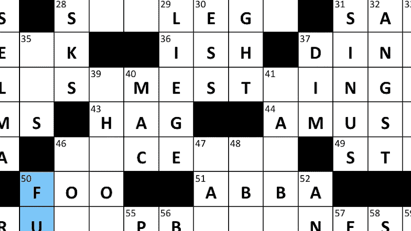

# 最好的 AI 填字游戏解决方案是什么？

> 原文：<https://medium.com/mlearning-ai/what-is-the-best-ai-crossword-solver-7713d73e9af3?source=collection_archive---------4----------------------->

## [机器学习艺术](https://mlearning.substack.com)

## 解决纵横字谜的最先进的方法

[https://mlearning.substack.com](https://mlearning.substack.com)

## 你说的“纵横字谜”到底是什么意思？

当单词根据数字线索排列成方块时，它们被称为“纵横字谜”,因为在…