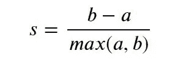
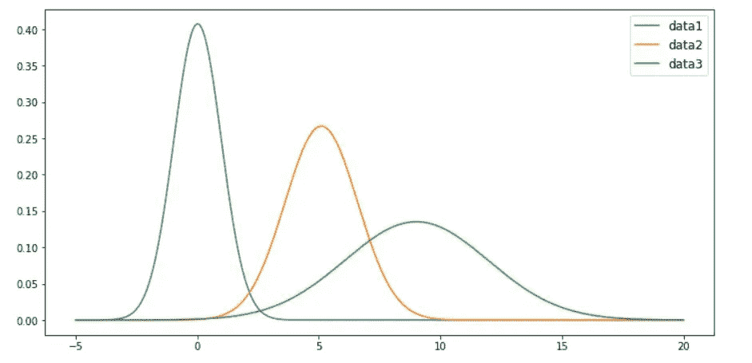
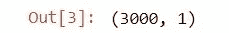
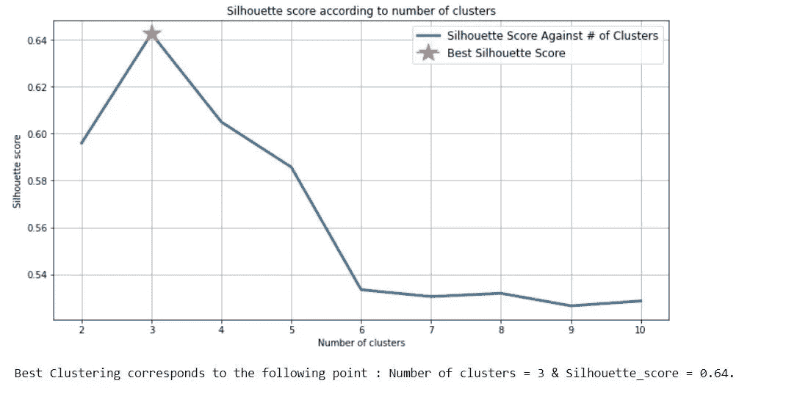
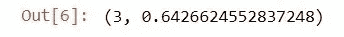
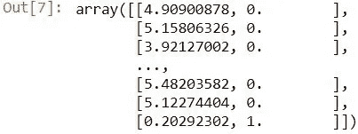

# 当标签未知时，我的数据中的最佳聚类是什么？

> 原文：<https://medium.com/mlearning-ai/what-is-the-best-clustering-in-my-data-when-labels-are-unknown-64d2cd99dd6c?source=collection_archive---------1----------------------->

# 使用轮廓分数的 KMeans 最佳聚类

无监督学习:在带有未知标签的数据中的最佳分割。


Ethereal clusters (photo by [Nareeta Martin](https://unsplash.com/@splashabout) on [Unsplash](https://unsplash.com/))

想象一下，你有数百万个未标记的数据要探索，每个数据都由一个向量表示，所有这些向量都分组到一个矩阵或表格中，数据的数量和种类越多，你就越能捕捉到你试图描述的现象，如客户类别、机器状态或疾病的不同状态。在您的情况下，您不知道在您处理的数据中表示了多少个州或类，因为它们没有被标记，并且您没有业务专家来手动标记数百万个数据。你只知道标签的数量大于或等于 2，换句话说，你必须解决一个无监督的分类问题，然后回答这样的问题:我的机器有多少种不同的状态？…我个人在真实用例中已经遇到过这种情况。

在本文中，为了简单和保密起见，我将生成数据，并尝试通过下面我将与您分享的 Python 代码片段找到原始聚类。

在本文中，我们将使用度量 [**剪影系数得分**](https://scikit-learn.org/stable/modules/generated/sklearn.metrics.silhouette_score.html) ，它计算数据集中所有示例的[](http://scikit-learn.org/stable/modules/clustering.html#silhouette-coefficient)**的**平均值**。**

**事实上，当“基本事实”或标签未知时，我们需要使用模型本身来评估不同的聚类。 [**轮廓系数得分**](https://scikit-learn.org/stable/modules/generated/sklearn.metrics.silhouette_score.html) 是一个允许进行这种评估的指标。**

**高**轮廓系数分数** - **接近 1** -与具有更好定义的**聚类**的模型相关。这里，我们将使用 [**Kmeans**](https://scikit-learn.org/stable/modules/generated/sklearn.cluster.KMeans.html) **实现 Scikit-learn。****

****轮廓系数**是为每个样本定义的，由两个分数组成:**

****a** :一个样本与同一类中所有其他点之间的平均距离。**

****b:** 一个样本与下一个最近的聚类中所有其他点之间的平均距离。**

**单个样本的**轮廓系数 s** 为:**

****

# **1-导入一些有用的模块**

# **2-使用来自 3 种不同分布的变量生成数据集**

**为了简单起见，我们将生成 3 个数据集，每个数据集只有一个变量。但显然，第三部分中的代码旨在用于多元数据集。**

****

**现在让我们对数据进行分组和洗牌:**

****

**在本文中，我们使用一个包含 3000 个示例和一个变量的人造数据集，当然，在现实世界中，我们会遇到包含数百万行的多元数据集，然后我们可能需要对初始样本进行子采样以缩短计算时间。子样本必须能代表原始样本总体。**

# **3-编写一个利用 silhouette_score 度量的函数**

*****该函数将帮助您评估带有未知标签的数据的最佳分割，同时也将为您提供一个带标签的数据集。*****

**当变量的取值范围不同时，这会对算法的性能产生负面影响。这就是为什么我们需要将数据缩放作为预处理步骤的一部分。
决策树和随机森林是少数几种我们不需要担心特征缩放的机器学习算法。这些算法是尺度不变的。重新缩放对于梯度下降等机器学习算法核心中使用的优化算法非常有用，对于回归和神经网络等加权输入的算法以及使用 K-最近邻或 [**K-Means**](https://scikit-learn.org/stable/modules/generated/sklearn.cluster.KMeans.html) 等距离度量的算法也非常有用。我们可以使用例如 scikit 的`[MinMaxScaler](https://scikit-learn.org/stable/modules/generated/sklearn.preprocessing.MinMaxScaler.html)`类来重新调整我们的数据。在下面的函数中，我们将参数“scaling”设置为 True，以防我们想要缩放数据。注意，因为我们的数据是单变量的，所以我们不需要将这个参数设置为 True。**

# **4 —我的数据的最佳聚类是什么？**

**我们现在将使用我在上面写的函数来评估我的数据中的最佳聚类。**

*   ****最佳聚类的可视化:****

```
# We don't need to scale the data since we only have one variable
Best_Clustering(data = data, scaling = False)
```

****

*   ****获取最佳参数和我标记的数据，以便我们以后使用:****

```
best_params , my_labeled_data = Best_Clustering(data = data, scaling = False, visualization = False)
best_params
```

****

```
my_labeled_data
```

****

****结论****

**使用这个函数，我们能够确定未标记数据中的聚类数。3 正好是最初生成的数据中的聚类数。因此，我们能够自动标记最初未标记的数据集。**

*****注意:请不要犹豫使用我在 Github 中的*** [***片段代码***](https://github.com/rmerzouki/ml/blob/main/Best%20Clustering%20with%20silhouette%20score_v1.4.ipynb) ***来评估多变量无标签数据集的最佳聚类，并为它们提供标签。*****

***如果您有任何问题或希望保持联系，请随时在 LinkedIn 上联系我:*[*Reda Merzouki*](https://www.linkedin.com/in/reda-merzouki-02843b/)**

# **感谢您的阅读！**