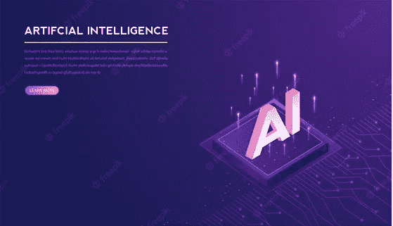

# 人工智能、机器学习、深度学习、数据科学有什么区别？

> 原文：<https://medium.com/mlearning-ai/what-is-the-difference-between-artificial-intelligence-machine-learning-deep-learning-and-data-4359eca6f483?source=collection_archive---------3----------------------->

Image Source: FreeImages

在人工智能助手司空见惯的世界里，很容易假设这些产品都属于人工智能的范畴。然而，人工智能是许多机器学习过程的一个分支，每一个都有独特的好处和挑战。有这么多的选择，理解他们的差异并不容易。本文将讨论人工智能、机器学习、深度学习和数据科学的定义和区别。让我们开始吧！

# 人工智能

人工智能(AI)是我们试图创造能够执行通常需要人类智能的任务的计算机系统的领域。人工智能系统旨在支持决策，而不是取代人类(尽管有时会出现这种结果)。我们的目标是在社会和经济的各个方面复制或超越人类的表现。人工智能系统有许多应用，包括众所周知的自动驾驶汽车和医疗诊断。其他不太常见的例子包括虚拟助手，如 Siri 或 Alexa，它们可以帮助我们完成日常任务，或者投资银行用来管理业务账目的自动交易系统。

至少从 20 世纪 50 年代开始，人工智能就出现在科幻小说中。事实上，直到最近，计算机系统才变得足够先进，能够实现我们与人工智能相关的一些事情，例如学习和解决问题。

# 机器学习

机器学习是 AI 的子领域，它专注于创建能够“学习”周围世界的计算机程序，并根据这些信息做出决策。在很多方面，它是 AI 的一个子领域。然而，有些人更愿意将其视为一个独立的领域。当我们谈论“机器学习”时，我们通常指的是受监督的机器学习(有时也称为“监督学习”)。当我们的计算机程序使用带有标签或“标题”的数据集进行“训练”时，监督机器学习就会发生。然后，程序可以查看新的数据集，并确定它们适合哪个“标题”。

# 深度学习

深度学习是机器学习的子领域，它使用神经网络来训练计算机算法。神经网络是可以“模拟”人脑简单方面的计算机程序。他们接收数据，处理数据，并产生一个输出，这个输出可以作为决策过程的一部分。深度学习常用于 AI。然而，它并不总是需要的。很多成功的 AI 应用并没有使用深度学习。深度学习在过去的 5-10 年中被广泛采用。这主要是由于“张量处理单元”(TPUs)的发展，这是一种旨在帮助深度学习所需的复杂计算的计算机芯片。

# 数据科学

能够“学习”世界并根据这些信息做出决定的计算机程序通常被称为人工智能(AI)。然而，数据科学是实现人工智能的科学方法。需要注意的是，没有一个单独的过程或程序可以被称为“数据科学”相反，有各种不同的方法可以用来解决各种问题。

然而，数据科学可以定义为使用计算机和分析方法从数据中提取知识和见解。数据科学家使用统计学、计算机编程和许多其他技能和工具来帮助企业了解他们的客户，创建更有效的营销活动，并改善客户服务。

# AI、机器学习、深度学习、数据科学的区别？

对许多读者来说，这是一个价值百万的问题。这方面没有明确的答案。虽然这三个领域有所重叠，但是许多人更喜欢用它们来对各种工具和技术进行分类。更重要的是，知道 AI 和机器学习的具体区别，以及机器学习和深度学习的具体区别是必不可少的。让我们详细地看一下每一个。

人工智能与人工智能——人工智能是一个广义的术语，指的是能够“学习”周围世界并根据这些信息做出决定的计算机程序。ML 是人工智能的一个特定子集，专注于创建可以从现有数据集“学习”的计算机程序。

AI 与 DL——AI 是一个广义的术语，指的是可以“学习”周围世界并根据这些信息做出决定的计算机程序。DL 是人工智能的一个特定子集，专注于创建可以从“原始数据”中“学习”的计算机程序。

数据科学与深度学习——数据科学是实现人工智能的科学方法。需要注意的是，没有一个单独的过程或程序可以被称为“数据科学”相反，有各种不同的方法可以用来解决其他问题。DL 是数据科学的一个特定子集，专注于创建能够从“原始数据”中“学习”的计算机程序。

数据科学与机器学习——数据科学是实现人工智能的科学方法。机器学习是人工智能的一个子领域，专注于创建可以从现有数据集“学习”的计算机程序。

数据科学是一个更广泛的术语，可以包含深度学习。例如，数据科学家可能会使用采用深度学习的计算机程序来解决特定问题。相反，深度学习是数据科学中的一种特殊方法，可用于解决各种不同的问题。

数据科学与人工智能——数据科学是实现人工智能的科学方法。人工智能是一个广义的术语，指的是能够“学习”周围世界并根据这些信息做出决定的计算机程序。

# 那么，深度学习和数据科学有什么区别呢？

这两个领域的区别在于，数据科学是一个宽泛的术语，包括解决问题的所有方法。深度学习是数据科学中的一种特定方法，专注于创建可以从原始数据中“学习”的计算机程序。

机器学习是人工智能的一个子领域，专注于创建可以从现有数据集“学习”的计算机程序。另一方面，深度学习是机器学习的一个子领域，专注于开发可以从“原始数据”中“学习”的计算机程序。

# 总结:人工智能已经在实践中了吗？

这是一个很好的问题，但回答起来可能会显得过于投机。虽然技术已经出现，但还没有完全成为主流。这可能是因为它对许多企业来说仍然过于昂贵，或者以一种对公司的底线产生有意义的影响的方式实施起来太困难了。也就是说，这项技术可能会继续扩散。

 [## Mlearning.ai 提交建议

### 如何成为 Mlearning.ai 上的作家

medium.com](/mlearning-ai/mlearning-ai-submission-suggestions-b51e2b130bfb)