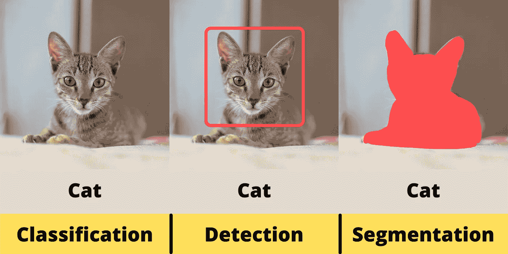

# 深度学习和机器学习有什么区别？

> 原文：<https://medium.com/mlearning-ai/what-is-the-difference-between-deep-learning-and-machine-learning-5850bf19861f?source=collection_archive---------3----------------------->

## 机器学习——深度学习

Photo by [Andrea De Santis](https://unsplash.com/@santesson89?utm_source=medium&utm_medium=referral) on [Unsplash](https://unsplash.com?utm_source=medium&utm_medium=referral)

# 什么是深度学习和机器学习？

深度学习和机器学习是人工智能行业最热门的几个话题。它们也是两个不同但相关的概念，已经探索了几十年。

最简单的形式，ML 是人工智能研究的一个分支，专注于统计分析、模式识别和分类。换句话说，ML 是一组算法，可以被训练来识别数据中对人类来说可能不明显的模式。

深度学习是 ML 的一个子集，其架构由几个隐藏层组成，其中信息在由最终层处理之前通过连续层传播，最终层决定结果。

# 训练深度神经网络的两种方法

训练深度神经网络的两种方式是前馈网络和反向传播算法。这两者中的后者比前者更复杂，但也更准确。

有许多方法可以训练深度神经网络，但区分它们的一种方法是通过它们如何处理信息流。前馈网络自上而下和自下而上，而反向传播算法只在相反的方向上推动数据。这意味着在前向网络中，您总是可以在两个方向上找到损失函数和成本函数，而在反向传播算法中，对于给定的权重集，您只能找到先向前后向后的成本函数。

# 深度神经网络的优势

深度神经网络(DNNs)是一类神经网络，旨在解决以前的机器学习模型的局限性。

DNNs 的最大优势之一是它们允许更好的泛化。这意味着他们不太可能过度拟合他们的训练数据，这意味着他们的预测在看不见的情况下更准确。当面临问题时，dnn 陷入局部极小值的风险也小得多。

# 深度神经网络与机器学习算法

机器学习算法是一种使用统计技术的算法。这些算法已经存在了很长一段时间，并以许多不同的方式用于解决各种问题。近年来，机器学习算法已经被用于计算机视觉领域中的分类和回归任务。

深度神经网络是机器学习算法的一种形式，它使用分层神经网络来决定处理什么数据，并确定它们应该产生什么输出。它们可用于许多不同的领域，如 [*【计算机视觉】*](https://pycad.medium.com/the-ai-technology-behind-computer-vision-e7d7c6821b3b)**自然语言处理*等。*

*一些最著名的深度神经网络使用深度卷积神经网络(CNN)和递归神经网络(RNNs)。CNN 由多层神经元组成，这些神经元创建了一个树状结构，其中网络学习边缘、形状和模式等特征。当网络识别到物体时，它会将信息发送到更高层。rnn 用于需要内存或顺序数据的任务，如语音翻译或语音识别。*

# *机器学习的深度架构与算法的比较*

*机器学习的两种最常见的方法是深度架构和算法。使用深度架构，ML 被建模为一组互连的层，代表数据的不同方面。该算法是一个迭代过程，涉及检查模式的数据，然后产生新的算法结构。*

*深度架构更适合复杂的任务，如对象检测、分割和识别，因为它可以跨越不同的抽象层次。另一方面，算法更适合更线性的任务，如分类或检测，因为它们可以用数学证明来表达。*

**

*The can image is by [Swapnil Kulkarni](https://www.pexels.com/@majjatantu) from Pexels, then modified by the author*

> *订阅[我的时事通讯](https://astounding-teacher-3608.ck.page/136bdb1fbe)获取关于我工作的所有更新:)。*