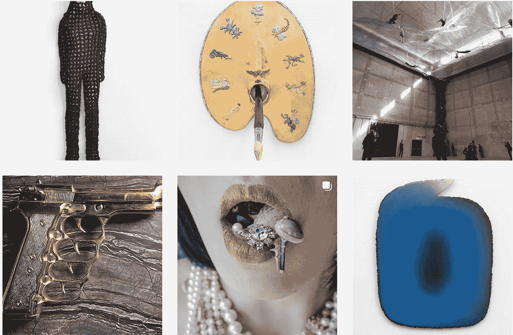

# 数字艺术的未来是什么？

> 原文：<https://medium.com/mlearning-ai/what-is-the-future-of-digital-art-936bf9f815d7?source=collection_archive---------0----------------------->

## 趋势:人工智能

🟣要成为会员，使用此链接: [**获得全媒体权限**](https://evartology.medium.com/membership)

[https://www.instagram.com/evartology/](https://www.instagram.com/evartology/)

**到底什么是数字艺术？这些以及其他问题将在本文中得到解答。敬请期待！**

➡️ [**梦想之乳——2022 年威尼斯双年展**](/data-driven-fiction/the-tragedy-of-the-biennales-46d71c411700) 到此结束