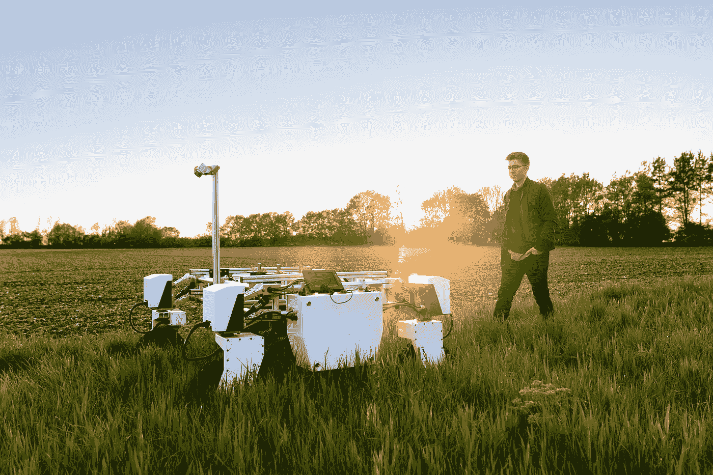
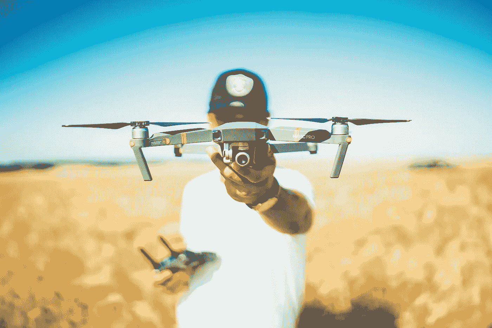
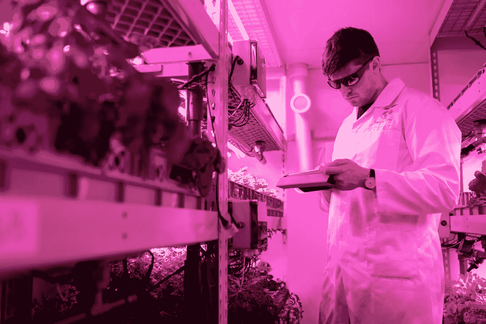

# 农业的未来是什么？

> 原文：<https://medium.com/mlearning-ai/what-is-the-future-of-farming-46f17677ea0?source=collection_archive---------2----------------------->

农业正面临着人口增长、气候变化和自然资源限制带来的巨大挑战。为了应对这些挑战，农民需要雇佣更多的工人在他们拥有的土地上种植粮食和农作物。农业中的人工智能正在拯救人类，取代人类执行多余的世俗任务，并通过为农民提供无人机图像的各种人工智能分析，让他们最大限度地利用自己的土地。让我们来看看今天已经在农业中使用的一些人工智能以及[数据注释](https://mindy-support.com/services-post/data-annotation-services/)在其发展中的作用。

# 农业机器人和人工智能

过去，农民们不得不在田间漫游，寻找成熟的庄稼来采摘。这非常耗时，最近已经实现了自动化。人工智能机器人现在能够在其周围导航，找到他们需要的作物，并确定它们是否可以收获。他们使用激光雷达技术来识别周围的物体。激光雷达创建了一个 [3D 点云](https://mindy-support.com/services-post/3d-point-cloud/)，这是机器人看待世界的方式的数字表示。它需要由人类使用标记和语义分割等技术进行注释，以便机器人可以学习识别周围的物体。

Photo by [ThisisEngineering RAEng](https://unsplash.com/@thisisengineering) on [Unsplash](https://unsplash.com/?utm_source=medium&utm_medium=referral)

还有无人机技术，使用计算机视觉相机拍摄农田的空中图像。机器学习算法能够检测出重要信息，例如受损的作物和产量低于其他作物的田地区域。这是非常重要的信息，因为农民将能够使用各种农业方法来肥沃土壤，并有助于增加收成。这种计算机视觉技术还需要图像注释，因为人工智能系统需要学习一些信息，如某些作物的外观以及健康作物与受损作物的区别。

还有一些有趣的人工智能技术，可以让农民更好地监控农场动物。有时，牛、羊和其他动物会通过某些姿势发出它们感觉不舒服的信号，比如它躺下的方式。计算机视觉摄像头在这种情况下也很有用，因为它们可以检测到任何潜在的问题，并提醒农民有什么不对劲。

Photo by [david henrichs](https://unsplash.com/@davidhenrichs) on [Unsplash](https://unsplash.com/?utm_source=medium&utm_medium=referral)

# 新的耕作方式

根据联合国的数据，54%的世界人口居住在城市。这个数字预计到 2050 年将增加到[的 68%。这意味着农村地区生产的产品需要长途运输到城市。政府试图解决这些挑战和减少粮食短缺的一个有趣的新方法是使用新的农业技术，如垂直农业。这是指作物在垂直堆叠的层中生长，因此需要的资源少得多，在土地稀缺的城市地区非常有用。此外，由于作物生长在室内，它们对天气变化的抵抗力更强，这意味着作物损失更少。它对本地植物和动物的破坏也较小，从而保护了本地的植物和动物。](https://www.un.org/development/desa/en/news/population/2018-revision-of-world-urbanization-prospects.html)

沙漠农业也在美国、以色列、澳大利亚、沙特阿拉伯和其他气候干旱的国家使用。如果我们看看像帝国谷这样的地方，它每年只有大约 [3 英寸的降雨量](https://en.wikipedia.org/wiki/Imperial_Valley#:~:text=The%2085%2Dyear%20average%20annual,occurred%20on%20December%2012%2C%201932.)，然而它也生产美国 90%的冬季蔬菜。我们在以色列看到了类似的成功，这个国家 60%的土地是沙漠。早在 20 世纪 60 年代，他们发明了现代滴灌技术，使农民能够节约足够的水在沙漠中种植作物。今天，我们看到了劳动的成果，例如生长在内盖夫沙漠的圣女果，其产量已经是世界其他地方的 3-4 倍。

还有海水养殖，以解决沿海地区农业严重缺乏淡水和土壤条件不足的问题。这种方法允许农民利用盐水种植和支持他们的作物，并丰富他们所在地区的土壤。我们看到海水养殖在荷兰、英国和美国等地得到应用，它们正在积极发展海水养殖。[在苏格兰](https://www.wired.co.uk/article/growing-crops-in-seawater)，海水解决方案公司利用退化的沿海农田，在上面种植天然耐盐草本植物，如 samphire 和 sea blite，然后通过拆除海堤或从海洋中抽水来淹没该地区，从而创造一个人工盐沼。

# 预计未来物联网设备的使用将会扩大

我们提到无人机已经被用于通过计算机视觉摄像头监控作物，但在未来，我们将看到物联网设备的增强使用。例如，我们可以看到部署来监测土壤条件的传感器可以通过 LPWAN 进行通信，指导洒水装置调整水和养分的应用。收集的所有信息可用于做出更明智的决策和优化收获窗口。

Photo by [ThisisEngineering RAEng](https://unsplash.com/@thisisengineering) on [Unsplash](https://unsplash.com/?utm_source=medium&utm_medium=referral)

我们还可以在建筑和设备管理领域看到物联网设备。监测和测量筒仓和仓库水平的芯片和传感器可以触发自动再订购，降低农民的库存成本，他们中的许多人已经在使用 Blue Level Technologies 等公司的这种系统。类似的工具还可以通过监测和自动优化储存条件，提高投入的保质期，减少收获后的损失。监控建筑物和设备的条件和使用情况也有可能降低能耗。安装在设备上并与预测维护系统相连的计算机视觉和传感器可以降低维修成本，延长机器和设备的寿命。

# 未来的技术将有助于让农民的生活更轻松

尽管很多人担心人工智能和其他智能技术将开始夺走人类的工作，但事实上，它们将帮助农民优化他们的工作流程，以获得更大的利润。他们将能够通过分析无人机和物联网设备关于土壤条件的数据来种植更多的产品，并做出必要的调整，以确保作物按计划生长。机器人将帮助人类工人执行多余的任务，以便他们的努力可以得到更好的利用。所有这些技术都将使农民的生活变得更加轻松，并提高生产率和收入。