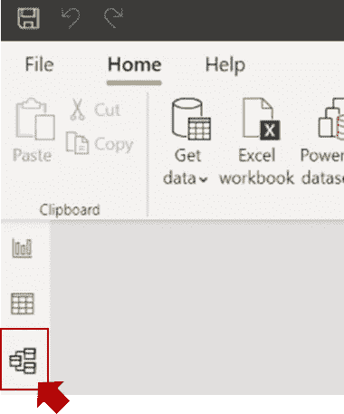
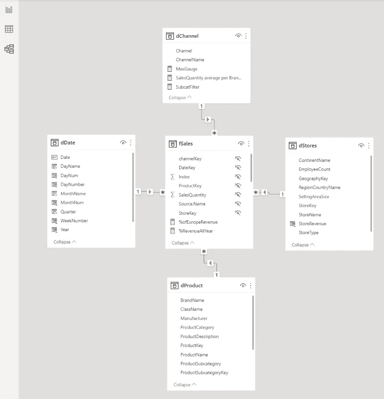
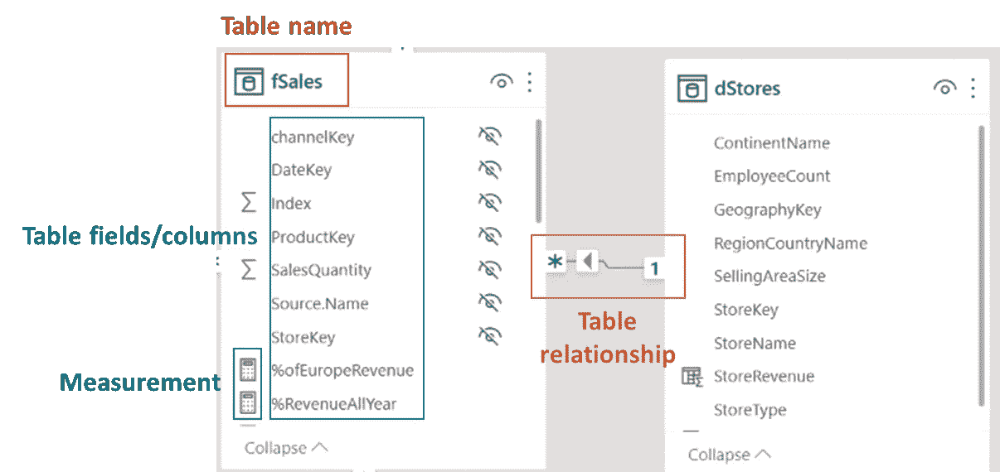
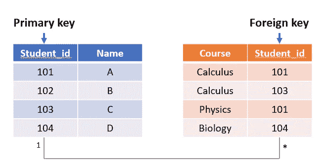
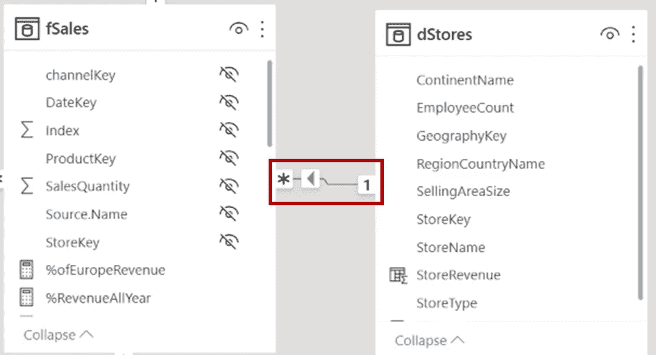
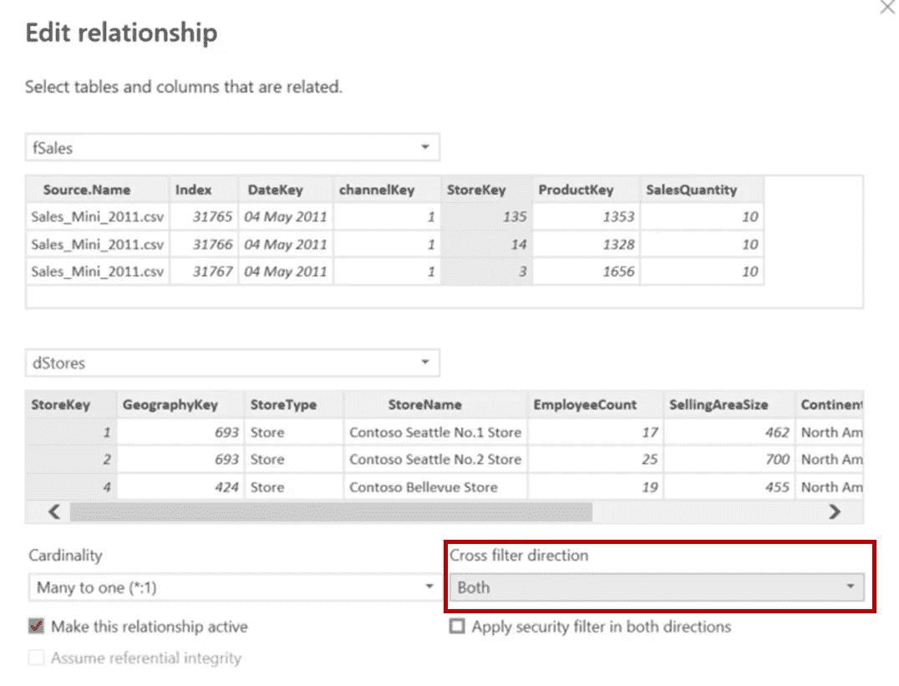
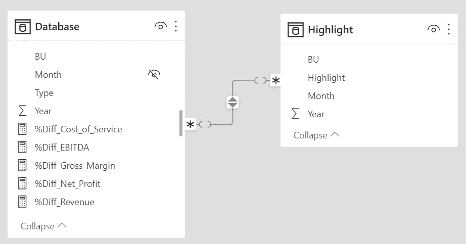
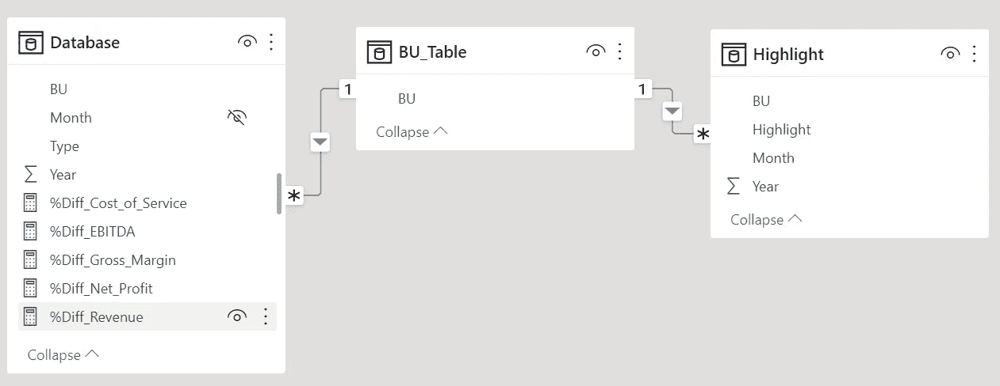

# 对于 Power BI，什么是合适的数据模型？

> 原文：<https://medium.com/mlearning-ai/what-is-the-proper-data-model-for-power-bi-79641b328941?source=collection_archive---------3----------------------->

Source: [https://learn.microsoft.com/](https://learn.microsoft.com/)

数据模型是创建数据仪表板的重要部分之一。如果数据模型设计不当，可能很难处理复杂的参数，并且可能导致错误的数据可视化。

在本文中，我将介绍 Power BI 仪表板的数据模型设计的最佳实践。我不会涵盖所有类型的数据库模式，这些模式可能会让不熟悉数据库设计的读者感到困惑。

# 本文的内容

*   什么是数据模型？
*   表关系
*   合适的数据模型
*   如何创建合适的数据模型？

# 什么是数据模型？

数据模型是说明表之间关系的图表。在 Power BI 中，数据模型将允许跨表过滤和分析。

在 Power BI 桌面上，您可以在左侧的最后一个选项卡中找到数据模型。

How to find the data model in Power BI?

下面是一个数据模型的例子。

Data model example

数据模型由表名、表字段/列和表关系组成。计算器图标指示测量字段。表关系将在下一部分描述。

# 表关系

每个表都应该有主键。**主键**是包含唯一值的字段/列。通常，主键是一个 ID 列，如事务 ID 或用户 ID。

您还应该知道外键。**外键**是一个表中的字段，它连接到另一个表中的主键。

两个表可以通过连接主键和外键来创建关系。

**表格关系的类型**

1.  1–1

1 个表的 1 条记录与另一个表的 1 条记录匹配。
一个表的主键可以匹配另一个表的主键。

1–1 relationship

2.一对多

1 个表中的 1 条记录与另一个表中的多条记录匹配。
一个表的主键可以匹配另一个表的多个外键。

1–many relationships

3.多对多

一个表中的许多记录与另一个表中的许多记录相匹配。

many-many relationship

# 合适的数据模型

在谈论合适的数据模型之前，你应该了解 Power BI 中的[过滤](https://learn.microsoft.com/en-us/power-bi/transform-model/desktop-relationships-understand)。

电力 BI 中的滤波有方向。默认情况下，当您筛选关系 1 侧的表数据时，它也会筛选关系*-侧的表数据。

例如，如果您筛选 dStores 表中的数据，它也会筛选 fSale 表中的数据。

表关系上的箭头将指示过滤方向。

Filter direction

您可以向两侧编辑十字滤镜方向。然后，您可以从两个表中过滤，它将过滤另一个表。然而，**不建议将交叉过滤器方向改为 both** ，因为当仪表板更复杂时，这可能会搞乱您的仪表板。

您应该设计一个数据模型来匹配您的可视化目的，而不是改变过滤器的方向。

## 星型模式设计原则

建议使用星型架构来获得仪表板的最佳性能。

星型模式的中心是一个**事实表**，该事实表被**维度表**包围。

Source: [https://learn.microsoft.com/](https://learn.microsoft.com/)

事实表通常是事务表，维度表具有描述事实表的属性。维度表的主键将与事实表的外键相连接。

如果数据很复杂，您可以尝试使用 [Snowflex](https://en.wikipedia.org/wiki/Snowflake_schema) 数据模式，它扩展了维度表以连接到其他表。

# 如何创建合适的数据模型？

我们的数据模型的目标是一个星型模式。

这些是我用过的步骤。

1.  写下您想要用来在 Power BI 中创建仪表板的表的列表。
2.  标识每个表的主键。每个表都必须有一个主键。如果没有，您可以添加一个 id 列并将其用作主键(不要忘记更改其他表中的外键以匹配这个主键)。
3.  绘制表之间的关系，并查看它们是如何链接的。
4.  决定哪个表是事实表。它应该是一个链接到几乎所有表的表。
5.  在事实表和维度表之间创建关系。请确保它是一对多(1-*)关系，并且单侧在维度表上。
6.  如果您发现了任何多对多关系，则在该关系之间创建一个新表，以建立两个一对多关系，如下例所示。

many-many relationship

Create a new table to make 1–* relationship

# 结论

星型模式是一个合适的数据模型，因为您可以控制过滤器方向，并使其更容易创建度量。您可以通过标识每个表的主键并只创建 1 –*表关系来实现这一点。

如果您想阅读更多数据分析内容，请鼓掌并关注我。

**我的文章可能对你有用**

*   [Python 中的 Power BI](/mlearning-ai/python-in-power-bi-66a80590ecc0)
*   [Power BI 中的字云可视化](/mlearning-ai/word-cloud-visualization-in-power-bi-a993dc4afb77)
*   [用于 Power BI 流程可视化的桑基图](/mlearning-ai/sankey-chart-for-flow-visualization-in-power-bi-828e62da4c0)
*   [电力 BI 中的聚类](/mlearning-ai/clustering-in-power-bi-e1c7fd5700e)

 [## Mlearning.ai 提交建议

### 如何成为 Mlearning.ai 上的作家

medium.com](/mlearning-ai/mlearning-ai-submission-suggestions-b51e2b130bfb)